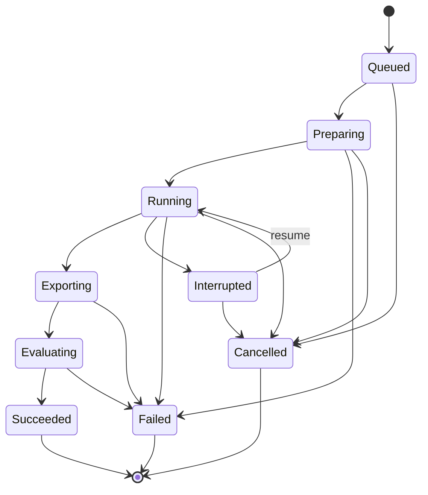

# ADR-0002: データライフサイクルと不変性

| 項目 | 内容 |
|---|---|
| ADR ID | 0002 |
| タイトル | データライフサイクルと不変性 |
| 作成日 | 2026-09-02 |
| 作成者 | implementation-plan.md タスク A-03 |
| ステータス | **採用済み（実装前）** |
| 依存 ADR | ADR-0001（プロセスアーキテクチャ） |
| 要求基準 | `docs/requirement-definition.md` v0.3（SHA-256 `2f1c57da...`） |

---

## 1. 背景と動機

AutoVision Studio は、Project 単位で画像・アノテーション・学習成果物を完全ローカルで管理する。次の衝突する要求が同時に存在するため、ライフサイクル全体を一つの決定として固定する必要がある。

- 編集中の作業領域（Annotation Workspace）は可変でなければならない（FR-ANN-001, FR-ANN-002, FR-ANN-006）。
- 学習の教師データ（Dataset Revision）は確定後に不変でなければならない（FR-DAT-015, FR-ANN-010）。
- 学習済みモデル（Model Version）は上書き不可の不変成果物でなければならない（FR-PRJ-010, FR-MOD-001）。
- 補助候補（Model Suggestion）は人が明示確認するまで Ground Truth にしてはならない（FR-AST-011, NFR-ANN-005）。
- Copy モードと Reference モードで、元ファイルへの影響範囲が異なる（FR-PRJ-008, FR-DAT-011, FR-DAT-012）。
- 学習中の異常終了後も再開できなければならない（FR-TRN-014）。
- 削除によって他の成果物の lineage を破損してはならない（FR-MOD-004, FR-PRJ-007）。

これらをアドホックに実装すると、確定済みデータの意図しない変更・削除・lineage 断絶が発生する。本 ADR はエンティティごとの可変性・不変性・ライフタイム・削除境界を公式に固定する。

---

## 2. スコープと非スコープ

### 2.1 本 ADR が固定すること

- 各エンティティの可変性クラス（可変 / 制限的可変 / 不変）
- Copy モードと Reference モードの責務分担と hash 検証の契約
- Annotation Workspace から Ground Truth を経て Dataset Revision へ至るコミットシーケンス
- Training Run の状態遷移と復旧可能性の条件
- Model Suggestion の分離原則と確定禁止条件
- 削除操作の境界（Project 所有データ vs 参照元）
- atomic rename と transaction によるメタデータ整合性の確保方法

### 2.2 本 ADR が固定しないこと

- SQLite スキーマの具体的な列定義（CORE-04 以降のタスクで確定）
- ファイルシステム上の実際のパス（CORE-01 で確定）
- Python worker とのプロトコル詳細（JOB-03 で確定）
- Reference モードの永続アクセス実装（SPI-19 で実証後に確定。D-19 参照）
- 個々の Model Suggestion の score の意味とモデル別閾値（FR-AST-012, FR-AST-013, SPI-17 後）

---

## 3. 決定

### 3.1 データ階層と可変性クラス

以下の 5 層でデータを管理する。

```
Project（設定のみ可変）
├── LabelSchema（初回学習まで可変、以後 lock）
├── Annotation Workspace（確定まで可変、複数世代）
│   ├── AnnotationItem（Workspace 内で可変）
│   └── ModelSuggestion（出力不変、decision のみ可変）
├── Dataset Revision（確定後不変）
│   └── DatasetItem（不変）
├── TrainingRun（状態遷移とログ追記のみ）
│   └── Trial（完了後不変）
└── ModelVersion（作成後不変）
    └── LicenseManifest（モデル版と共に不変）
```

Python worker は DB を直接変更しない。入力 manifest と Dataset Revision を読み取り専用で使い、成果物を一時ディレクトリに出力する。Main プロセスが checksum 検証後に atomic rename と DB transaction で commit する（§3.6 参照）。  
根拠: implementation-plan.md §3.1「Python worker は DB を直接変更しない」、FR-SEC-009、NFR-REL-003。

### 3.2 Copy モードと Reference モードの責務

| 観点 | Copy モード | Reference モード |
|---|---|---|
| 元ファイルの変更・削除 | なし。Project が独立した複製を保有 | なし。元パスを読み取るだけ（FR-PRJ-008, FR-DAT-012） |
| hash 保存 | コピー完了時に SHA-256 source manifest を Workspace に保存（FR-DAT-011） | 絶対パス + OS 永続アクセス情報 + サイズ + mtime + SHA-256 を保存（FR-DAT-012） |
| 起動時の再検証 | 不要（複製が Project 内に存在） | 必要。アクセス不能時は relink を要求（FR-DAT-012） |
| Training Run 開始直前の hash 再検証 | 不要 | 必須。変更・消失が 1 件でも検出されれば Run を開始せず、relink または Copy 再取り込みを案内する（FR-DAT-013） |
| Training Run 実行中の hash 再検証 | 不要 | epoch/trial 境界で再検証。変更・消失時は安全停止（FR-DAT-013） |
| Project 削除時の元ファイル扱い | 複製を削除（FR-PRJ-008） | 元ファイルは一切削除しない（FR-PRJ-008） |
| Reference 永続アクセスの実証 | 不要 | SPI-19 で Windows・macOS の再起動後アクセスを実証してから実装を確定する（D-19） |

**現時点の実装状態:** Reference モードの永続アクセスは SPI-19 で検証中であり、未実証の機能を実装済みと扱わない。SPI-19 が合格するまで Reference モードの本実装は開始しない。

### 3.3 Ground Truth とその確定条件

**Ground Truth の定義:** ユーザーが画面で明示的に確定操作を行った分類ラベルまたは矩形 annotation のみ（RD §5 定義）。

確定条件（FR-ANN-005、FR-ANN-010、FR-ANN-011、FR-AST-011）:
- 画像の状態が `確認済み` であること。
- `確認済み` は、ユーザーが全候補と画像全体を確認した上で明示確定した場合だけに遷移する。
- 未処理 ModelSuggestion が 1 件でもあれば画像を `確認済み` にできない（FR-AST-011）。
- 候補の score によらず、自動承認・一括承認を提供しない（FR-AST-011）。

**annotation provenance の記録:** 各 AnnotationItem は次の provenance を保持する（FR-ANN-007）。

| provenance 値 | 意味 |
|---|---|
| `manual` | ユーザーが画面で直接作成 |
| `import-unmodified` | import した annotation をそのまま確認 |
| `import-edited` | import した annotation をユーザーが編集して確認 |
| `model-accepted` | ModelSuggestion を承認してそのまま確認 |
| `model-edited` | ModelSuggestion を編集してから確認 |

**現時点の実装状態:** provenance の記録は ANN-16 で実装予定。本 ADR はその契約を固定する。

### 3.4 Dataset Revision の不変性

Dataset Revision は Annotation Workspace の確定操作によってのみ生成される（FR-DAT-015）。

**不変性の内容（FR-ANN-010, FR-DAT-011, NFR-ANN-005）:**
- 確定後の Dataset Revision に含まれる DatasetItem、Ground Truth、Label Schema スナップショット、画像 hash、annotation hash、除外一覧、確定日時は変更不可。
- `lastVerifiedAt` だけは Reference モードの hash 再検証時に更新可（RD §9.1 DatasetRevision の更新方針）。
- 確定済み Dataset Revision を修正する場合は内容を新しい Annotation Workspace に複製し、修正後に新しい Revision として確定する（FR-ANN-013）。過去 Revision を上書きしない。

**Dataset Revision の生成条件:**
- 確認済み Ground Truth のみを含む（NFR-ANN-005）。
- 未確認画像 および 未処理 Model Suggestion は 1 件も含めない（FR-AST-011, FR-ANN-011）。
- Error（Schema 外 class、0/複数 class 分類、非有限・範囲外の矩形など）がある場合は確定不可（FR-ANN-011）。
- 確定後、5 秒以内に Training Run を Queued または Running にする（FR-TRN-001, NFR-PERF-002）。

### 3.5 Training Run と Trial の状態

Training Run の合法な状態遷移は RD §10 に定義された以下のみ:



**復旧可能性の条件（FR-TRN-014, §10）:**
- `Interrupted` 状態の Run のみ resume 可能。
- resume 時にコード版・checkpoint 形式・Dataset Revision hash の 3 点が一致しない場合は resume せず新規 Run を案内する。
- `Cancelled` は終端状態。再開不可。ログ・Trial・診断情報はユーザーが削除するまで保持する（FR-TRN-013）。

**Model Version 生成条件（FR-MOD-001, §10）:**
- `Succeeded` 状態のときだけ推論可能な Model Version を 1 つ生成する。
- `Failed` / `Cancelled` からは Model Version を作成しない。

**Trial の不変性:**
- Trial は完了後不変（RD §9.1 Trial の更新方針）。
- 内包する全パラメーター・中間指標・最終指標・pruneReason を保持する（FR-TRN-015, FR-REP-004）。

**現時点の実装状態:** Training Run のバックエンド実装は Phase I（TRN-01〜TRN-21）で行う。本 ADR は状態遷移の契約のみ固定する。

### 3.6 atomic rename とトランザクションによる整合性

**ファイル成果物のコミット手順（NFR-REL-003, FR-SEC-009）:**

1. Python worker が成果物（manifest JSON、ONNX ファイル等）を一時ディレクトリに出力する。
2. Main プロセスが一時ディレクトリの全成果物の SHA-256 を検証する。
3. 検証通過後、OS の atomic rename（`rename(2)` / `MoveFileEx`）で正規パスに移動する。
4. 成果物移動後に SQLite transaction でメタデータを commit する。
5. transaction が失敗した場合、正規パスへ移動済みだが DB から参照されない孤立成果物として検出・削除対象にする。DB 更新が失敗しているため、同じ transaction で `Failed` を記録できたとは扱わない。

**DB メタデータの更新（NFR-REL-003, NFR-REL-004）:**
- 同一 Project への同時書き込みを SQLite の WAL モードと application-level lock で防ぐ（D-03 選択: Electron Main プロセスの `better-sqlite3` が唯一の DB writer）。
- Migration 前に自動バックアップし、失敗時に旧版に戻せる（NFR-REL-002）。
- 生成物には checksum を持たせ、再起動後のロード時に検証する。

**キャッシュの扱い（FR-DAT-014, NFR-STO-003）:**
- サムネイルや前処理キャッシュは参照元とは別の派生データとして識別し、Project 削除またはキャッシュ削除で消去する。
- キャッシュ削除は依存関係を壊さずに実行できる。

### 3.7 Model Suggestion の分離

**ModelSuggestion の不変性:**
- 候補の出力内容（矩形・ラベル・score 等）は作成後不変（RD §9.1 ModelSuggestion の更新方針）。
- `decision`（pending / accepted / edited / rejected）のみ更新可能。

**Ground Truth との分離（FR-AST-009, FR-AST-011）:**
- suggestion と確定 annotation をデータ上も分離する。同じテーブル・同じレコードに混在させない。
- 承認操作は候補を draft annotation へコピーするだけ。画像全体を `確認済み` にしない。
- `確認済み` への遷移は、ユーザーが全候補処理と明示確認を完了した後にのみ可能。

**Suggestion Set のバージョン管理（FR-AST-015）:**
- 補助候補を再生成しても確認済み Ground Truth を上書きしない。
- 新旧 suggestion set を version 管理し、ユーザーが比較・破棄できる。

**メタデータ保存内容（FR-AST-014）:**
- suggestion ごとに assist model ID / version / checkpoint SHA-256、Project Model Version、task、input image hash、prompt/model alias、preprocess、threshold、raw score、生成日時、承認/編集/却下結果を保存する。

**現時点の実装状態:** Suggestion は Phase H（AST-01〜AST-22）で実装。Gate 2 で承認済みモデルが確定するまで補助機能は実装しない（FR-AST-004）。

### 3.8 削除境界

| 操作 | 削除されるデータ | 保持されるデータ |
|---|---|---|
| Project 削除 | Annotation Workspace、ModelSuggestion、Copy モードの複製・生成物、Training Run ログ・Trial・レポート・キャッシュ、Model Version ファイル（依存確認後） | **Reference モードの参照元ファイルは一切削除しない**（FR-PRJ-008） |
| Dataset Revision 単独削除 | （通常は行わない。Training Run が参照中の Revision は削除不可） | - |
| Model Version 削除 | 使用中または子版の親となる場合は依存関係を表示して明示確認（FR-MOD-004） | 子版の成果物と lineage 情報を破損させない |
| cache 削除 | サムネイル・前処理キャッシュ（FR-DAT-014） | 元 Dataset Revision・Ground Truth は無傷 |
| Failed Run の一時 checkpoint 削除 | 一時 checkpoint のみ（NFR-STO-003） | 完了済み Trial のログと診断情報は保持 |

**削除前確認（FR-PRJ-007）:**
Project 削除前に、対象エンティティ種別ごとの件数と容量を表示し、ユーザーの明示確認を求める。

---

## 4. 却下した代替案

### 4.1 Annotation Workspace を不変にする案

**内容:** 編集のたびに新しい Workspace バージョンを作成する。  
**却下理由:** FR-ANN-006（自動保存・undo/redo）と NFR-ANN-001（1 秒以内の永続化）を満たすために、バージョン管理オーバーヘッドは不要に大きい。Workspace は確定前の作業領域であり、不変化する価値は Dataset Revision が担保する。

### 4.2 ModelSuggestion を Ground Truth と同一テーブルに格納する案

**内容:** suggestion の decision フラグが `accepted` になった時点で Ground Truth レコードとして扱う。  
**却下理由:** FR-AST-009 と FR-AST-011 は候補と確定 annotation を「データ上も分離」することを明示要求する。同一テーブルでは「自動/一括承認の禁止」をスキーマレベルで強制できない。

### 4.3 Python worker が SQLite に直接書き込む案

**内容:** worker が学習・補助ジョブの結果を直接 DB に commit する。  
**却下理由:** implementation-plan.md §3.1 の明示的なアーキテクチャ決定に反する。Worker に DB writer 権限を与えると、Renderer との同時書き込み競合、IPC validation のバイパス、Main プロセスの atomic commit 手順の分散が起きる。

### 4.4 Dataset Revision を mutable にして「最新状態」だけを保持する案

**内容:** Ground Truth を編集するたびに Revision レコードを上書きする。  
**却下理由:** FR-TRN-015 は再現性のために使用した Dataset Revision の内容を記録することを要求する。上書きでは「この Run がどのデータで学習したか」が検証できなくなる。また FR-ANN-013 は「修正する場合は新しい Workspace に複製して新 Revision として確定」と明示する。

### 4.5 Copy/Reference の区別を実行時に動的に判断する案

**内容:** 元ファイルが存在すれば Reference として扱い、なければ Copy とみなす。  
**却下理由:** FR-DAT-002 はユーザーが「必ず」選択することを要求する。また FR-DAT-013 は Reference モードの「再現性が失われた状態での継続禁止」を要求するが、動的判断では意図せず Reference として扱われた場合の検証契約が曖昧になる。

### 4.6 汎用イベントソーシング・CQRS・リポジトリフレームワークの導入

**却下理由:** implementation-plan.md §1.3 規則 3・6 で明示禁止。MVP は単一ユーザー・少量メタデータ・単純な状態遷移で構成される。Event Store、CQRS infrastructure、ORM は不要な複雑性を導入する。手書き SQL と機能別 repository で十分である。

---

## 5. 状態・不変性テーブル

| エンティティ | 可変性クラス | 更新可能な属性 | 更新不可な属性 | 根拠要求 ID |
|---|---|---|---|---|
| Project | 制限的可変 | name, description, workspacePath, InferenceProfile 設定 | id(UUID), taskType（初回学習後）, 作成日時 | FR-PRJ-005, FR-PRJ-006 |
| LabelSchema | 制限的可変 | classes, aliases, colors, instructions（初回学習前） | 初回学習後は全項目 lock | FR-ANN-012 |
| AnnotationWorkspace | 可変（確定前） | state, AnnotationItem 全体, 関連 Suggestion の decision | 確定後は新規 Workspace へ複製 | FR-ANN-002, FR-ANN-013 |
| AnnotationItem | 可変（Workspace 内） | annotation, state, provenance, updatedAt | imageHash（参照は変えない） | FR-ANN-006, FR-ANN-007 |
| ModelSuggestion | 制限的可変 | decision（pending/accepted/edited/rejected のみ） | 候補出力、rawScore、生成日時、provenance | FR-AST-014, FR-AST-015 |
| DatasetRevision | 不変（`lastVerifiedAt` のみ例外） | lastVerifiedAt（Reference 検証時のみ） | 含まれる全 DatasetItem、Ground Truth、hash 群、確定日時 | FR-DAT-015, FR-ANN-010, NFR-ANN-005 |
| DatasetItem | 不変 | なし | 全属性 | RD §9.1 |
| TrainingRun | 制限的可変 | status（合法遷移のみ）、ログ追記 | baseModelVersionId, datasetRevisionId, 開始日時 | FR-TRN-011, §10 |
| Trial | 不変（完了後） | なし（完了後） | 全パラメーター・指標 | RD §9.1 |
| ModelVersion | 不変 | なし | 全属性（versionNo, onnxPath, hash, labels, metrics 等） | FR-PRJ-010, FR-MOD-001 |
| LicenseManifest | 不変 | なし | 全属性 | FR-MOD-002, FR-LIC-004 |
| InferenceProfile | 可変 | modelVersionId, cameraId, threshold, displayOptions | id, projectId | FR-INF-014 |
| AssistModelVersion | 不変（リリース単位） | なし | 全属性 | FR-AST-004 |

---

## 6. Annotation Workspace から Dataset Revision へのコミットシーケンス

以下は現在設計された手順であり、実装は Phase G（ANN-17〜ANN-22）で行う。

```
1. ユーザーが確定操作を実行（UI の「教師データを確定」ボタン）
       │
       ▼
2. Main: 確認済み Ground Truth の存在を確認
   - 未確認画像が 1 件でもある → Error、確定不可（FR-ANN-011）
   - 未処理 ModelSuggestion が 1 件でもある → Error、確定不可（FR-AST-011）
   - annotation validation（Schema 外・0/複数 class・非有限矩形 等）→ Error があれば確定不可（FR-ANN-011）
       │
       ▼
3. Python worker（split_dataset.py）を spawn
   - 入力: confirmed AnnotationItem の manifest JSON（画像 hash・annotation・provenance）
   - 処理: 固定 seed で train/validation/test を stratified split（FR-DAT-009）
   - 処理: 同一内容 hash を複数 split に配置しない（FR-DAT-009）
   - 出力: split 結果 JSON を一時ディレクトリに書き出す
       │
       ▼
4. Main: 成果物 hash 検証（NFR-REL-003）
   - split 結果 JSON の SHA-256 を検証
       │
       ▼
5. Main: Dataset Revision manifest を一時ファイルに書き込む
   - 含む内容: revisionNo, mode, splitSeed, 全 DatasetItem（hash/label/split 等）, confirmedAt（FR-ANN-010, FR-DAT-011）
       │
       ▼
6. Main: atomic rename で manifest を正規パスに配置（FR-SEC-009, NFR-REL-003）
   - Copy モード: datasets/<revision-id>/manifest.json
   - Reference モード: 同上（元ファイルは変更しない）
       │
       ▼
7. Main: SQLite transaction
   - DatasetRevision レコードを INSERT（`lastVerifiedAt` を除いて以後 UPDATE 不可、§3.4 参照）
   - DatasetItem レコードを INSERT
   - AnnotationWorkspace の state を「確定済み」に UPDATE
   - commit（失敗時 rollback → Workspace は可変状態のまま維持）
       │
       ▼
8. Main: Training Run を Queued に INSERT（5 秒以内、FR-TRN-001, NFR-PERF-002）
   - 追加の HPO 入力画面を表示しない
```

**追加学習の場合の差分（FR-DAT-016, FR-TRN-004, FR-TRN-005）:**
- 選択した Base Model Version が使用した Dataset Revision を Workspace に取り込む。
- 新規データを追加し、内容 hash で重複排除する。
- 新規データの Ground Truth を確認後に上記 1〜8 を実行し、新しい Dataset Revision を生成する。
- 親 Training Run と Dataset Revision の lineage を Training Run に記録する。

---

## 7. 削除シーケンス（Project 削除の例）

実装は CORE-10（delete-preview.ts）で行う。

```
1. ユーザーが Project 削除を要求
       │
       ▼
2. Main: 削除対象の件数・容量を計算（FR-PRJ-007）
   - Annotation Workspace 数・容量
   - ModelSuggestion 数
   - Dataset Revision 数（Copy モード複製の容量含む）
   - Training Run 数・ログ容量
   - Model Version 数・ファイル容量
   - キャッシュ容量
   - （Reference モードの参照元は計上しない）
       │
       ▼
3. UI: 確認ダイアログを表示（削除対象一覧 + 明示確認）
       │
       ▼
4. ユーザーが明示確認
       │
       ▼
5. Main: SQLite transaction
   - Project の全 ModelVersion・LicenseManifest・TrainingRun・Trial・DatasetRevision・DatasetItem・
     AnnotationWorkspace・AnnotationItem・ModelSuggestion を DELETE
   - Project レコードを DELETE
   - commit（失敗時 rollback → Project は残る）
       │
       ▼
6. Main: ファイルシステム上の Project 作業フォルダー配下を削除
   - datasets/、runs/、models/、reports/、cache/、annotations/、suggestions/ を削除
   - Reference モードの参照元パス（元ファイル）は読み取らず、削除しない（FR-PRJ-008）
   - 削除失敗した項目を報告する（FR-SEC-012）
```

---

## 8. 未解決の Gate 項目（Unresolved Gates）

本 ADR を実装に移す前に以下を確定しなければならない。

| 項目 | 内容 | 必要な Gate / タスク | 状態 |
|---|---|---|---|
| **G-1** | Reference モードの永続アクセス実証（D-19） | SPI-19 合格が必要 | **未実施。Windows・macOS の再起動後アクセスを実証できなければ Reference モードの本実装は開始しない** |
| **G-2** | SQLite スキーマの具体的な列定義と migration 手順 | CORE-04（001_core.sql）, ANN-01（004_annotations.sql）, AST-02（005_suggestions.sql）| 未実施。本 ADR はスキーマ設計の原則を固定するが、実際の DDL は別タスクで確定 |
| **G-3** | Python worker の split アルゴリズムの実装と、データ不足（ゼロ件クラス・少数クラス）の扱い | ANN-17（split_dataset.py） | 未実施。FR-DAT-009 / FR-DAT-010 の自動調整ロジックの具体的な実装 |
| **G-4** | Gate 2: Curated Base Weight および Annotation Assist Model の法務承認 | SPI-11〜14, SPI-17, Gate 2 | 未承認。承認前は ModelSuggestion の生成機能を出荷しない（FR-AST-004） |
| **G-5** | Training Run の checkpoint 形式と resume 時の互換性検証手順 | TRN-13（checkpoint.py） | 未実施。FR-TRN-014 の「コード版・checkpoint 形式・Revision hash の 3 点一致」の実際の検証ロジック |
| **G-6** | Model Version 削除時の依存確認（子版・使用中チェック）のロジック | Phase I 以降 | 未実施。FR-MOD-004 の依存関係表示と明示確認の実装 |
| **G-7** | macOS の atomic rename の挙動（クロスボリューム）の実証 | SPI-19 または別途 spike | 未実施。macOS でプロジェクト作業フォルダーがシステムボリュームと異なる場合のファイル移動挙動 |

---

## 9. 現時点で実装済みの設計と未実装の機能の区別

| 設計要素 | 現在の状態 | 詳細 |
|---|---|---|
| データ階層の定義（§3.1） | **ADR で確定。コード未実装** | CORE-04 以降で実装 |
| Copy モードの hash 保存契約（§3.2） | **ADR で確定。コード未実装** | DAT-06, DAT-07 で実装 |
| Reference モードの hash 保存と再検証契約（§3.2） | **ADR で確定。実装は SPI-19 合格後** | SPI-19 未実証のため本実装保留（D-19） |
| Ground Truth 確定条件（§3.3） | **ADR で確定。コード未実装** | ANN-15, ANN-22 で実装 |
| Dataset Revision 不変性（§3.4） | **ADR で確定。コード未実装** | ANN-18, ANN-19 で実装 |
| Training Run 状態遷移（§3.5） | **ADR で確定。コード未実装** | JOB-02 で実装 |
| atomic rename + transaction 手順（§3.6） | **ADR で確定。コード未実装** | DAT-06, ANN-18 で実装 |
| ModelSuggestion 分離（§3.7） | **ADR で確定。コード未実装** | AST-02, AST-03 で実装（Gate 2 後） |
| 削除境界（§3.8） | **ADR で確定。コード未実装** | CORE-10 で実装 |
| Suggestion Set バージョン管理（§3.7） | **ADR で確定。コード未実装** | AST-14 で実装（Gate 2 後） |

---

## 10. 引用要求 ID インデックス

| 節 | 引用した要求 ID |
|---|---|
| §2, §3.1 | FR-ANN-001, FR-ANN-002, FR-ANN-006, FR-ANN-010, FR-DAT-015, FR-PRJ-008, FR-PRJ-010, FR-MOD-001, FR-AST-011, NFR-ANN-005 |
| §3.2 | FR-PRJ-008, FR-DAT-011, FR-DAT-012, FR-DAT-013 |
| §3.3 | FR-ANN-005, FR-ANN-007, FR-ANN-010, FR-ANN-011, FR-AST-011 |
| §3.4 | FR-ANN-010, FR-ANN-013, FR-DAT-015, FR-TRN-001, FR-TRN-015, NFR-ANN-005, NFR-PERF-002 |
| §3.5 | FR-TRN-011, FR-TRN-013, FR-TRN-014, FR-MOD-001 |
| §3.6 | FR-SEC-009, NFR-REL-002, NFR-REL-003, NFR-REL-004 |
| §3.7 | FR-AST-009, FR-AST-011, FR-AST-014, FR-AST-015 |
| §3.8 | FR-PRJ-007, FR-PRJ-008, FR-MOD-004, FR-DAT-014, FR-SEC-012, NFR-STO-003 |
| §6 | FR-ANN-009, FR-ANN-010, FR-ANN-011, FR-AST-011, FR-DAT-009, FR-DAT-011, FR-SEC-009, FR-TRN-001, FR-TRN-004, FR-TRN-005, NFR-ANN-005, NFR-PERF-002, NFR-REL-003 |
| §7 | FR-PRJ-007, FR-PRJ-008, FR-SEC-012 |
