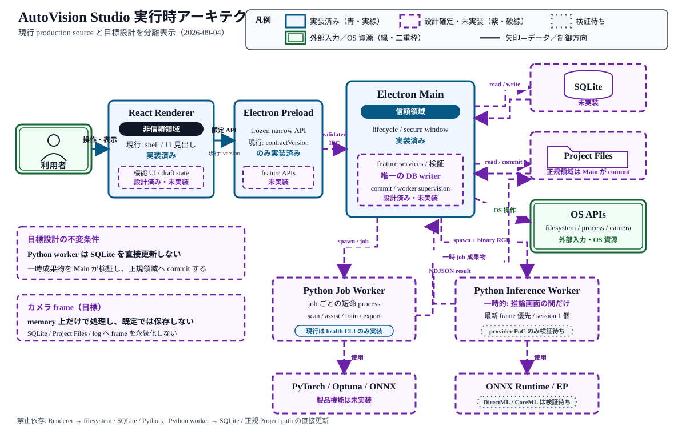
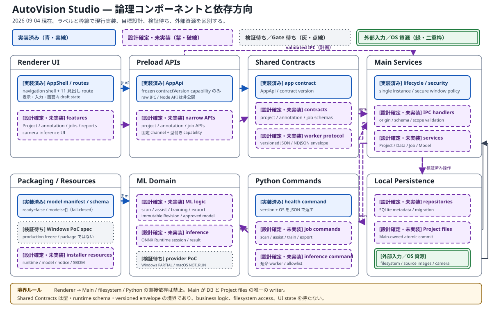
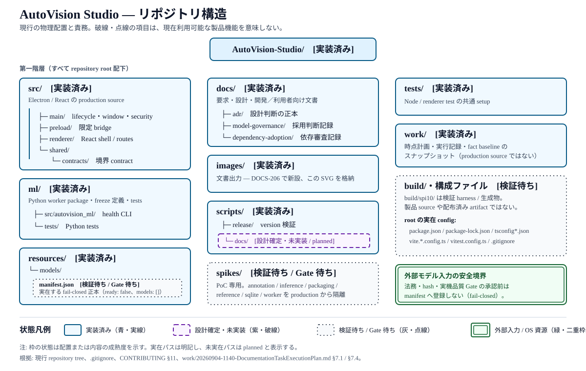
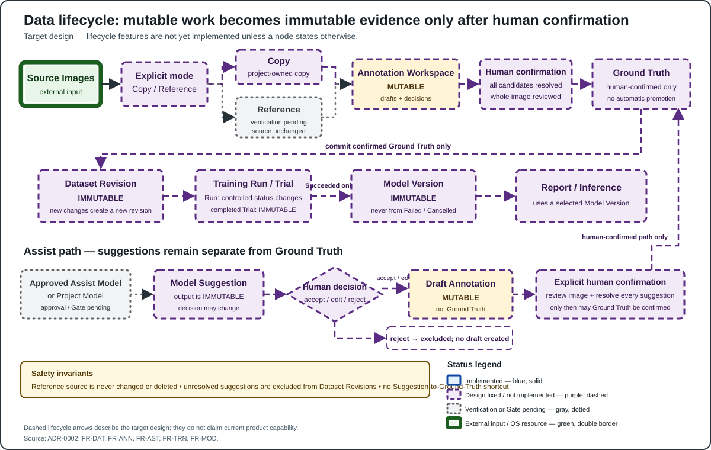

# AutoVision Studio アーキテクチャ

> **機能状態:** 検証待ち
>
> **文書成熟度:** 要求反映済み
>
> **要求基準:** [`requirement-definition.md`](requirement-definition.md) v0.4 Draft
>
> **目的:** 現行 source、目標設計、許可される依存、禁止される依存を区別して案内する

本書は 2026-09-04 時点の production source と目標設計を対応付ける文書です。Version 1（MVP）の対象は Windows 11 24H2 以降 x64 のみであり、macOS は将来対応です。現行 source と対象 test がある領域は `実装済み`、要求または ADR だけがある領域は `設計確定・未実装`、PoC はあるが Windows 実機または Gate が未完了の領域は `検証待ち` として区別します。詳細な設計理由、却下案、障害時の状態遷移は ADR を正本とし、本書では複製しません。

## 文書・図の規約

- 本文は日本語を基本とし、パス、symbol、要求 ID は原文表記を維持します。
- 用語は[ユーザーガイドの用語集](users-guide.md#用語集)を正本とします。
- 機能状態は `実装済み`、`設計確定・未実装`、`検証待ち`、`対象外` のいずれかで示します。
- 文書成熟度は `構成のみ`、`要求反映済み`、`実測済み` のいずれかで示します。
- 相対リンクはリンク元 Markdown を基準にします。詳細な理由、却下案、障害時動作は複製せず [ADR](adr/) へリンクします。
- SVG は repository root の [`images/`](../images/) に置き、XML declaration、`viewBox`、`role="img"`、`aria-labelledby`、一意な `title` / `desc` を持つ standalone file とします。
- SVG は外部 resource、CSS、web font、JavaScript、`foreignObject` を使用しません。
- 状態はラベルと線種を併用します。実装済みは青・実線、設計確定・未実装は紫・破線、検証待ちは灰・点線、外部入力／OS 資源は緑・二重枠で示します。
- 背景と文字は WCAG AA 相当の contrast を確保し、100% / 200%、high contrast、印刷でも読める余白と文字サイズを使用します。
- 本文は v0.4 の Windows Version 1 基準です。参照する SVG は WIN-SCOPE-05 で再整合するまで旧 macOS 表示を含む場合があり、その表示を Version 1 の対象、現行実装、Gate 条件とは扱いません。本タスクでは SVG を編集しません。

## システム全体と実行時 process



- **目的・読み方:** 利用者から右へ進む UI / IPC / 永続化経路と、Main から下へ分かれる Job Worker / Inference Worker の目標経路を読みます。矢印はデータまたは制御の方向であり、接続が描かれているだけで production 実装や試験合格を示すものではありません。
- **状態:** 青・実線は現行 source がある `実装済み`、紫・破線は `設計確定・未実装`、灰・点線は PoC または Gate の `検証待ち`、緑・二重枠は利用者入力または OS 資源です。複合ノードでは内側のラベルを優先し、たとえば Job Worker は health CLI だけが実装済みです。
- **主要ノード・フロー:** React Renderer → Electron Preload → Electron Main が制御経路で、目標設計では Main が SQLite / Project Files / OS API と worker spawn を所有します。Job Worker は一時成果物を返し、Inference Worker は推論画面の間だけ RGB frame を受けて NDJSON result を返します。
- **境界・根拠:** Renderer から filesystem / SQLite / Python へ直接到達せず、Python worker は SQLite や正規 Project path を直接更新せず、camera frame を既定で永続化しないことが不変条件です。正本は [ADR-0001](adr/0001-process-architecture.md)、[要求定義の FR-SEC / FR-TRN / FR-INF](requirement-definition.md)、[実装計画の JOB / INF task と Gate](implementation-plan.md)です。

### 現行

**実装済み:** 現在起動する production process は Electron Main、sandboxed React Renderer、Electron Preload です。`src/main/index.ts` が app lifecycle と secure `BrowserWindow` を接続し、`src/preload/index.ts` は Renderer の `window.autoVision` へ `contractVersion` だけを公開します。Renderer は `src/renderer/layout/AppShell.tsx` の navigation shell と 11 個の見出し route までで、Project、データ、学習、レポート、カメラ推論の処理は実装されていません。

**実装済み（診断 command のみ）:** Python package には `ml/src/autovision_ml/cli.py` の `health` command があり、version と OS 名を JSON で返します。Electron Main からの spawn、ジョブ protocol、SQLite、Project files との接続はまだありません。

### 目標

**設計確定・未実装:** Version 1 の目標 process は React Renderer → narrow Preload API → Electron Main を制御経路とし、Main が SQLite、Project files、Windows OS API、Python worker を所有します。Python は二種類の短命 worker とし、学習・assist・ONNX export を行う Job Worker と、推論画面の生存期間だけ ONNX Runtime session を保持する Inference Worker に分けます。Version 1 の推論 EP は Windows の DirectML / CPU を対象とします。HTTP server、localhost API、message broker、汎用 RPC、runtime plugin loader は設けません。process 構成の決定と理由は [ADR-0001](adr/0001-process-architecture.md) §2 を参照してください。

許可する依存は Main ↔ SQLite / Project files、Main → OS API / worker spawn、worker → 一時 job directory です。Renderer → filesystem / SQLite / Python、worker → SQLite / 正規 Project path の直接更新は禁止します。

**検証待ち:** Windows の保存済み SPI-08 は単一 FP32 `Add` model による CPU / DirectML provider smoke を確認していますが、production inference worker、採用モデル互換性、10 Hz camera pipeline、30 分性能を実証したものではありません。したがって DirectML / CPU 推論を利用可能な製品機能として扱いません。保存済み macOS CPU / CoreML / MPS の `NOT_RUN` と調査結果は将来対応の履歴として保持しますが、Version 1 の Gate 1 / 4 を停止せず、Windows の合格証拠にも macOS の合格証拠にも読み替えません。

## 信頼境界と IPC validation

Renderer は非信頼領域です。**実装済み**の window 境界は `contextIsolation: true`、`sandbox: true`、Node integration 無効、navigation と新規 window の拒否を設定しています。Preload も **実装済み**ですが、現在の公開 API は frozen な `AppApi.contractVersion` だけであり、raw `ipcRenderer`、filesystem、Node API、`child_process` を Renderer へ渡していません。

**設計確定・未実装:** feature IPC を追加するときは `src/shared/contracts/` の機能別 contract、Main の機能別 handler、Preload の narrow API を一組にし、Main で sender origin、runtime schema、Project ID、path scope、状態遷移を検証します。Renderer から channel 名、任意 path、任意 command を指定できる汎用 APIは禁止です。worker 入出力は `schemaVersion` を持つ versioned JSON / NDJSON とし、stdout は machine-readable event、stderr は機密画像や不要な絶対 path を含めない診断に限定します。正確な検証契約は [ADR-0001](adr/0001-process-architecture.md) §2.3〜2.5 と FR-SEC-004〜006 を参照してください。

現在は feature IPC handler 自体が存在しないため、sender / payload validation が production で完成しているとは扱いません。カメラ permission handler も **設計確定・未実装**であり、起動時ではなくユーザーの推論開始操作後に video だけを許可する境界は INF-* の実装と packaged Windows の実機 evidence が必要です。macOS TCC は将来 lane で別途検証します。

## Component と依存方向



- **目的・読み方:** 上段を Renderer UI → Preload APIs → Shared Contracts → Main Services、下段を Packaging / Resources → ML Domain ← Python Commands、および Main Services → Local Persistence として読み、矢印が許可された依存方向を示します。図は責務配置の案内であり、破線 component の実装存在を証明しません。
- **状態:** 青・実線は `実装済み`、紫・破線は `設計確定・未実装`、灰・点線は `検証待ち` / Gate 待ち、緑・二重枠は外部入力または OS 資源です。group 全体ではなく各 card のラベルで、たとえば Preload の version API と将来の feature API を区別します。
- **主要ノード・フロー:** 現行の AppShell / routes、`AppApi`、app contract、Main lifecycle / security、health command、空の model manifest と、将来の feature、runtime schema、IPC handler、repository、job command、ML logic を分離しています。Shared Contracts は process 間の型と検証 schema を安定させ、Main が persistence と worker を調整します。
- **境界・根拠:** Renderer → Main service / filesystem / Python の直接依存、worker → SQLite の書き込み、Shared Contracts への business logic / filesystem / UI state の配置は禁止です。正本は [ADR-0001](adr/0001-process-architecture.md)、[ADR-0002](adr/0002-data-lifecycle.md)、[要求定義の FR-SEC / FR-DAT / FR-TRN](requirement-definition.md)、[実装計画の component / directory task](implementation-plan.md)です。

| Component | 現在状態 | 責務 | 許可される依存 | 禁止される依存 |
|---|---|---|---|---|
| Renderer UI | shell は **実装済み**、feature は **設計確定・未実装** | 表示、入力、画面内 draft state | React、shared contract、Preload が公開する限定 API | Electron Main service、filesystem、SQLite、Python、raw Node API への直接依存 |
| Preload APIs | version API のみ **実装済み** | Renderer 向け型付き capability の公開 | shared contract、固定された IPC channel | business logic、DB、任意 IPC / command / path の公開 |
| Shared Contracts | app version contract のみ **実装済み** | process 間の型、runtime schema、versioned envelope | schema / type 定義に必要な最小依存 | filesystem access、Electron lifecycle、ML 計算、UI state |
| Main lifecycle / security | **実装済み** | single instance、window lifecycle、security policy | Electron、local entry files | ML 計算、Renderer rendering |
| Main feature services | **設計確定・未実装** | Project、data、annotation、job、model、storage、camera の調整 | shared contract、機能別 repository、OS API、worker supervisor | UI rendering、worker 内部アルゴリズム、無検証 payload の処理 |
| Local persistence | **設計確定・未実装** | SQLite metadata と Project 所有 file の整合 | Main service からの検証済み操作 | Renderer / Preload / Python worker からの直接書き込み |
| Python Commands / ML Domain | health のみ **実装済み**、その他は **設計確定・未実装** | scan、assist、training、export、inference の明示 command | versioned input、読み取り専用 Revision / manifest、一時 job directory、承認済み model | SQLite 書き込み、camera permission、UI 操作、network download、未承認 model plugin |
| Packaging / Resources | schema と Windows PoC spec は **実装済み**、Version 1 製品 package は **検証待ち** | lock 済み runtime と承認済み payload の Windows x64 配布 | release manifest、SBOM / notice、Windows native build tool | runtime download、driver 導入、未承認 model の同梱、将来 macOS payload の現行同梱 |

依存方向は UI から境界 contract を通って Main へ、Main から persistence / OS / worker へ向けます。結果は同じ境界を通して返し、下位 component が Renderer を import しないようにします。Shared Contracts は依存方向を安定させる境界であり、service locator や business logic の置き場にはしません。process 分離の根拠は [ADR-0001](adr/0001-process-architecture.md)、データ更新責務は [ADR-0002](adr/0002-data-lifecycle.md)を参照してください。

## Repository structure



- **目的・読み方:** repository root の物理配置を三列で追い、`src/` / `ml/` / `resources/` の製品境界、`docs/` / `images/` / `scripts/` の支援領域、`spikes/` / `build/` / `work/` の非 production 領域を区別します。図は表示時点の配置を要約したもので、directory の存在だけから機能完成を証明しません。
- **状態:** 青・実線は実在する `実装済み` の配置、紫・破線は `設計確定・未実装` の `planned` 配置、灰・点線は PoC / 生成物 / Gate の `検証待ち`、緑・二重枠は外部 model 入力に対する安全境界です。枠の状態は配下すべての機能状態ではなく、図中ラベルが示す配置または内容の成熟度です。
- **主要ノード・フロー:** `src/{main,preload,renderer,shared}`、`ml/src/autovision_ml`、`resources/models` を production 側として示し、`docs/adr`、model / dependency governance、tests と release script を支援領域として示します。`spikes/` は PoC、`build/` は harness / 生成物、`work/` は時点記録です。
- **境界・根拠:** `planned` path を実在 path と扱わず、PoC / build / work を production capability の根拠にせず、未承認 model を fail-closed な manifest に登録しません。責務の正本は [ADR-0001](adr/0001-process-architecture.md)と [ADR-0003](adr/0003-packaging.md)、model / 保守要求は [要求定義の FR-LIC / NFR-MNT](requirement-definition.md)、将来配置は [実装計画](implementation-plan.md)です。

2026-09-04 時点の `src/`、`ml/`、`resources/` の production 配置は次のとおりです。`planned` は実装計画上の配置例であり、現存 directory ではありません。

```text
src/
├─ main/                    # 実装済み: index, lifecycle, secure window
├─ preload/                 # 実装済み: contractVersion だけの bridge
├─ renderer/                # 実装済み: React entry, AppShell, 11 empty routes, styles
│  └─ layout/
└─ shared/contracts/        # 実装済み: app contract だけ

ml/
├─ src/autovision_ml/       # 実装済み: __init__, health-only CLI
├─ tests/                   # 実装済み: health CLI tests
├─ packaging/               # 検証待ち: SPI-03 Windows PoC spec
├─ pyproject.toml           # OS/Python 別 lock 条件と ML dependency
└─ uv.lock

resources/models/
├─ manifest.json            # 実装済み: ready=false, models=[]
└─ manifest.schema.json     # 実装済み: approved payload の fail-closed schema

planned: src/main/{db,ipc,projects,jobs,data,models,inference,storage}/
planned: src/preload/*-api.ts, src/renderer/features/, src/shared/contracts/*
planned: ml/src/autovision_ml/{commands,assist,training,inference}/
```

`src/main` は信頼境界と orchestration、`src/preload` は capability bridge、`src/renderer` は UI、`src/shared/contracts` は境界 contract に限定します。`ml/src/autovision_ml` は ML command と domain logic を持ちますが、Electron や SQLite を知りません。`resources/models/manifest.json` は汎用 model registry ではなく、release に同梱可能な承認済み C6 / C7 payload だけを列挙する正本です。現在 `ready=false` かつ `models=[]` なので、同梱済み model があるとは扱いません。

production source 以外では、`spikes/` は PoC、root `build/` と `ml/build/` は検証 harness / 生成物、`work/` は時点計画、`docs/adr/` は設計判断です。これらを production capability の証拠にしません。将来 path の正確な task と依存は [`implementation-plan.md`](implementation-plan.md) §7 を参照してください。

## Data lifecycle と不変性



- **目的・読み方:** 上段を外部画像から可変な Annotation Workspace、人が確認した Ground Truth へ進む経路、中央を不変な Dataset Revision から Training Run / Trial、成功時の Model Version、Report / Inference へ進む経路として読みます。下段は assist 候補の判断経路であり、いずれの破線も目標設計を表すだけで実装や検証完了の証拠ではありません。
- **状態:** 青・実線は `実装済み`、紫・破線は `設計確定・未実装`、灰・点線は model 承認や Reference 実機確認の `検証待ち`、緑・二重枠は外部入力です。この図の lifecycle feature は、個別に明記された外部入力や検証待ちを除き、現時点では設計確定・未実装です。
- **主要ノード・フロー:** Source Images → 明示的な Copy / Reference → mutable Workspace → human confirmation → Ground Truth → immutable Dataset Revision → Training Run / Trial → Succeeded の場合だけ immutable Model Version → Report / Inference と進みます。Model Suggestion は別の不変出力で、accept / edit は mutable draft へコピーし、reject は除外します。
- **境界・根拠:** Reference 元を変更・削除せず、未解決 Suggestion を Revision に含めず、Suggestion から Ground Truth へ自動昇格せず、Failed / Cancelled Run から Model Version を生成しません。正本は [ADR-0002](adr/0002-data-lifecycle.md)、[要求定義の FR-DAT / FR-ANN / FR-AST / FR-TRN / FR-MOD](requirement-definition.md)、[実装計画の data / annotation / training task と Gate](implementation-plan.md)です。

**設計確定・未実装:** 目標の流れは Source Images → Copy / Reference 選択 → 可変な Annotation Workspace → ユーザーが確認した Ground Truth → 不変な Dataset Revision → Training Run / Trial → 成功時だけ作成する不変な Model Version → Report / Inference です。確定済み Revision や Model Version を上書きせず、変更は新しい Workspace / Revision / Version と lineage で表します。

Model Suggestion は Ground Truth と別の不変出力で、変更できるのは decision だけです。accepted でも draft annotation へのコピーに留まり、全候補の処理と画像全体の明示確認が終わるまで Dataset Revision に入りません。承認済み assist model がなく production annotation / assist / training module もないため、現時点ではすべて **設計確定・未実装**です。可変性、合法な状態遷移、atomic commit、削除境界の正本は [ADR-0002](adr/0002-data-lifecycle.md) §3〜§8 を参照してください。

Main は一時 path の成果物を checksum 検証し、atomic rename 後に SQLite transaction で metadata を commit する目標です。Python worker は Revision / manifest を読み取り専用で使用し、一時 job directory 以外へ書きません。production DB、repository、atomic-write helper はまだ存在しないため、NFR-REL-001〜004 の達成を宣言しません。

## Python worker 境界

| 境界 | Job Worker | Inference Worker |
|---|---|---|
| 状態 | health CLI 以外は **設計確定・未実装** | **設計確定・未実装**。SPI-08 は provider smoke のみ |
| lifetime | Main が job ごとに spawn し、完了・失敗・cancel で終了 | 推論画面で spawn、画面離脱または停止で kill |
| input | versioned JSON manifest / control message | 検証済み固定形状 RGB bytes と compact header |
| output | versioned NDJSON progress と一時成果物 | NDJSON result / metrics。画像 bytes は返さない |
| state | Main 所有の FIFO queue。Training Run は同時 1 件 | ONNX Runtime session 1 個、in-flight と pending 1 個を上限 |
| 許可 | 読み取り専用 Dataset Revision / model、job directory | 検証済み Model Version、memory 上の frame、承認済み EP |
| 禁止 | SQLite 更新、正規 Project path への commit、network download | camera permission / device UI、frame / result の既定保存、DB 更新 |

Job Worker は scan、assist、training、ONNX export を command allowlist で明示的に追加し、Main が exit、progress、cancel、artifact を監督します。Inference Worker は latency を蓄積しない最新 frame 優先の別 protocol とし、Job Worker の FIFO queue や汎用 scheduler を再利用しません。Version 1 の binary framing と Windows DirectML / CPU の production 採否は Gate 1、モデルを用いる command は Gate 2、production 実装は JOB-* / AST-* / TRN-* / INF-* の完了後に更新します。CoreML / MPS は将来 macOS lane の候補であり、Version 1 Gate の採否対象ではありません。protocol と lifecycle の詳細は [ADR-0001](adr/0001-process-architecture.md) §2.5〜2.6 にリンクします。

## Copy / Reference の data ownership

| 観点 | Copy モード | Reference モード |
|---|---|---|
| 現在状態 | **設計確定・未実装** | **検証待ち**。Version 1 の SPI-19 Windows reboot 条件は未完了。保存済み macOS `NOT_RUN` は将来履歴 |
| Project の所有物 | Project 内の複製、manifest、派生物 | path / file identity / size / mtime / SHA-256、Project 内の manifest / 派生物 |
| 参照元 | copy 後も変更・削除しない | 常に利用者所有。読み取りだけで変更・削除しない |
| 再検証 | Project 所有 copy を使用 | 起動時、Run 開始前、epoch / trial 境界で accessibility と hash を検証 |
| Project 削除 | Project 内の複製と派生物を削除対象にできる | Project metadata / 派生物だけ。参照元は削除対象に含めない |

選択はデータ確定前にユーザーが明示し、失われた Reference を暗黙に Copy と解釈しません。Reference が変更・消失した場合は再現性が失われるため、Run を開始しないか安全停止し、relink または Copy 再取り込みへ進む設計です。Version 1 の永続アクセス production 実装は、Windows で process 再起動と OS reboot 後の read/hash、変更・消失検出、relink、参照元非破壊を SPI-19 で実証するまで開始しません。native Apple Silicon Mac の永続アクセスは将来 lane で再検証し、Version 1 の開始条件には含めません。所有権、hash、削除契約の正本は [ADR-0002](adr/0002-data-lifecycle.md) §3.2 / §3.8、対応要求は FR-DAT-002、FR-DAT-011〜013 です。

## Packaging と OS 境界

**設計確定・未実装:** Version 1 の配布目標は Windows 11 24H2 以降 x64 の per-user electron-builder / NSIS 1-file EXE です。Electron app と Windows native の PyInstaller onedir worker、承認済み model、license notice / SBOM を `extraResources` で一つの offline installer に含めます。利用者へ Python、Node.js、CUDA Toolkit、開発 tool の導入を要求せず、GPU / NPU driver は同梱・更新しません。最終 NSIS EXE と同梱する全 PE を Authenticode と secure timestamp で署名し、署名と payload hash を build gate で検証します。設計理由、署名対象、servicing は [ADR-0003](adr/0003-packaging.md)を参照してください。

**検証待ち:** `ml/packaging/worker-windows.spec` は SPI-03 用の probe であり production freeze spec ではありません。保存済み Windows onedir 結果も current host では PARTIAL で、clean Windows と license payload gate が未完了です。`electron-builder.yml`、製品 NSIS installer、正式 Authenticode 署名、SBOM はまだ存在しません。NSIS / Authenticode を採用済み設計として扱うことと、署名済み installer が実装・検証済みであることは区別します。

Version 1 installer は Windows native build / test lane だけで作成し、正式な Windows code-signing identity、Gate 4、PKG-02、PKG-04〜05、PKG-07、PKG-09A〜11、PKG-13〜17、PKG-19、PKG-22 の Windows evidence が揃うまで利用不可です。macOS Apple Silicon arm64 の PyInstaller onedir、MPS / CoreML、camera permission、flat PKG、Developer ID 署名、Hardened Runtime、notarization、stapling、Gatekeeper、servicing は将来 backlog であり、Version 1 の Gate、依存、ブロッカーではありません。保存済み macOS `NOT_RUN` は成功へ変更せず、Windows の結果で macOS を合格扱いにしません。Windows on ARM、Windows 10 は Version 1 **対象外**で、Intel Mac を含む macOS の対応条件は将来要求で再決定します。

## 現行実装対応表

| 領域 | 現行 source / evidence | 現在状態 | 許可依存 | 禁止依存・未達境界 | 再確認条件 |
|---|---|---|---|---|---|
| Electron entry / lifecycle | `src/main/index.ts`, `src/main/app-lifecycle.ts` | **実装済み** | Electron app / BrowserWindow、secure window factory | ML logic、UI rendering | exact npm 12.0.0 で対象 test / aggregate test |
| Secure window | `src/main/window.ts`, `src/main/security.ts` | **実装済み** | local preload / renderer entry | navigation、新規 window、Node integration | exact npm 12.0.0 で security test |
| Preload bridge | `src/preload/index.ts`, `src/shared/contracts/app.ts` | contract version のみ **実装済み** | typed frozen `AppApi` | raw IPC、filesystem、Node / child process capability | feature API ごとに sender / schema test |
| Renderer shell | `src/renderer/App.tsx`, `src/renderer/layout/AppShell.tsx` | navigation shell は **実装済み** | React、route metadata | Main / filesystem / Python 直接依存 | exact npm 12.0.0 で shell test |
| Feature pages | `src/renderer/routes.tsx` | 11 route の見出しのみ **実装済み**、機能は **設計確定・未実装** | 将来の feature component と narrow API | 見出しの存在を feature 完成と扱うこと | CORE-* 以降の source / test / E2E |
| Python health CLI | `ml/src/autovision_ml/cli.py`, `ml/tests/test_cli_health.py` | `health` のみ **実装済み・実測済み** | Python stdlib、package version | job / training / inference capability の主張 | command 追加時に pytest / Ruff / Pyright |
| Worker protocol / supervisor | production source なし。planned: `src/shared/contracts/worker.ts`, `src/main/jobs/`, `ml/src/autovision_ml/protocol.py` | **設計確定・未実装** | versioned JSON / NDJSON、Main supervision | DB 直接更新、汎用 RPC / server | JOB-03〜07 と対象 test |
| SQLite / Project / jobs | production source なし。planned: `src/main/db/`, `src/main/projects/`, `src/main/jobs/` | **設計確定・未実装** | Main service / repository、transaction | Renderer / worker からの直接書き込み | CORE-* / JOB-* と recovery test |
| Data / annotation lifecycle | production source なし | **設計確定・未実装** | Main-owned files、immutable Revision contract | 確定済み Revision 上書き、Suggestion 自動承認 | DAT-* / ANN-* と不変性 test |
| Copy / Reference | `spikes/reference/*-result.md` | **検証待ち**。Windows reboot 条件は未完了、保存済み macOS `NOT_RUN` は将来履歴 | Project metadata、read-only source access | 参照元の変更・削除、未検証の永続 access | SPI-19 Windows 条件、DAT-08〜15。macOS は将来 lane |
| Assist / approved models | `resources/models/manifest.json`, `manifest.schema.json` | schema は **実装済み**、model は Gate 待ちで空 | approved C6 / C7 entry だけ | runtime download、未監査 model / plugin | Gate 2、SPI-11〜18、PKG-01 |
| Training / Model Version / report | production source なし | **設計確定・未実装** | immutable Revision、Job Worker、一時 artifact | mutable model version、Failed / Cancelled Run からの model 生成 | Gate 2 / 3、TRN-* / REP-* |
| Camera inference | `spikes/inference/provider-result.md` | production は **設計確定・未実装**、Windows CPU / DirectML provider PoC は **検証待ち** | user-initiated Windows video permission、Inference Worker、DirectML / CPU fallback | 起動時 permission、audio、frame / result の既定保存 | INF-*、SPI-07〜09 の Windows 条件。macOS TCC / CoreML は将来 lane |
| Python packaging | `ml/packaging/worker-windows.spec`, `spikes/packaging/windows-result.md` | SPI-03 probe は **検証待ち** | PoC-only generated entry / onedir | production installer / freeze 完了の主張 | clean Windows、license gate、PKG-02 |
| Installer / servicing | ADR-0003 と planned Windows PKG-* のみ | **設計確定・未実装**、利用不可 | Windows native NSIS / Authenticode release lane | unsigned release、未検証 installer、将来 macOS lane の現行 Gate 混入 | Gate 4、D-16、Windows PKG-*、DOCS-401 / 402。macOS PKG は将来 |

表の `planned` path は [`implementation-plan.md`](implementation-plan.md) §7 の成果物予定であり、現在の filesystem に存在するとは限りません。Node source には対象 test が存在しますが、2026-09-04 の事実ベースラインでは exact npm 12.0.0 がなく最新 test / typecheck / build は未実行です。source の状態語と最新 PASS を混同しません。

## 要求に沿った変更境界

変更は「追加しやすそうな directory」ではなく、要求が所有する process と contract に置きます。実施手順と Definition of Done は [`developer-guide.md`](developer-guide.md)を正本とし、本節は architecture 上の変更境界だけを示します。

| 変更種別 | 主な要求 / Gate | 現在状態 | 変更してよい境界 | 同時に確認する境界 | 越えてはならない境界 |
|---|---|---|---|---|---|
| 画面表示・操作 | UI-*、NFR-UX-* | shell のみ実装済み | `src/renderer/features/`（planned）、route / shell | shared contract、Preload API、keyboard / accessibility test | Renderer へ filesystem / DB / Python を導入しない |
| IPC / capability | FR-SEC-004〜006 | version API 以外は未実装 | shared runtime schema → Main handler → narrow Preload API | sender origin、Project / path scope、negative test | 汎用 channel、任意 command / path、raw IPC を公開しない |
| Project / persistence | FR-PRJ-*、NFR-REL-001〜004 | 設計確定・未実装 | Main service / repository / migration / Project-owned files | backup、transaction、atomic write、single writer | Renderer / worker を DB writer にしない |
| Import / annotation | FR-DAT-*、FR-ANN-* | 設計確定・未実装 | Main data service、annotation repository、検証済み worker command | Copy / Reference ownership、Ground Truth、Revision immutability | 参照元変更、未確認候補の確定、過去 Revision 上書きをしない |
| Job / training / report | FR-TRN-*、FR-MOD-*、FR-REP-*、Gate 2 / 3 | 設計確定・未実装 | versioned worker contract、Main supervisor、明示的 ML command | FIFO、cancel / recovery、artifact hash、lineage | network download、generic scheduler、worker DB write を追加しない |
| Assist / model | FR-AST-*、FR-LIC-*、Gate 2 | Gate 待ち・未実装 | approved manifest と task-specific assist code | license / provenance / quality / platform evidence | 未監査 model、runtime plugin、Suggestion 自動承認を入れない |
| Camera / inference | FR-INF-*、Gate 1 / 4 | Windows provider PoC のみ検証待ち | Windows permission boundary、frame protocol、Inference Worker、DirectML / CPU、overlay | user gesture、audio 無効、queue depth、non-persistence、Windows evidence | 起動時 permission、frame のログ / disk 保存、Job Worker との混同、将来 CoreML / TCC の現行 Gate 混入をしない |
| Packaging / OS | FR-INS-*、NFR-INS-*、Gate 4 / 5 | Windows NSIS / Authenticode は設計確定・未実装 | Windows native freeze / Authenticode sign / NSIS package / test lane | model manifest、SBOM、notice、Project retention | cross-build の合格扱い、driver 導入、runtime download、将来 PKG / notarization の現行 Gate 混入をしない |

要求 ID が存在しない挙動は先に要求変更レビューへ戻します。process、data ownership、packaging の採用決定を変える場合は、実装より先に対応する [ADR-0001](adr/0001-process-architecture.md)、[ADR-0002](adr/0002-data-lifecycle.md)、[ADR-0003](adr/0003-packaging.md)を更新します。user-visible な変更は実装・実測後に [`users-guide.md`](users-guide.md)へ反映し、production source が目標構成へ到達した時点で DOCS-407 により本書の `planned` と対応表を更新します。

## 関連文書

- [要求定義](requirement-definition.md)
- [実装計画](implementation-plan.md)
- [Process architecture ADR](adr/0001-process-architecture.md)
- [Data lifecycle ADR](adr/0002-data-lifecycle.md)
- [Packaging ADR](adr/0003-packaging.md)
