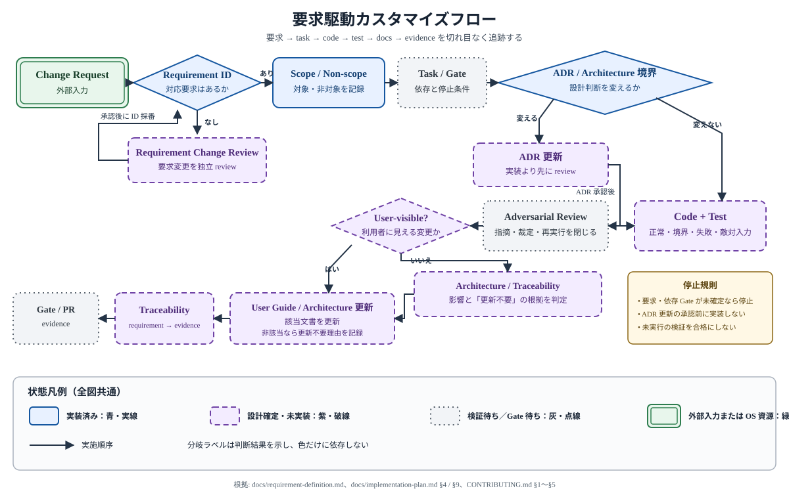

# AutoVision Studio 開発・カスタマイズガイド

> **機能状態:** 検証待ち
>
> **文書成熟度:** 構成のみ
>
> **要求基準:** [`requirement-definition.md`](requirement-definition.md) v0.4 Draft
>
> **対象者:** AutoVision Studio を要求定義に沿って変更・検証するソフトウェアエンジニア

現行 source と対象 test がある領域は `実装済み`、要求または ADR だけがある領域は `設計確定・未実装` として各節で区別します。Version 1 の toolchain、build、test、release は Windows 11 24H2 以降の x64 だけを対象とします。macOS の Python、MPS、CoreML、camera permission、PKG、署名、notarization、servicing は将来 backlog であり、現行の検証要件または対応表明ではありません。

## 文書規約

- 本文は日本語を基本とし、パス、コマンド、symbol、要求 ID は原文表記を維持します。
- `Project`、`Dataset Revision`、`Training Run`、`Model Version`、`Model Suggestion`、`Ground Truth`、`Copy モード`、`Reference モード` は[ユーザーガイドの用語集](users-guide.md#用語集)を正本とします。
- 機能状態には `実装済み`、`設計確定・未実装`、`検証待ち`、`対象外` だけを使用します。
- 文書成熟度には `構成のみ`、`要求反映済み`、`実測済み` だけを使用します。
- repository 内のリンクは、リンク元 Markdown からの相対パスで記述します。
- 本文の `src/main/` などの `/` は repository 相対 path の表記であり、runtime の path separator や macOS 対応を表明しません。Version 1 の command と実機 path 検証は Windows の `\`、drive、junction、symlink 境界を対象とし、実装では `node:path` または `pathlib` を使って separator を文字列連結しません。
- 図は repository root の [`images/`](../images/) に置く standalone SVG とし、状態を色だけで区別しません。
- 現行実装と目標設計を同じ文で混同せず、未実装の UI 文言、操作、保存先、所要時間を断定しません。

## 情報の優先順位

1. [`requirement-definition.md`](requirement-definition.md) — 製品要求と scope の正本
2. [`implementation-plan.md`](implementation-plan.md) — task、依存関係、Gate の正本
3. [ADR](adr/) — process、data、packaging の設計判断
4. [`architecture.md`](architecture.md) — 現行 source と目標設計の案内
5. [`../CONTRIBUTING.md`](../CONTRIBUTING.md) — 変更規模、toolchain、検証の規約

矛盾を発見した場合、実装に都合よく解釈せず、正本の変更を独立したレビューへ提出します。

## 開発環境

| 対象 | 必須 version / 条件 |
|---|---|
| Windows shell | 最新の PowerShell 7+ Core。Windows PowerShell 5.1 へ fallback しない |
| Node.js | `24.19.x` |
| npm | exact `12.0.0` |
| uv | exact `0.12.9` |
| Windows Python | CPython 3.14（3.14.1 を除く）x64 |

root `package.json` と `ml/pyproject.toml` にある Version 1 Windows 制約を正本とします。system npm が 12.0.0 以外なら Node 検証を継続しません。既存 lock、dependency adoption record、PoC result に残る macOS 3.13 arm64 の調査結果と `NOT_RUN` は履歴として保持しますが、Version 1 の必須環境、依存 lock の合格条件、build / test / release Gate には数えません。CoreML、MPS、camera permission、PKG、Developer ID 署名、notarization の検証は現行手順では実行も要求もせず、将来 macOS 対応時に新しい要求と実機証拠で再検証します。

### 依存復元

Node dependency は repository root で exact npm 12.0.0 の `npm ci` を使用します。`npm install`、`npx`、`npm exec` で lock 外 package を暗黙取得しません。

Python dependency は `ml/` を作業 directory とし、exact uv で lock を確認してから同期します。通常の接続環境では `uv lock --check --system-certs` と `uv sync --locked --system-certs` を使用します。既存 cache だけで再現する検証では `--frozen --offline` を使用できるものの、通常手順の代替として固定しません。

### 最小検証

Version 1 の最小検証は Windows で実行します。repository root の既存 package scripts は次の三つです。

```text
npm test
npm run typecheck
npm run build
```

`npm test` は product version checker、Node test、Vitest を順に実行します。`npm run build` は version checker の後で Main、Preload、Renderer を build します。`start`、`dev`、`lint` script は現在の `package.json` にないため案内しません。

`ml/` では次を実行します。

```text
uv lock --check --system-certs
uv sync --locked --system-certs
uv run --locked --system-certs pytest -q
uv run --locked --system-certs ruff check src tests
uv run --locked --system-certs ruff format --check src tests
..\node_modules\.bin\pyright.cmd
```

最後の command は Windows の repository root にある lock 済み Pyright を `ml/` から呼び出す path です。別 OS 向けの separator 読み替えは Version 1 の検証手順ではありません。Pyright は package を自動取得しません。

### VS Code / Pylance

interpreter は `ml/.venv` を選択します。system Python を選択した状態の import diagnostic を project dependency 不足の証拠にしません。Python command、pytest、Ruff は repository root ではなく `ml/` から実行します。

`ml/pyproject.toml` の Pyright `pythonVersion = "3.13"` と Ruff `target-version = "py313"` は、過去の両 OS dependency lock 調査から保持している保守的な共有 code target です。これは macOS を Version 1 の検証対象または対応 OS とする設定ではありません。Version 1 の runtime 適合は uv の Windows environment marker と Windows CPython 3.14 での pytest により別に確認し、検証時に静的 target を手動変更しません。将来 macOS lane では Python version、wheel、静的 target を改めて決定します。

### 2026-09-04 の再検証状態

- PowerShell 7.6.5 Core、Node.js 24.19.0、uv 0.12.9 を確認しました。
- `uv sync --frozen --offline`、pytest（4 passed）、Ruff、Pyright（0 errors / 0 warnings）は合格しました。
- system npm 11.17.0 は検証に使用せず、承認済み Microsoft proxy metadata と artifact digest を照合して一時展開した npm 12.0.0 を使用しました。
- `npm test`（64 tests）、`npm run typecheck`、`npm run build`（Main / Preload / Renderer）は合格し、`package.json` と `package-lock.json` の hash は不変でした。nested `npm run` も同じ版を使うよう npm 12.0.0 の shim directory を `PATH` の先頭へ置きました。

## Source tree と entry point

| 領域 | 現行 entry / 正本 | 役割 |
|---|---|---|
| Electron Main | `src/main/index.ts` | app lifecycle と secure main window を接続 |
| Main lifecycle | `src/main/app-lifecycle.ts` | single instance、window lifecycle、OS 終了分岐 |
| Window security | `src/main/window.ts`, `src/main/security.ts` | BrowserWindow security と navigation 制限 |
| Preload | `src/preload/index.ts` | versioned `AppApi` の限定公開 |
| Shared contract | `src/shared/contracts/app.ts` | Main / Preload / Renderer 境界の型 |
| Renderer | `src/renderer/main.tsx`, `src/renderer/App.tsx` | React root と navigation shell |
| Routes | `src/renderer/routes.tsx` | 11 route。各 feature は見出しだけ |
| Python worker | `ml/src/autovision_ml/cli.py` | 現在は `health` command だけ |
| Model governance | `resources/models/manifest.json` | 承認済み同梱 model の fail-closed 正本。現在は空 |

production source と `spikes/` を混同しません。`spikes/` は PoC、root `build/` は検証 harness / 生成物、`work/` は時点計画です。

## アーキテクチャと信頼境界

[`architecture.md`](architecture.md)を参照してください。

## 要求駆動のカスタマイズ

変更は次の 12 段階を順に実施します。要求、Gate、境界、検証のいずれかが未確定なら後続へ進まず、実行していない検証を合格扱いにしません。



- **目的・読み方:** 上段を Change Request → Requirement ID → Scope / Non-scope → Task / Gate → ADR / Architecture 境界と進み、右から下段へ折り返して Code + Test → Adversarial Review → 文書判定 → Traceability → Gate / PR evidence と読みます。矢印は実施順序と戻り先であり、図自体は code、test、Gate 合格の証拠ではありません。
- **状態:** 青・実線は既に確立した `実装済み` の要求識別 / 境界判断、紫・破線は変更ごとに実施する `設計確定・未実装` の活動、灰・点線は task、review、Gate の `検証待ち`、緑・二重枠は外部入力である Change Request です。色だけでなく枠線と node / 分岐ラベルを併読します。
- **主要ノード・フロー:** 対応要求があれば対象 / 非対象、依存 task / Gate、ADR 影響を確定してから code と正常・境界・失敗・敵対入力の test へ進みます。その後、敵対的レビュー、user-visible 判定、architecture / traceability 判定を経て証拠を閉じます。
- **境界・根拠:** 要求 ID がなければ独立した Requirement Change Review へ戻し、長期的な architecture 決定を変える場合は実装前に ADR review を完了します。依存 Gate が未確定のまま進めず、非 user-visible 変更でも architecture / traceability の更新要否を判定し、未実行検証を合格へ読み替えません。正本は [要求定義](requirement-definition.md)、[実装計画の task / Gate / traceability](implementation-plan.md)、[ADR-0001〜0003](adr/)、[`CONTRIBUTING.md`](../CONTRIBUTING.md)です。

1. [`requirement-definition.md`](requirement-definition.md) から対象の `FR-*`、`NFR-*`、`UI-*`、`POC-*` ID を特定し、要求文と受入条件を引用できる状態にする。
2. 対象要求と非対象要求を一行ずつ記録し、MVP 非対象、将来拡張、無関係な refactoring を変更へ混在させない。
3. [`implementation-plan.md`](implementation-plan.md) の対応 task、入力、出力 file、依存 task、Phase Gate、予定する検証を確認し、依存が未合格なら停止する。
4. [ADR-0001](adr/0001-process-architecture.md)〜[ADR-0003](adr/0003-packaging.md) と [`architecture.md`](architecture.md) から、責務を置く process、信頼境界、データ所有者、OS 境界を決める。ADR の目標設計を現行実装と誤認しない。
5. 対応要求がない変更は実装せず、要求定義の変更を独立した review として先に提案する。要求追加を実装 task のついでに行わない。
6. [`../CONTRIBUTING.md`](../CONTRIBUTING.md) の上限に従い、一つの要求 group、一つの観測可能な挙動、通常 1〜3 production file と 1〜2 test file へ分割する。migration と repository、backend と UI、分類と検出は原則別 task とする。Version 1 の Windows 変更と Future macOS backlog は同じ task に含めない。
7. `shared contract → Main backend または Python worker → Preload bridge → Renderer` の順に、必要な層だけを変更する。Renderer から filesystem、SQLite、raw IPC、Python へ直接到達する経路や、worker から SQLite を更新する経路を作らない。
8. 正常系に加え、境界値、失敗経路、敵対的入力を対象 test に追加する。特に sender / payload / path、状態遷移、不変データ、Reference 元、未確認 Model Suggestion、worker 異常終了を対象要求に応じて確認する。
9. 対象 test と editor diagnostics を先に確認し、変更範囲に応じて type check、Node / Python の全 test、build を実行する。実行環境、command、終了 code、結果要約を記録し、対象 test 合格前に依存 task を開始しない。
10. user-visible な変更は実装と実測の完了後、同じ縦スライスの DOC task で [`users-guide.md`](users-guide.md) の該当節を更新する。未実装の UI 文言、手順、保存先、所要時間を推測で確定しない。
11. `requirement → implementation task → code → test → docs → evidence` の参照を更新する。process、信頼境界、データ不変性、packaging の決定を変える場合は実装より先に ADR を追加または更新し、既存決定内の局所変更なら不要な ADR を作らない。
12. test 合格後に敵対的レビューを行い、scope creep、境界条件、失敗経路、敵対入力を再確認する。指摘、裁定、修正、再実行結果を閉じ、DoD と PR 証拠が揃ってから後続 task または Gate へ進む。

## 変更種別ごとの影響範囲

要求 ID と実装計画の task 行を起点に、次の範囲を判定します。表の path は責務の配置先であり、未作成の path を実装済みとは扱いません。

| 変更種別 | 主な影響範囲 | 必須確認 |
|---|---|---|
| Renderer の画面・操作 | `src/renderer/`。表示、一時 draft、keyboard / focus / screen reader、200% 拡大、Error / Warning、進捗と cancel 表示 | 対応する `UI-01〜11`、`NFR-UX-001〜004`、機能要求を結び、role / label を用いた対象 UI test と user-visible 文書更新を判定する。Main、filesystem、Python を直接呼ばない |
| Preload API と shared contract | `src/preload/`、`src/shared/contracts/`、対応する Main IPC handler | API / worker の version、runtime schema、sender と payload の拒否、Main・Preload・Renderer 間の contract test を同じ変更単位で確認する。raw `ipcRenderer`、任意 path、child process を公開しない（FR-SEC-006） |
| Main service・SQLite migration・ファイル操作 | `src/main/`。Main が唯一の SQLite writer、OS 権限、job lifecycle、Project file、checksum、atomic commit を所有 | migration と利用 repository を分離し、順序、transaction、backup / rollback、同一 Project の排他、path / symlink 越境、Copy / Reference の非破壊境界、不変な Dataset Revision / Model Version を確認する（FR-SEC-009、NFR-REL-002〜004） |
| Python worker command | `ml/src/autovision_ml/` と対応する `ml/tests/`。job 単位 CLI、versioned JSON / NDJSON、成果物の一時出力 | command allowlist、schema version、stdout / stderr 契約、cancel / 異常終了、決定性、offline、画像や機密 path を診断へ出さないことを確認する。SQLite 更新、network download、常駐 HTTP server を追加しない（FR-TRN-002、FR-TRN-019、FR-AST-018） |
| model・dependency・license | `resources/models/manifest.json`、`docs/model-governance/`、lock file、[`dependency-policy.md`](dependency-policy.md) と採用記録 | code、checkpoint、学習データ、transitive dependency、NOTICE、取得元、hash、intended use、再配布条件を分離して審査する。Gate 2 前の未承認 model、unknown / 非商用条件、lock 外取得、実行時 download を製品経路へ入れない（FR-LIC-001〜015、NFR-MNT-001） |
| Version 1 toolchain / build / test | Windows 11 24H2 以降 x64、PowerShell 7+ Core、Node.js 24.19.x、npm 12.0.0、uv 0.12.9、Windows CPython 3.14（3.14.1 を除く）x64、root / `ml/` の各 lock | [最小検証](#最小検証)を Windows で実行し、command、tool version、exit code、test 件数、lock 不変性を記録する。macOS の dependency、wheel、build、test は Version 1 evidence に要求しない |
| Version 1 Windows packaging / release | Windows x64 の PyInstaller onedir、Electron / NSIS、全 PE、署名、installer / servicing test。詳細は ADR-0003 と `PKG-*` | Windows 上で freeze / package し、自己完結・offline、per-user、payload / SBOM / hash、Authenticode と timestamp、clean install、repair、upgrade、rollback、uninstall、Project 保持を Windows 実機 evidence で確認する（FR-INS-001〜020、NFR-INS-001〜008） |
| Future macOS backlog | 保持済みの Python 3.13 arm64、PyInstaller、MPS / CoreML、camera permission、flat PKG、Developer ID、notarization、servicing の lock 調査・技術調査・`NOT_RUN` 記録 | Version 1 の実装、必須確認、Gate、DoD、release blocker に含めない。既存記録を削除または PASS へ変更せず、将来 scope 化された時点で要求、toolchain、path、wheel、実機、署名、配布試験を新規に確定する。Windows evidence を macOS evidence へ転用せず、将来対応を主張しない |

複数行に該当する変更でも、共有 contract、migration、model manifest、共通 package 設定を同時編集する task は並列化しません。分類と検出は shared contract 固定後、出力 file が重ならない場合だけ並列化します。Version 1 の Windows task と Future macOS backlog を同じ変更または完了判定へ混在させません。

## 検証と Definition of Done

### 検証の選択と順序

1. 隣接する unit / integration test と、実装計画の task 行に指定された対象 test を実行する。
2. VS Code diagnostics と対象言語の lint / type check を確認する。Node 側は `npm run typecheck`、Python 側は `ml/` から Ruff、Pyright を実行する。
3. 変更した実行境界を Windows build で確認する。Node 側の全 entry は `npm run build` を使用し、個別 `build:*` を release gate の代替にしない。Python package / installer は Version 1 の Windows `SPI-*` / `PKG-*` task と Gate が要求するときだけ Windows 上で実行する。
4. task の対象 test が合格した後、Phase Gate で Node は `npm test`、Python は `ml/` から pytest を含む[最小検証](#最小検証)を Windows で広く実行する。文書だけの変更へ無関係な ML / installer 実機試験を追加せず、Future macOS backlog の試験を Version 1 Gate へ追加しない。
5. test 後の敵対的レビューで、対象外機能の混入、空または不正 payload、不正 sender / path、違法な状態遷移、partial write、worker failure、Reference 元の変更・削除、未承認 model / dependency、OS 間の証拠代用を変更内容に応じて確認する。修正した場合は対象 test、diagnostics、指摘項目を再確認する。

Version 1 の Windows 環境不足、未承認 dependency / model、未合格 Gate、正式な Windows 署名 identity の不在により実行できない必須検証は `未実行` または `BLOCKED` とし、理由と解除条件を残します。native Mac、Apple signing identity、notarization credential の不在は Version 1 blocker ではありません。設計文書、command の存在、過去の macOS lock 調査や `NOT_RUN` だけを Windows 合格証拠にしません。

### 文書と ADR

- user-visible な挙動、Error / Warning、権限、データ保持・削除、ライセンス表示、インストール／servicing が変わる場合は、実測後に `users-guide.md` の対応節と要求 ID を更新します。
- source の責務、依存方向、信頼境界、データフロー、現行実装対応が変わる場合は `architecture.md` を更新します。予定 path と実在 path を区別します。
- ADR-0001 の process / IPC / trust boundary、ADR-0002 の所有権 / 不変性 / commit / 削除境界、ADR-0003 の build tool / bundle / OS native build / 署名 / servicing を覆す、または新しい長期的制約を導入する変更は、実装前に ADR を追加または更新します。承認済み決定をそのまま実装する局所変更や、容易に戻せる UI 詳細だけを理由に ADR を増やしません。
- 要求自体を変える場合は要求変更を独立 review とし、実装計画、traceability、影響する guide / ADR を再確認します。

### Definition of Done

次をすべて満たした task だけを完了とします。

- 対象要求、非対象、task ID、依存 Gate、観測可能な一挙動が明記され、依存 task が合格している。
- 変更は責務境界と task の出力 file 内に収まり、不要な抽象化、依存、設定、将来機能を追加していない。
- 正常、境界、失敗、敵対入力の対象 test があり、対象 test、diagnostics、必要な lint / type check / build が合格している。
- 不変データ、Reference 元、ローカル／offline、IPC / Windows path、model / dependency / license、Windows 固有境界への影響を判定し、Version 1 の該当 Gate を満たしている。Future macOS backlog の未実施項目を DoD または blocker に含めていない。
- user-visible 変更の `users-guide.md`、構造変更の `architecture.md`、決定変更の ADR、requirement から evidence までの参照が必要に応じて更新されている。
- 敵対的レビューの全指摘が修正または根拠付きで裁定され、修正後の再検証で閉じている。
- 実行していない Version 1 Windows 項目は未実行として明示され、waiver や blocker を成功へ読み替えていない。保持済み macOS 調査と `NOT_RUN` は履歴のままであり、Version 1 の分母、失敗、waiver、PASS のいずれにも数えていない。

### PR に残す証拠

commit message には task ID を含め、PR description または review comment には次を残します。

- 対象／非対象の requirement ID、実装 task、依存 Gate。
- 完了条件ごとの code / test / docs の対応と、変更 file の責務。
- 実行した command、Windows version / x64、主要 tool version、終了 code、test 件数または結果要約。CI や Windows 実機 Gate がある場合はその log / record への参照。
- build、性能、offline、署名、payload、SBOM、model hash / license など task が要求する実測値または判断記録。未実行項目は理由と解除条件。
- 敵対的レビューの観点、指摘、裁定、修正内容、再実行結果。
- user guide / architecture / ADR / traceability の更新有無と、更新不要の場合の理由。
- Future macOS backlog に触れる場合は、履歴調査または `NOT_RUN` であること、Version 1 の Gate / DoD / release blocker ではないこと、将来 support を主張しないこと。
