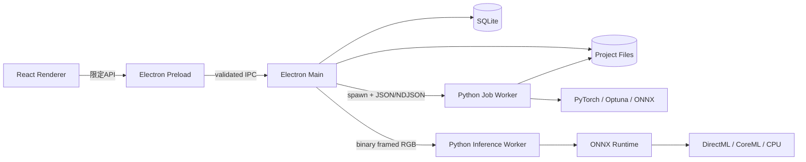
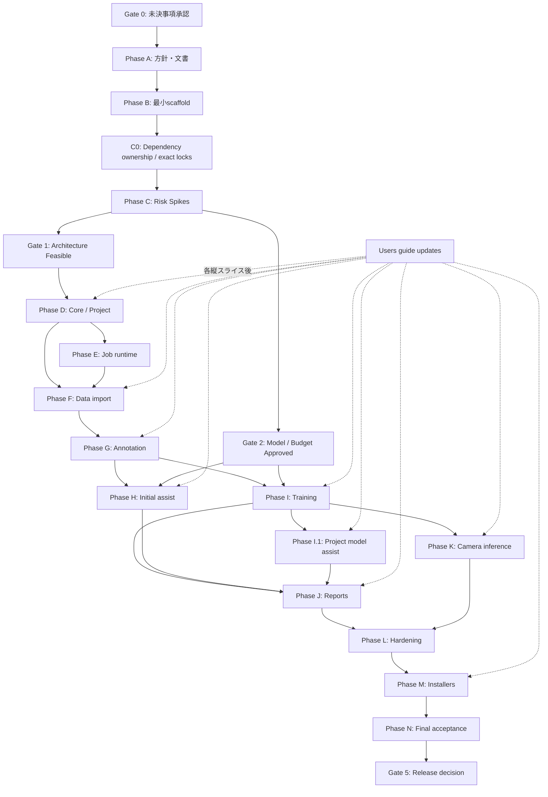

# AutoVision Studio 詳細実装プラン

| 項目 | 内容 |
|---|---|
| 文書バージョン | 0.2 Draft |
| 作成日 | 2026-09-02 |
| 対象 | Version 1（MVP） |
| 状態 | **デフォルト決定承認済み・実装中** |
| 要求基準 | `docs/requirement-definition.md` v0.3、914 行、SHA-256 `2f1c57da192710ffb2fd764c7e342cf2e9106fa7387be7393133873cc815052f` |
| 実装開始条件 | 2026-09-02 にユーザーが全デフォルト案の採用と全タスク実行を指示（充足済み） |

> D-01〜D-19 はデフォルト案を採用する。検証できない事項は成功扱いにせず、該当 Gate を停止する。

## 1. 調査結果と計画の前提

### 1.1 リポジトリの実在状態

2026-09-02 時点で確認できた実在ファイルは `.gitignore`、`LICENSE`、`README.md`、未追跡の `docs/requirement-definition.md` である。アプリケーションコード、テスト、ビルド設定は存在しない。

- 指定された `hve-dev/requirement-definition.md` は存在しない。
- 実在する要求定義は `docs/requirement-definition.md` v0.3 のみである。
- `users-guide` を名前に含む文書は存在しない。
- `copilot-instructions.md` および `.github/copilot-instructions.md` は存在しない。したがって、現時点で無視対象となる `## §0 最優先ルール（認知プライミング）` も存在しない。
- `docs/` は Git 上で未追跡である。

この計画では、捏造を避けるため、実在する `docs/requirement-definition.md` を唯一の要求基準として扱う。パス差異は D-01 でレビュー対象とする。

### 1.2 `users-guide` 更新要否の調査結論

**必要である。新規作成が必要。**

理由は、利用者が操作する次のフローが要求されているためである。

- OS 別インストール、初回診断、アップグレード、アンインストール（FR-INS-001〜020）
- Project CRUD（FR-PRJ-001〜010）
- Copy/Reference 取り込み（FR-DAT-001〜016）
- 分類ラベルと検出矩形の作成（FR-ANN-001〜014、FR-ANN-101〜107、FR-ANN-201〜209）
- モデル候補の確認・修正（FR-AST-001〜020）
- AutoML、版管理、レポート（FR-TRN、FR-MOD、FR-REP）
- カメラ権限と推論（FR-INF-001〜019）

最終段階で一括執筆すると実装との乖離が起きやすいため、`docs/users-guide.md` を初期段階で作り、各ユーザー向け縦スライスの完了時に該当節だけ更新する。

### 1.3 オーバーエンジニアリング防止ルール

1. MVP は single-label multi-class 分類と axis-aligned rectangle 検出だけに限定する。
2. Cloud API、認証、共同編集、プラグイン、汎用ワークフローエンジンは作らない。
3. Strategy/Factory/DI container/汎用 repository framework は導入しない。
4. 分類と検出で実装が異なる箇所は、明示的な2モジュールに分ける。未採用モデル向け抽象層は作らない。
5. Redux 等の全体状態管理は導入せず、React state と画面単位の hooks を使う。必要性が実測で生じた場合のみ別タスクを起票する。
6. DB ORM は導入せず、少数の SQL migration と機能別 repository を使う。
7. Python worker はジョブ単位の CLI process とし、常駐 HTTP server、localhost API、message broker は作らない。
8. モデルを実行時 download しない。未承認 checkpoint の placeholder を製品経路へ入れない。
9. エラー処理は要求された失敗経路と実際に再現した失敗に限定する。
10. 各タスクで関係のないリファクタリング、先行する将来拡張、未使用フラグを追加しない。

### 1.4 現在の実行環境による制約

現在確認できる作業環境は Windows だけである。macOS arm64 の build、MPS/CoreML、camera permission、Developer ID署名、notarization、PKG/Gatekeeper試験は Windows 上で合格扱いにしない。SPI-04/06/08/09/19、macOS側のPKG task、Gate 1/4/5には、別途 native Apple Silicon Mac と正式なApple署名identityが必要である。

## 2. 不明点・選択肢・デフォルト

実装開始前にユーザーが変更しない限り、次のデフォルトを採用する。`必須決定` は該当 Gate より前に確定しなければならない。

| ID | 不明点 | 選択肢 | デフォルトの選択肢 | デフォルトを選ぶ理由 | 決定期限 |
|---|---|---|---|---|---|
| D-01 | 要求定義の正しいパス | A. 実在する `docs/requirement-definition.md` / B. `hve-dev/` へ移動 / C. 別ファイルを提示 | **A** | 現在実在し、v0.3・229要求・出典S1〜S55を持つ唯一の文書だから。存在しない文書を参照したとは扱えない。 | 実装開始前・必須決定 |
| D-02 | Desktop stack | A. Electron+React+TypeScript / B. Tauri / C. OS native 2実装 | **A** | 要求定義 §13 の参考構成と整合し、camera/file/desktop packaging を単一 UI codebase で扱える。Electron security checklist は公式に公開されている [P01]。 | Gate 0 |
| D-03 | SQLite の所有 process | A. Electron main の `better-sqlite3` / B. 常駐 Python `sqlite3` service / C. Electron 同梱 Node の `node:sqlite` | **A** | 単一利用者・小規模 metadata に対して、常駐 service と追加 IPC を避けられる。native addon の packaging 可否は先に SPI-01 で検証する [P10]。 | Gate 1 |
| D-04 | Annotation editor | A. React-Konva で task-specific 実装 / B. Label Studio 組込み / C. CVAT 組込み | **A** | MVP は classification choices と axis-aligned rectangles に限定される。Konva は選択、drag、resize、境界制約、zoom/pan の公式例を持ち [P06]、server/認証/不要機能を同梱しない。 | Gate 1 |
| D-05 | Installer build tool | A. `electron-builder` / B. Electron Forge / C. WiX+個別macOS scripts | **A** | NSIS EXE、macOS PKG、`extraResources`、署名/notarization を同じ設定系で扱える [P02][P03][P04]。 | Gate 1 |
| D-06 | Python bundle 形式 | A. PyInstaller `onedir` を installer へ内包 / B. PyInstaller `onefile` / C. Python runtime をそのまま同梱 | **A** | top-level installer は1ファイルのまま、worker 起動ごとの展開を避けられる。PyInstaller は `onedir` を既定とし、`onefile` は起動時展開を行う [P05]。 | Gate 1 |
| D-07 | Camera frame → inference process | A. 固定サイズRGB binary pipe / B. localhost HTTP / C. custom-built `onnxruntime-node` | **A** | network listener を作らず、macOS CoreML を公式 Python package で検証できる。Node binding の公開 matrix は macOS CoreML を明示保証していない [P08]。10 Hz 可否は SPI-07〜09 で測定する。 | Gate 1 |
| D-08 | Curated/Assist model | A. 要求定義候補から法務・PoC 合格モデルを選定 / B. 未監査モデルで先行実装 | **A（fail closed）** | 要求定義 §13.3 は承認済み Assist Model がないと明記する。モデル固有実装は checkpoint、学習データ由来、再配布、品質の承認後にのみ開始する。 | Gate 2・必須決定 |
| D-09 | 承認済み model binary の保管 | A. build machine の `vendor/models/` に手動配置し hash 検証 / B. Git LFS / C. build 時自動 download | **A** | runtime/build の暗黙通信を避け、大容量 binary を通常 Git 履歴へ入れない。追跡対象は manifest と証拠文書だけにする。 | Gate 2 |
| D-10 | Product identity | A. `io.github.dahatake.autovisionstudio` / B. 所有 domain ベース / C. 別 ID | **A（暫定）** | repository owner を基に衝突しにくい。署名、macOS TCC、upgrade identity に影響するため正式 build 前に確定が必要。 | Gate 3・必須決定 |
| D-11 | CI/release 実行場所 | A. local/self-hosted Windows+Mac / B. GitHub-hosted CI / C. hybrid | **A** | Cloud 不使用を最も厳格に守り、model/signing key を外部 runner へ置かない。Apple notarization だけは要求定義 §3.3 の配布工程例外とする。 | Gate 1 |
| D-12 | Update | A. 新しい署名済み installer を手動実行 / B. online auto-updater | **A** | MVP は更新確認と runtime 通信を禁止する。in-place upgrade は新 installer の実行で満たす。 | Gate 0 |
| D-13 | Chart UI | A. 小さな React chart dependency / B. 自前 SVG | **A** | loss/PR curve、混同行列、tooltip、accessibility を自作する範囲を抑える。採用 package は依存監査タスクで1つに固定する。 | REP phase 前 |
| D-14 | User guide path | A. `docs/users-guide.md` / B. `users-guide/` directory | **A** | 現在の文書が `docs/` にあり、単一日本語 MVP guide で十分だから。 | Gate 0 |
| D-15 | AutoML の最大 Trial/時間 | A. 実機 mini-run 後に versioned policy を確定 / B. 根拠なく固定値を置く | **A** | 要求定義 TBD-03 が未決であり、測定前の数値を捏造しないため。Gate 2 の実測後まで model training 実装を固定しない。 | Gate 2・必須決定 |
| D-16 | Windows/macOS release signing identity | A. 組織の正式証明書 / B. test/ad-hoc のまま出荷 | **A** | FR-INS-008/010 が正式署名を必須とする。証明書名・保管方法はユーザー提示が必要。 | Gate 5・必須決定 |
| D-17 | Node/Electron/Python の版 | A. 実装開始時に全採用依存が公式対応する安定版を調べ、exact lock / B. 現時点で未検証の版番号を固定 | **A** | 実装前の空 repository で互換性未確認の版を捏造しない。B-01/B-11 で基盤を固定し、Phase C で初めて必要になる依存と B-13 品質ツールの所有権不足は C0 で是正する。C0 後の変更は各採用 task に明記された場合だけ許可する。 | B-01/B-11、Phase C 前の C0 |
| D-18 | UI component | A. semantic HTML/native control を先に使い、不足する操作だけ1つの headless libraryを追加 / B. UI kit 全体を先行導入 | **A** | 現在必要と判明しているのは dialog/table/tab 等に限られ、全 UI kit の先行導入は YAGNI になる。追加時は対象操作、accessibility、licenseを個別に検証する。 | 各 UI task 前 |
| D-19 | Reference モードの永続アクセス | A. absolute path+file identity+hashを保存し、起動後に再検証・必要時relink / B. macOS App Sandbox/bookmarkを前提化 / C. Copyだけに制限 | **A（PoC 条件）** | direct-distribution の非 sandbox app を前提とし、要求された非破壊参照を最小構成で満たす。ただし Windows/macOS の再起動後アクセスを SPI-19 で実証できなければ再決定する。 | Gate 1 |

## 3. デフォルト実装アーキテクチャ

### 3.1 Process 境界

- Renderer は filesystem、Node、Electron raw API、Python process へ直接アクセスしない。
- Preload は画面ごとに必要な narrow API だけを公開する。
- Main は window、permission、path、SQLite、job lifecycle、atomic commit を担当する。
- Python worker は DB を直接変更しない。入力 JSON と immutable Dataset Revision を読み、成果物 JSON/file を作る。Main が成功後に DB transaction で commit する。
- 長時間処理は job ごとに別 process とし、常駐 local server を作らない。
- Camera inference だけは session warm-up のため専用 process を推論画面の間だけ維持する。

### 3.2 最小 dependency 方針

| 領域 | デフォルト | 導入理由 | 導入しないもの |
|---|---|---|---|
| UI | Electron, React, TypeScript, Vite | Desktop UI と build | Next.js、SSR、web server |
| Desktop package | electron-builder | NSIS EXE、PKG、resources、signing [P02]〜[P04] | 複数 installer framework |
| UI components | semantic HTML/native control。必要性を test で示した操作だけ1つの headless library | 依存を先行追加せず accessibility を満たす | UI kit 全体、複数 UI kit |
| Rectangle editor | Konva + react-konva | pointer hit-test、drag/resize、zoom [P06] | generic design canvas |
| Renderer state | React hooks | 画面単位 state で足りる | Redux、MobX、global event bus |
| IPC validation | Zod | untrusted inputのruntime parseとTypeScript型推論を1 schemaで行い、依存0・MIT [P14] | schema code generator |
| Metadata | better-sqlite3 + hand-written SQL | server 不要、transaction、少量 metadata [P10] | ORM、remote DB |
| Python env | uv + `uv.lock` | cross-platform lock と exact sync [P11] | 複数 Python manager |
| Python bundle | PyInstaller onedir | Python 不要の配布、OS別 build [P05] | runtime pip install |
| ML | PyTorch, Optuna, ONNX Runtime | 要求定義で調査済み [RD §13] | ML framework の複数併用 |
| TS test | Vitest + React Testing Library + Playwright Electron | Vite/TS単体testとrole中心のuser操作test [P15][P16]、desktop E2E。Electron automationはexperimentalなのでpackage testを併用 [P09] | browser-only E2E への依存 |
| Python test | pytest | worker/domain unit test | notebook を test runner に使用 |

### 3.3 Worker protocol

- Control input: versioned JSON file (`schemaVersion`, `jobId`, `projectId`, command-specific payload)。
- Progress: stdout の NDJSON (`started`, `progress`, `warning`, `completed`, `failed`)。
- Diagnostics: stderr。画像本体や機密 path は出力しない。
- Result: job directory に JSON と artifact を一時出力し、Main が hash 検証後に rename/DB commit。
- Camera: 4-byte payload length + compact header + fixed-shape RGB bytes。結果は NDJSON。仕様は SPI-07 の実測に合格した場合のみ確定する。

汎用 RPC framework、HTTP、WebSocket、protobuf codegen は導入しない。

## 4. タスク粒度と実行規約

### 4.1 1タスクの上限

通常タスクは次を上限とする。

- production file: 1〜3
- test file: 1〜2
- documentation section: 1
- requirement group: 1つ
- 完了条件: 観測可能な1挙動

上限を超える場合は開始前に分割する。migration とそれを使う repository、backend と UI、Windows と macOS、分類と検出は原則として別タスクにする。

### 4.2 各タスクで読む Context Pack

各タスク開始時に読むものを次だけに限定する。

1. 対象 requirement ID
2. 依存 ADR の該当節
3. 編集対象 file 全文
4. 直接 import 先/元
5. 隣接 test

全 repository の再読込は phase gate のときだけ行う。

### 4.3 各タスクの完了手順

1. 対象要求と非対象を再確認。
2. 1挙動だけ実装。
3. その挙動の unit/integration test を追加。
4. Type/lint/editor diagnostics を確認。
5. 対象 test だけ実行。
6. user-visible 挙動なら `docs/users-guide.md` の該当節を更新する別 DOC タスクを続ける。
7. phase gate で初めて広い suite を実行する。

### 4.4 タスク表の入出力の読み方

- **入力:** `依存` 欄にある task/gate の合格成果物と、対応 requirement ID である。
- **出力:** `作成・編集 file` 欄に列挙した file だけである。未記載 file のついで編集は禁止する。
- **検証:** 同じ行の test file と `完了条件` を満たす最小 test である。test file が未記載の文書判断 task は、一次資料 URL、取得日、hash または判断記録を review する。
- **並列性:** 依存が完了し、出力 file が重ならない task だけを並列実行できる。表中の範囲依存（例: `SPI-01〜17`）は全 task 完了を意味する。
- **要求対応:** §9 の計画時 traceability map を入力とする。実装完了を意味する最終 traceability は FIN-01 で test evidence と共に確定する。

## 5. 依存関係と並列実行設計

### 5.1 並列 lane

- **Lane UI:** Renderer、annotation、report、camera display。
- **Lane Core:** Main process、SQLite、IPC、job supervisor。
- **Lane ML-Class:** classification import/assist/train/export/evaluate。
- **Lane ML-Detect:** COCO/rectangle assist/train/export/evaluate。
- **Lane Release-Windows / Release-macOS:** OS 別 freeze/sign/package/test。
- **Lane Docs:** user guide と ADR。実装より先走らず、完成済み挙動だけ記載。

同じ migration、shared contract、model manifest を編集するタスクは並列にしない。分類・検出は shared contract が固定された後のみ並列化する。

## 6. Phase Gate

| Gate | 合格条件 | 不合格時 |
|---|---|---|
| Gate 0 | D-01〜D-19 のレビュー完了。特に要求パス、stack、Cloud境界を承認。 | 実装開始しない。 |
| Gate 1 | Windows/macOS で Electron+SQLite、Python onedir、installer resource 同梱、Reference永続アクセス、RGB pipe、ORT provider、Konva PoC が成立。 | native Macがない間は未判定。失敗 component だけ代替案を再評価し、feature 実装へ進まない。 |
| Gate 2 | 分類/検出の Curated Base Weight と Assist checkpoint が法務・hash・実機品質 gate を通過し、AutoML budget を実測決定。 | 未承認モデルを同梱しない。manual annotation/core のみ継続可。 |
| Gate 3 | Project→Import→Annotation→Dataset Revision→Queued Run の縦スライスが両OSで成立。 | Training/assist の機能実装を開始しない。 |
| Gate 4 | Initial/Project model assist、Train→ONNX parity→Model Version→Report→Camera inference が分類・検出の両方で成立。 | package release を開始しない。 |
| Gate 5 | 署名 installer、offline clean install、upgrade/rollback、全受入条件、SBOM、users guide が合格。 | release 不可。 |

## 7. 詳細タスク

以下の file は将来タスクの成果物であり、現時点では存在しないものを含む。

### Phase A — 方針・基盤文書

| ID | タスク | 作成・編集 file | 依存 | 完了条件 / 根拠 |
|---|---|---|---|---|
| A-01 | 要求パスを確定し、要求基準 hash を固定 | `README.md`, `docs/implementation-plan.md` | Gate 0 | D-01 の決定を記録。存在しない path を参照しない。 |
| A-02 | Process architecture ADR | `docs/adr/0001-process-architecture.md` | A-01 | Renderer/Main/Python job/inference の責務と非採用案を記録。RD §13。 |
| A-03 | Data lifecycle ADR | `docs/adr/0002-data-lifecycle.md` | A-01 | Workspace→Ground Truth→Revision→Run→Model の不変性を固定。RD §5, §9。 |
| A-04 | Packaging ADR | `docs/adr/0003-packaging.md` | A-01 | electron-builder、PyInstaller onedir、OS別build、manual update を固定 [P02]〜[P05]。 |
| A-05 | Dependency/license policy | `docs/dependency-policy.md` | A-01 | 許可/禁止 license、追加手順、unknown fail を記録。FR-LIC。 |
| A-06 | Model adoption template | `docs/model-governance/adoption-template.md` | A-05 | code/checkpoint/data/terms/hash/quality の証拠欄を定義。FR-LIC-004/014。 |
| A-07 | Model manifest schema | `resources/models/manifest.schema.json`, `resources/models/manifest.json` | A-06 | 空の承認済み一覧から開始。未承認 model を登録しない。 |
| A-08 | User guide skeleton | `docs/users-guide.md` | A-01, D-14 | Install/Project/Data/Annotation/Training/Report/Camera/Troubleshooting 見出しだけ作成。 |
| A-09 | 開発・検証方針 | `CONTRIBUTING.md` | A-02, A-04 | 小タスク規約、Windowsはpwsh 7+、OS別test方針を記録。 |
| A-10 | 生成物と秘密情報の ignore 規則 | `.gitignore` | A-04 | `node_modules/`、Electron/Python出力、local Project/cache、`vendor/models/`、署名秘密を除外し、`package-lock.json`、`uv.lock`、`ml/packaging/*.spec` は追跡対象にする。既存の `build/` と `*.spec` 除外を確認してから例外を追加する。 |

### Phase B — 最小 scaffold

| ID | タスク | 作成・編集 file | 依存 | 完了条件 |
|---|---|---|---|---|
| B-01 | Node package 初期化 | `package.json`, `package-lock.json` | A-02 | Electron/React/TS/Vite の必要最小依存だけ lock。 |
| B-02 | TypeScript config | `tsconfig.json`, `tsconfig.main.json`, `tsconfig.renderer.json` | B-01 | Main/Preload/Renderer 境界が型検査可能。 |
| B-03 | Vite entry config | `vite.main.config.ts`, `vite.preload.config.ts`, `vite.renderer.config.ts` | B-02 | 3 entry を build できる。 |
| B-04 | Electron lifecycle | `src/main/index.ts`, `src/main/app-lifecycle.ts`, `src/main/app-lifecycle.test.ts` | B-03 | 起動・single instance・終了だけ動く。 |
| B-05 | Secure window | `src/main/window.ts`, `src/main/security.ts`, `src/main/security.test.ts` | B-04 | sandbox/contextIsolation/remote navigation deny [P01]。 |
| B-06 | Narrow preload shell | `src/preload/index.ts`, `src/shared/contracts/app.ts`, `src/preload/index.test.ts` | B-05 | raw IPC/Node を renderer に公開しない。 |
| B-07 | React entry | `src/renderer/index.html`, `src/renderer/main.tsx`, `src/renderer/App.tsx` | B-03 | Local content だけで window 表示。 |
| B-08 | Navigation shell | `src/renderer/routes.tsx`, `src/renderer/layout/AppShell.tsx`, `src/renderer/layout/AppShell.test.tsx` | B-07 | UI-01〜11 の空 route を作るが機能は作らない。 |
| B-09 | Base theme | `src/renderer/styles/tokens.css`, `src/renderer/styles/global.css` | B-07 | OS theme、focus、200% zoom の基礎。 |
| B-10 | TS test setup | `vitest.config.ts`, `tests/setup.ts` | B-01 | DOM/unit test 1件が通る。 |
| B-11 | Python project | `ml/pyproject.toml`, `ml/uv.lock` | A-05 | Python version と最小 dependency を lock [P11]。 |
| B-12 | Python package/health CLI | `ml/src/autovision_ml/__init__.py`, `ml/src/autovision_ml/cli.py`, `ml/tests/test_cli_health.py` | B-11 | `health` command が version/OS を JSON で返す。 |
| B-13 | Python quality config | `ml/pyproject.toml`, `ml/tests/conftest.py` | B-12 | pytest/Ruff/type check の対象を設定する。Ruff/Pyright実行packageのlock所有権は後続C0-PYTHONとする。 |

### Checkpoint C0 — Phase C 依存lock所有権の是正

C0 は完了済み B-01/B-11/B-13 の履歴を上書きせず、Phase C で初めて必要になる依存と、設定だけ存在して実行packageが未固定の品質ツールに所有者を与えるための**管理チェックポイント**である。下表の項目は §7 の正本253 taskには数えない。C0を `CLOSED` とするまでは SPI-01〜19を開始しない。

| 項目 | 作成・編集 file | 依存 | 完了条件 |
|---|---|---|---|
| C0-PLAN | `docs/implementation-plan.md`, `docs/dependency-adoption/c0-plan-review.md` | B-GATE 初回実行 | 本節、D-17、依存DAG、Phase C開始条件を整合させ、独立敵対レビューで成果物不足・循環依存・正本task数不変を確認し、指摘・裁定・修正・再確認を記録する。 |
| C0-NODE | `package.json`, `package-lock.json`, `docs/dependency-adoption/node-phase-c.md` | C0-PLAN | `better-sqlite3`、`electron-builder`、`konva`、`react-konva`について、必要性、安定版、Node/Electron/React・Windows x64/macOS arm64対応、直接/transitive license、脆弱性、native binaryを一次資料と実installで確認し、runtime/devを分けてexact lockする。 |
| C0-PYTHON | `ml/pyproject.toml`, `ml/uv.lock`, `docs/dependency-adoption/python-phase-c.md` | C0-PLAN | PyInstaller、PyTorch/TorchVision、Optuna、ONNX/ONNX RuntimeのOS別package、およびRuff/Pyrightについて、Python 3.14・Windows x64/macOS arm64 wheel、license、脆弱性、provider競合を確認し、CUDA/cuDNNを暗黙導入せずexact lockする。 |
| C0-REVIEW | `docs/dependency-adoption/c0-review.md` | C0-NODE, C0-PYTHON | lock差分・integrity/hash・OS marker・license・Critical/High・clean install・最小import/build smokeを独立敵対レビューする。指摘反映後のB-GATE実コマンド、環境、exit code、test件数、lock不変性とPASS/BLOCKED判定を同fileへ記録する。macOS実行をWindows結果で代替しない。 |

C0-NODE と C0-PYTHON は出力fileが重ならないため C0-PLAN のレビュー完了後に並列実行できる。各採用記録には、package、用途と代替不能理由、runtime/dev区分、候補と採用exact版、一次資料URL・取得日・文書/release版、直接/transitive licenseとNOTICE、脆弱性確認コマンド・結果、対象OS/architectureの配布artifact・hash、実install/smoke結果、review指摘・裁定を記録する。

採用版は調査時点の一次資料と実installで確定し、未指定の `latest`、`^`、`~`、未承認model binary、runtime downloadを入れない。PyInstallerの採否は採用版のbootloader exceptionを含むlicense全文を確認し、SPDX名だけで判断しない。ONNX RuntimeのWindows providerは公式の現行保守状態と配布packageを確認し、D-07/SPI-08の実測前に利用可能と断定しない。

### Phase C — 高リスク PoC（本実装前）

**開始条件:** C0-REVIEW後のB-GATEがPASSし、C0がCLOSEDしていること。

PoC code は `spikes/` に隔離し、Gate 1/2 後に採用部分だけ production file へ移す。不要な spike は Gate 記録後に削除する。

| ID | タスク | 作成・編集 file | 依存 | 完了条件 |
|---|---|---|---|---|
| SPI-01 | Electron SQLite package smoke | `spikes/sqlite/main.ts`, `spikes/sqlite/smoke.test.ts`, `spikes/sqlite/README.md` | B-05 | better-sqlite3 が dev/package で CRUD。D-03 判定 [P10]。 |
| SPI-02 | Electron→Python spawn smoke | `spikes/worker/main.ts`, `spikes/worker/worker.py`, `spikes/worker/README.md` | B-12 | JSON input、NDJSON progress、exit/cancel を確認。 |
| SPI-03 | Windows Python onedir | `ml/packaging/worker-windows.spec`, `spikes/packaging/windows-result.md` | SPI-02, A-10 | clean Windows で Python 未導入でも PyTorch/Optuna/ORT の import、health、CPU実行が成功する。CUDA/DirectML は利用可能な実機で確認し、サイズ・cold start・PE一覧も実測 [P05]。 |
| SPI-04 | macOS Python onedir | `ml/packaging/worker-macos.spec`, `spikes/packaging/macos-result.md` | SPI-02, A-10 | clean Apple Silicon Mac で PyTorch/Optuna/ORT の import、health、CPU/MPS/CoreML probe が成功し、サイズ・cold start・nested code一覧を実測 [P05]。 |
| SPI-05 | Windows EXE resource smoke | `spikes/packaging/electron-builder.windows.yml`, `spikes/packaging/windows-installer-result.md` | SPI-03 | NSIS EXE が worker directory を同梱・起動 [P02][P03]。production config はまだ作らない。 |
| SPI-06 | macOS PKG resource smoke | `spikes/packaging/electron-builder.macos.yml`, `spikes/packaging/entitlements.mac.plist`, `spikes/packaging/macos-pkg-result.md` | SPI-04 | PKG が worker を同梱し、nested code 構造を検証 [P04]。production config はまだ作らない。 |
| SPI-07 | Binary frame protocol throughput | `spikes/inference/pipe.ts`, `spikes/inference/pipe.py`, `spikes/inference/pipe-result.md` | SPI-02 | 320/640固定RGBを10Hz送受信し latency/CPU/memory を実測。 |
| SPI-08 | ORT provider smoke | `spikes/inference/provider_probe.py`, `spikes/inference/provider-result.md` | B-11 | Windows DirectML/CPU、macOS CoreML/CPU の利用可否を実測 [P07][P08]。 |
| SPI-09 | Camera→pipe→dummy output | `spikes/inference/camera.tsx`, `spikes/inference/camera-result.md` | SPI-07, SPI-08 | queue=1、drop、30分の基礎測定。数値は実測のみ記録。 |
| SPI-10 | Rectangle canvas | `spikes/annotation/CanvasSpike.tsx`, `spikes/annotation/CanvasSpike.test.tsx`, `spikes/annotation/result.md` | B-07 | 4K+100 box で create/select/move/resize/zoom を実測 [P06]。 |
| SPI-11 | Classification base weight 監査 | `docs/model-governance/classification-base.md` | A-06 | license/data/intended use/re-distribution が全て known。RD TBD-02。 |
| SPI-12 | Detection base weight 監査 | `docs/model-governance/detection-base.md` | A-06 | 同上。 |
| SPI-13 | Classification assist 監査 | `docs/model-governance/classification-assist.md` | A-06 | SigLIP等を一次資料・hashで判定。RD §13.3。 |
| SPI-14 | Detection assist 監査 | `docs/model-governance/detection-assist.md` | A-06 | Florence-2/Grounding DINO等を一次資料・hashで判定。 |
| SPI-15 | Classification train/export parity | `spikes/models/classification.py`, `spikes/models/classification-result.md` | SPI-11, SPI-08 | 小さな権利確認済み fixture で train→ONNX→CPU parity。 |
| SPI-16 | Detection train/export parity | `spikes/models/detection.py`, `spikes/models/detection-result.md` | SPI-12, SPI-08 | 同上、box/score/label と mAP差を実測。 |
| SPI-17 | Assist quality baseline | `spikes/models/assist_benchmark.py`, `spikes/models/assist-result.md` | SPI-13, SPI-14 | gold set で coverage/accept/edit/reject/time を manual-only と比較。 |
| SPI-18 | Gate 1/2 判定 | `docs/adr/0004-spike-decisions.md`, `resources/models/manifest.json` | A-07, SPI-01〜17, SPI-19 | 採用/不採用と実測値を記録。未承認 model は manifest に追加しない。 |
| SPI-19 | Reference 永続アクセス | `spikes/reference/reference-access.ts`, `spikes/reference/windows-result.md`, `spikes/reference/macos-result.md` | B-05, D-19 | 両OSで選択→再起動→read/hash検証、変更・消失・relinkを実測し、参照元を変更しない。 |

**並列:** SPI-01、SPI-02、SPI-10、SPI-11〜14 は B 完了後に並列可能。SPI-03/04、SPI-05/06、SPI-15/16 は OS/タスク別に並列可能。

### Phase D — App core / Project / 診断

| ID | タスク | 作成・編集 file | 依存 | 完了条件 |
|---|---|---|---|---|
| CORE-01 | App data path | `src/main/paths.ts`, `src/main/paths.test.ts` | Gate 1 | OS user-data、project、cache、logs のみ定義。 |
| CORE-02 | SQLite open/close | `src/main/db/database.ts`, `src/main/db/database.test.ts` | SPI-01, CORE-01 | foreign key、WAL、single writer lifecycle。 |
| CORE-03 | Migration runner | `src/main/db/migrate.ts`, `src/main/db/migrate.test.ts` | CORE-02 | version順、transaction、失敗rollback。 |
| CORE-04 | Initial schema | `src/main/db/migrations/001_core.sql`, `src/main/db/schema.test.ts` | CORE-03 | projects/settings の最小 table。 |
| CORE-05 | Project contract | `src/shared/contracts/project.ts`, `src/shared/contracts/project.test.ts` | CORE-04 | UUID/name/taskType validation。 |
| CORE-06 | Project repository/service | `src/main/projects/project-repository.ts`, `src/main/projects/project-service.ts`, `src/main/projects/project-service.test.ts` | CORE-05 | CRUD と taskType lock。 |
| CORE-07 | Project IPC | `src/main/ipc/project-handlers.ts`, `src/preload/project-api.ts`, `src/shared/contracts/project-ipc.ts`, `src/main/ipc/project-handlers.test.ts` | CORE-06 | sender+payload validation。 |
| CORE-08 | Project list UI | `src/renderer/features/projects/ProjectListPage.tsx`, `src/renderer/features/projects/ProjectListPage.test.tsx` | CORE-07 | UI-02 list/search/status。 |
| CORE-09 | Project form UI | `src/renderer/features/projects/ProjectForm.tsx`, `src/renderer/features/projects/ProjectForm.test.tsx` | CORE-07 | create/edit validation。 |
| CORE-10 | Delete preview | `src/main/projects/delete-preview.ts`, `src/renderer/features/projects/DeleteProjectDialog.tsx`, `src/main/projects/delete-preview.test.ts` | CORE-06 | owned/reference data を区別して表示。 |
| CORE-11 | Hardware probe | `ml/src/autovision_ml/commands/probe_hardware.py`, `ml/src/autovision_ml/cli.py`, `ml/tests/test_probe_hardware.py` | B-12, SPI-08 | 明示allowlistへ`probe-hardware`を登録し、OS/CPU/RAM/disk/CUDA/MPS/ORT providerをJSON。cameraは開かない。 |
| CORE-12 | Diagnostics integration/UI | `src/main/diagnostics/diagnostics-service.ts`, `src/main/ipc/diagnostics-handlers.ts`, `src/renderer/features/diagnostics/DiagnosticsPage.tsx`, `src/main/diagnostics/diagnostics-service.test.ts` | CORE-11, SPI-02 | UI-01 に非対応/CPU可/推奨を表示。 |
| CORE-13 | Project E2E | `tests/e2e/project-crud.spec.ts`, `tests/fixtures/project.ts` | CORE-08〜10 | 再起動後保持、他project非干渉。 |
| CORE-14 | Power/thermal warning | `src/main/diagnostics/power-thermal.ts`, `src/renderer/features/diagnostics/PowerWarning.tsx`, `src/main/diagnostics/power-thermal.test.ts` | CORE-12 | OSが取得可能なbattery/thermal状態だけを表示し、長時間学習前に警告。取得不能時に状態を推測しない。 |
| DOC-01 | Project/診断 guide | `docs/users-guide.md` | A-08, CORE-12〜14 | 実装済み画面だけ記載。 |

### Phase E — Job runtime

| ID | タスク | 作成・編集 file | 依存 | 完了条件 |
|---|---|---|---|---|
| JOB-01 | Job schema/types | `src/main/db/migrations/002_jobs.sql`, `src/shared/contracts/job.ts`, `src/main/db/job-schema.test.ts` | CORE-03 | 要求された状態だけ定義。 |
| JOB-02 | Job repository/state transition | `src/main/jobs/job-repository.ts`, `src/main/jobs/job-state.ts`, `src/main/jobs/job-state.test.ts` | JOB-01 | 不正遷移を拒否。 |
| JOB-03 | Worker envelope | `src/shared/contracts/worker.ts`, `ml/src/autovision_ml/protocol.py`, `ml/tests/test_protocol.py` | SPI-02 | schemaVersion と progress envelope 固定。 |
| JOB-04 | Worker supervisor | `src/main/jobs/worker-supervisor.ts`, `src/main/jobs/worker-supervisor.test.ts` | JOB-02, JOB-03 | spawn、stdout parse、exit、artifact path。 |
| JOB-05 | Progress/cancel | `src/main/jobs/job-service.ts`, `src/main/ipc/job-handlers.ts`, `src/preload/job-api.ts`, `src/main/jobs/job-service.test.ts` | JOB-04 | progress購読と明示cancel。 |
| JOB-06 | Restart recovery | `src/main/jobs/recover-jobs.ts`, `src/main/jobs/recover-jobs.test.ts` | JOB-05 | Running→Interrupted。Cancelledは再開不可。 |
| JOB-07 | Training concurrency | `src/main/jobs/training-queue.ts`, `src/main/jobs/training-queue.test.ts` | JOB-05 | training 1件、FIFO。generic scheduler は作らない。 |
| JOB-08 | Job status UI | `src/renderer/features/jobs/JobStatusBar.tsx`, `src/renderer/features/jobs/JobPage.tsx`, `src/renderer/features/jobs/JobPage.test.tsx` | JOB-05 | queue/progress/cancel表示。 |

### Phase F — Data import

| ID | タスク | 作成・編集 file | 依存 | 完了条件 |
|---|---|---|---|---|
| DAT-01 | Scan command contract | `src/shared/contracts/import.ts`, `ml/src/autovision_ml/commands/scan_dataset.py`, `ml/src/autovision_ml/cli.py`, `ml/tests/test_scan_dataset_contract.py` | JOB-03, CORE-11 | input/output schemaを固定し、明示allowlistへ`scan-dataset`を登録。 |
| DAT-02 | Image enumerate/hash | `ml/src/autovision_ml/data/image_scan.py`, `ml/tests/test_image_scan.py` | DAT-01 | extension、magic、SHA-256、duplicate。 |
| DAT-03 | Decode/EXIF limits | `ml/src/autovision_ml/data/image_decode.py`, `ml/tests/test_image_decode.py` | DAT-02 | orientation、broken、animated、size limit。 |
| DAT-04 | Classification import | `ml/src/autovision_ml/data/classification_import.py`, `ml/tests/test_classification_import.py` | DAT-02 | unlabeled/folder/UTF-8 CSV。 |
| DAT-05 | COCO import | `ml/src/autovision_ml/data/coco_import.py`, `ml/tests/test_coco_import.py` | DAT-02 | image/category/bbox、invalid item report。 |
| DAT-06 | Copy storage | `src/main/data/copy-source.ts`, `src/main/data/copy-source.test.ts` | CORE-01 | temp copy→hash→atomic commit。元fileを変更しない。 |
| DAT-07 | Import persistence | `src/main/db/migrations/003_import.sql`, `src/main/data/import-repository.ts`, `src/main/data/import-repository.test.ts` | DAT-01, CORE-03 | source manifest と scan result を保持。 |
| DAT-08 | Import orchestration | `src/main/data/import-service.ts`, `src/main/ipc/import-handlers.ts`, `src/preload/import-api.ts`, `src/main/data/import-service.test.ts` | DAT-04〜07, DAT-11〜13, JOB-04 | picker→scan→権利確認→容量確認→copy/reference→workspace準備。 |
| DAT-09 | Import UI | `src/renderer/features/import/ImportPage.tsx`, `src/renderer/features/import/ImportSummary.tsx`, `src/renderer/features/import/ImportPage.test.tsx` | DAT-08 | UI-04、Error/Warning、mode確認。 |
| DAT-10 | Import E2E | `tests/e2e/import-classification.spec.ts`, `tests/e2e/import-detection.spec.ts` | DAT-09 | folder/CSV/COCO/unlabeled、壊れたfile、容量不足、権利未確認、Reference再起動/relink。 |
| DAT-11 | Import 容量 preflight | `src/main/data/import-capacity.ts`, `src/main/data/import-capacity.test.ts` | DAT-02, CORE-01 | 元容量+派生予測+一時領域+20%を計算し、不足時は書込前に停止。 |
| DAT-12 | Reference 保存・再リンク | `src/main/data/reference-source.ts`, `src/main/data/reference-source.test.ts` | SPI-19, CORE-01 | absolute path、file identity、size、mtime、SHA-256を保存し、再起動後検証とrelink。参照元は変更・削除しない。 |
| DAT-13 | 入力データ権利確認 | `src/main/data/rights-acknowledgement.ts`, `src/renderer/features/import/RightsConfirmation.tsx`, `src/main/data/rights-acknowledgement.test.ts` | CORE-06 | Project初回取り込み時に確認し、確認日時を保存。法的権利を自動保証しない。 |
| DAT-14 | Safe local image protocol | `src/main/data/image-protocol.ts`, `src/main/security/safe-path.ts`, `src/main/data/image-protocol.test.ts` | DAT-06, DAT-12 | Project allowlist内の検証済み画像だけをread-only配信し、traversal/symlink越境/任意pathを拒否。 |
| DAT-15 | Native picker/package確認 | `tests/manual/windows-file-picker.md`, `tests/manual/macos-file-picker.md` | DAT-08, SPI-19 | 署名前packageでOS標準picker、複数選択、folder、cancel、再起動後Reference access/relinkを両OS確認。 |
| DOC-02 | Data import guide | `docs/users-guide.md` | DOC-01, DAT-10, DAT-15 | Copy/Reference、容量、権利確認、format、修正/relink方法。 |

**並列:** DAT-04 と DAT-05、classification/detection E2E は shared scan 固定後に並列可能。

### Phase G — Label Schema / Annotation / Dataset Revision

| ID | タスク | 作成・編集 file | 依存 | 完了条件 |
|---|---|---|---|---|
| ANN-01 | Annotation DB schema | `src/main/db/migrations/004_annotations.sql`, `src/main/db/annotation-schema.test.ts` | DAT-07 | schema/workspace/item/revision/provenance table。 |
| ANN-02 | Domain contracts | `src/shared/contracts/annotation.ts`, `src/shared/contracts/annotation.test.ts` | ANN-01 | states、provenance、classification/rectangle union。 |
| ANN-03 | Label schema backend | `src/main/annotations/label-schema-repository.ts`, `src/main/annotations/label-schema-service.ts`, `src/main/annotations/label-schema-service.test.ts` | ANN-02 | UUID、Unicode name、alias、lock。 |
| ANN-04 | Label schema IPC/UI | `src/main/ipc/label-schema-handlers.ts`, `src/preload/annotation-api.ts`, `src/renderer/features/annotations/LabelSchemaPage.tsx`, `src/renderer/features/annotations/LabelSchemaPage.test.tsx` | ANN-03 | UI-09 CRUD、例/説明。 |
| ANN-05 | Workspace backend | `src/main/annotations/workspace-repository.ts`, `src/main/annotations/workspace-service.ts`, `src/main/annotations/workspace-service.test.ts` | ANN-02 | mutable workspace、past revision非変更。 |
| ANN-06 | Workspace IPC | `src/main/ipc/annotation-handlers.ts`, `src/shared/contracts/annotation-ipc.ts`, `src/main/ipc/annotation-handlers.test.ts` | ANN-05 | page/query/save payload validation。 |
| ANN-07 | Gallery/single navigation | `src/renderer/features/annotations/AnnotationPage.tsx`, `src/renderer/features/annotations/ImageGallery.tsx`, `src/renderer/features/annotations/AnnotationPage.test.tsx` | ANN-06, DAT-14 | safe protocol経由のlazy thumbnails、状態filter、前後移動。 |
| ANN-08 | Autosave/undo | `src/renderer/features/annotations/useAnnotationDraft.ts`, `src/renderer/features/annotations/useAnnotationDraft.test.ts`, `src/main/annotations/save-draft.ts` | ANN-06 | 1秒内保存開始、current image undo/redo。 |
| ANN-09 | Classification editor | `src/renderer/features/annotations/ClassificationEditor.tsx`, `src/renderer/features/annotations/ClassificationEditor.test.tsx` | ANN-04, ANN-08 | exactly one class、replace/clear/exclude。 |
| ANN-10 | Classification bulk/stats | `src/renderer/features/annotations/ClassificationBulkBar.tsx`, `src/renderer/features/annotations/ClassDistribution.tsx`, `src/renderer/features/annotations/ClassificationBulkBar.test.tsx` | ANN-09 | multi-select apply、count/imbalance warning。 |
| ANN-11 | Detection canvas base | `src/renderer/features/annotations/DetectionCanvas.tsx`, `src/renderer/features/annotations/canvas-coordinates.ts`, `src/renderer/features/annotations/canvas-coordinates.test.ts` | SPI-10, ANN-08 | image pixel↔view transform、zoom/pan。 |
| ANN-12 | Rectangle create/select | `src/renderer/features/annotations/RectangleLayer.tsx`, `src/renderer/features/annotations/RectangleLayer.test.tsx` | ANN-11 | create/select/delete。 |
| ANN-13 | Rectangle move/resize | `src/renderer/features/annotations/RectangleTransformer.tsx`, `src/renderer/features/annotations/RectangleTransformer.test.tsx` | ANN-12 | clamp、min size、pixel座標保存。 |
| ANN-14 | Region list/class/negative | `src/renderer/features/annotations/RegionList.tsx`, `src/renderer/features/annotations/NoObjectButton.tsx`, `src/renderer/features/annotations/RegionList.test.tsx` | ANN-13, ANN-04 | class変更、対象物なし、未着手と区別。 |
| ANN-15 | Annotation validation | `src/main/annotations/validate-annotation.ts`, `src/main/annotations/validate-annotation.test.ts` | ANN-09, ANN-14 | Schema外、0/multiple class、nonfinite/zero/outside box。 |
| ANN-16 | Provenance | `src/main/annotations/provenance.ts`, `src/main/annotations/provenance.test.ts` | ANN-15 | manual/import-unmodified/import-edited/model-*。 |
| ANN-17 | Dataset split | `ml/src/autovision_ml/data/split_dataset.py`, `ml/tests/test_split_dataset.py` | ANN-15 | fixed seed、stratification、hash leakage防止。 |
| ANN-18 | Revision manifest writer | `src/main/data/revision-manifest.ts`, `src/main/data/revision-manifest.test.ts` | ANN-15〜17 | temp→hash→atomic rename、confirmedのみ。 |
| ANN-19 | Revision repository | `src/main/data/revision-repository.ts`, `src/main/data/revision-service.ts`, `src/main/data/revision-service.test.ts` | ANN-18 | immutable revision と lineage。 |
| ANN-20 | Edit/additional-learning workspace | `src/main/annotations/clone-workspace.ts`, `src/main/annotations/clone-workspace.test.ts` | ANN-19 | revision clone、hash dedupe、元非変更。 |
| ANN-21 | Confirm UI | `src/renderer/features/annotations/ConfirmDatasetDialog.tsx`, `src/renderer/features/annotations/ConfirmDatasetDialog.test.tsx` | ANN-15, ANN-19 | Error時block、件数/provenance/未処理候補表示。 |
| ANN-22 | Queue handoff | `src/main/annotations/confirm-and-queue.ts`, `src/main/annotations/confirm-and-queue.test.ts` | ANN-21, JOB-07 | commit後5秒内にTraining RunをQueued。worker未実装でも状態整合。 |
| ANN-23 | Classification label access | `src/renderer/features/annotations/LabelPicker.tsx`, `src/renderer/features/annotations/useRecentLabels.ts`, `src/renderer/features/annotations/LabelPicker.test.tsx` | ANN-09 | 検索、最近使用、数字shortcutをmouse/keyboard双方で実行。 |
| ANN-24 | Detection command completion | `src/renderer/features/annotations/RectangleCommands.tsx`, `src/main/annotations/duplicate-warning.ts`, `src/renderer/features/annotations/RectangleCommands.test.tsx` | ANN-13 | rectangle複製、全選択、keyboard操作、同一class高重複warning。 |
| ANN-25 | Annotation instruction 常時表示 | `src/renderer/features/annotations/AnnotationInstructions.tsx`, `src/renderer/features/annotations/AnnotationInstructions.test.tsx` | ANN-04, ANN-11 | Project固有のocclusion/端切れ/極小/曖昧境界方針をeditorで常時参照。 |
| ANN-26 | 共通item操作と保存状態 | `src/renderer/features/annotations/ItemActions.tsx`, `src/renderer/features/annotations/SaveStatus.tsx`, `src/renderer/features/annotations/ItemActions.test.tsx` | ANN-07〜09, ANN-14 | 分類/検出画像の除外理由と保存中/保存済み/失敗を表示し、keyboard操作可能。 |
| ANN-27 | Classification E2E | `tests/e2e/annotation-classification.spec.ts`, `tests/fixtures/classification-images.ts` | ANN-10, ANN-22, ANN-23, ANN-26 | POC-14 flow。 |
| ANN-28 | Detection E2E | `tests/e2e/annotation-detection.spec.ts`, `tests/fixtures/coco.ts` | ANN-14, ANN-22, ANN-24〜26 | POC-15 flow。 |
| DOC-03 | Annotation guide | `docs/users-guide.md` | DOC-02, ANN-27, ANN-28 | Label Schema、tag、rectangle、shortcut、instruction、対象物なし、確定。 |

**並列:** ANN-09/10/23 と ANN-11〜14/24/25、ANN-27 と ANN-28 は shared contract/validation 固定後に並列可能。

### Phase H — Annotation Assist

Gate 2 で承認された分類用・検出用 model だけを実装する。候補ごとの汎用 plugin API は作らない。

| ID | タスク | 作成・編集 file | 依存 | 完了条件 |
|---|---|---|---|---|
| AST-01 | Approved manifest loader | `src/main/models/model-manifest.ts`, `src/main/models/model-manifest.test.ts` | SPI-18 | schema、local path、SHA-256、approvalを検証。 |
| AST-02 | Suggestion schema | `src/main/db/migrations/005_suggestions.sql`, `src/shared/contracts/suggestion.ts`, `src/shared/contracts/suggestion.test.ts` | ANN-01 | set/version/decision/rawScore/provenance。 |
| AST-03 | Suggestion repository/service | `src/main/assist/suggestion-repository.ts`, `src/main/assist/suggestion-service.ts`, `src/main/assist/suggestion-service.test.ts` | AST-02 | immutable output + mutable decision。 |
| AST-04 | Assist worker contract | `src/shared/contracts/assist-worker.ts`, `ml/src/autovision_ml/commands/assist.py`, `ml/src/autovision_ml/cli.py`, `ml/tests/test_assist_contract.py` | JOB-03, AST-02, DAT-01 | task-specific input/outputを固定し、明示allowlistへ`assist`を登録。 |
| AST-05 | Classification assist | `ml/src/autovision_ml/assist/classification.py`, `ml/tests/test_classification_assist.py` | AST-01, AST-04, Gate 2 | approved modelで既存Schema top-3。 |
| AST-06 | Label-name candidates | `ml/src/autovision_ml/assist/label_names.py`, `ml/tests/test_label_names.py` | AST-01, AST-04, Gate 2 | 新規名は別候補、Schemaへ自動追加しない。 |
| AST-07 | Detection assist | `ml/src/autovision_ml/assist/detection.py`, `ml/tests/test_detection_assist.py` | AST-01, AST-04, Gate 2 | approved modelでbox/class/raw score。 |
| AST-08 | Project model assist worker（deferred） | `ml/src/autovision_ml/assist/project_model.py`, `ml/tests/test_project_model_assist.py` | AST-04, TRN-21 | 成功済みModel Versionだけを読み、task/schema完全一致、版/hashを出力。TRN-21前には開始しない。 |
| AST-09 | Initial assist orchestration | `src/main/assist/assist-service.ts`, `src/main/ipc/assist-handlers.ts`, `src/preload/assist-api.ts`, `src/main/assist/assist-service.test.ts` | AST-03〜07, JOB-05 | 初回modelのauto queue、disable/cancel、model/hash、OOM時batch縮小/CPU fallback。 |
| AST-10 | Assist progress UI | `src/renderer/features/assist/AssistJobPage.tsx`, `src/renderer/features/assist/AssistJobPage.test.tsx` | AST-09 | UI-11 progress/device/ETA/failures。 |
| AST-11 | Suggestion presentation | `src/renderer/features/assist/SuggestionPanel.tsx`, `src/renderer/features/assist/SuggestionOverlay.tsx`, `src/renderer/features/assist/SuggestionPanel.test.tsx` | AST-03, ANN-11 | Ground Truth と色/線/badge/visibilityを分離。 |
| AST-12 | Accept/edit/reject | `src/renderer/features/assist/useSuggestionDecision.ts`, `src/renderer/features/assist/useSuggestionDecision.test.ts`, `src/main/assist/apply-decision.ts` | AST-11 | 個別操作はdraftへコピー。自動/一括承認なし。 |
| AST-13 | Image confirmation gate | `src/main/assist/confirmation-gate.ts`, `src/main/assist/confirmation-gate.test.ts` | AST-12, ANN-21 | 全候補処理+画像単位確認までRevisionへ入らない。 |
| AST-14 | Regeneration/versioning | `src/main/assist/regenerate.ts`, `src/main/assist/regenerate.test.ts` | AST-09, AST-13 | confirmedを上書きせずset比較。 |
| AST-15 | High-risk class filter | `src/main/assist/high-risk-labels.ts`, `src/main/assist/high-risk-labels.test.ts` | AST-06 | 要求された属性だけをblock/warn。汎用content safetyは作らない。 |
| AST-16 | Assist report aggregation | `src/main/reports/assist-report.ts`, `src/main/reports/assist-report.test.ts` | AST-03, AST-12 | coverage/accept/edit/reject、accuracy捏造禁止。 |
| AST-18 | Deterministic assist | `ml/src/autovision_ml/assist/determinism.py`, `ml/tests/test_assist_determinism.py` | AST-05, AST-07 | image/checkpoint/prompt/preprocess/threshold/seedが同一なら同一候補。残る非決定性はmanifestへ記録。 |
| AST-19 | Initial threshold policy | `ml/src/autovision_ml/assist/threshold_policy.py`, `ml/tests/test_threshold_policy.py` | AST-01, AST-05, AST-07 | 採用PoCで固定したmodel別policyだけを適用し、scoreがないmodelにはconfidenceを生成しない。 |
| AST-20 | Classification similarity grouping | `ml/src/autovision_ml/assist/classification_similarity.py`, `ml/tests/test_classification_similarity.py` | AST-05, AST-18 | 確認済みembeddingで類似順indexを作る。Ground Truthと元順序は変更しない。 |
| AST-21 | Similarity sort UI | `src/renderer/features/assist/SimilaritySort.tsx`, `src/renderer/features/assist/SimilaritySort.test.tsx` | AST-20, ANN-07 | 類似順/元順を切替え、件数や偏りを隠さない。FR-AST-017を実装しない場合は推奨要件waiverをGate 4で明記。 |
| AST-22 | Initial assist E2E | `tests/e2e/assist-classification.spec.ts`, `tests/e2e/assist-detection.spec.ts` | AST-10〜15, AST-18〜21 | POC-16、unconfirmed 0、offline、版/hash/provenance、決定性。 |
| DOC-04 | Initial assist guide | `docs/users-guide.md` | DOC-03, AST-22 | 候補の限界、scoreの意味、確認手順、類似順を記載。 |

AST-08 は表の位置にかかわらず TRN-21 後まで開始しない。初回同梱モデル支援と Project model 支援を同じ巨大タスクにしないための意図的な deferred task である。

### Phase I — Training / AutoML / Model Version

分類と検出は dataset/revision/job contract を共有するが、model code は明示的に分離する。

| ID | タスク | 作成・編集 file | 依存 | 完了条件 |
|---|---|---|---|---|
| TRN-01 | Revision materializer / Reference再検証 | `ml/src/autovision_ml/data/materialize_revision.py`, `ml/tests/test_materialize_revision.py` | ANN-19, DAT-12 | confirmed Ground Truthをmaterializeし、開始直前とepoch/trial境界でReference hashを再検証。変更・消失時は安全停止。 |
| TRN-02 | Device/repro setup | `ml/src/autovision_ml/training/runtime.py`, `ml/tests/test_training_runtime.py` | CORE-11 | CPU/CUDA/MPS、seed、version記録。 |
| TRN-03 | Classification dataset | `ml/src/autovision_ml/training/classification_dataset.py`, `ml/tests/test_classification_dataset.py` | TRN-01 | preprocess/augmentation、single class。 |
| TRN-04 | Classification single trial | `ml/src/autovision_ml/training/classification_trial.py`, `ml/tests/test_classification_trial.py` | TRN-02, TRN-03, Gate 2 | selected modelだけで1 trial。 |
| TRN-05 | Classification metrics | `ml/src/autovision_ml/evaluation/classification_metrics.py`, `ml/tests/test_classification_metrics.py` | TRN-03 | accuracy/balanced/macro/micro/class-wise/confusion。 |
| TRN-06 | Detection dataset | `ml/src/autovision_ml/training/detection_dataset.py`, `ml/tests/test_detection_dataset.py` | TRN-01 | box/class/negative sample。 |
| TRN-07 | Detection single trial | `ml/src/autovision_ml/training/detection_trial.py`, `ml/tests/test_detection_trial.py` | TRN-02, TRN-06, Gate 2 | selected modelだけで1 trial。 |
| TRN-08 | Detection metrics | `ml/src/autovision_ml/evaluation/detection_metrics.py`, `ml/tests/test_detection_metrics.py` | TRN-06 | mAP50:95/AP50/AP75/class-wise/PR。 |
| TRN-09 | Versioned policies | `ml/src/autovision_ml/training/policies.py`, `ml/tests/test_policies.py` | SPI-15〜18, D-15 | 実測した有限budget/search space。unused optionなし。 |
| TRN-10 | Classification Optuna | `ml/src/autovision_ml/training/classification_study.py`, `ml/tests/test_classification_study.py` | TRN-04, TRN-05, TRN-09 | TPE+pruning、report全parameter。 |
| TRN-11 | Detection Optuna | `ml/src/autovision_ml/training/detection_study.py`, `ml/tests/test_detection_study.py` | TRN-07〜09 | 同上。 |
| TRN-12 | Budget/pruning | `ml/src/autovision_ml/training/budget.py`, `ml/tests/test_budget.py` | TRN-10, TRN-11 | wall-clock、mini-run estimate、prune reason。 |
| TRN-13 | Checkpoint/resume/cancel | `ml/src/autovision_ml/training/checkpoint.py`, `ml/tests/test_checkpoint.py` | TRN-10, TRN-11 | epoch/trial boundary、compatible Interruptedのみresume。 |
| TRN-14 | Training command | `ml/src/autovision_ml/commands/train.py`, `ml/src/autovision_ml/cli.py`, `ml/tests/test_train_command.py` | AST-04, TRN-10〜13, TRN-25〜28 | 明示allowlistへ`train`を登録し、classification/detectionをdispatchしてbaseline、選定理由、分類済みfailureを返す。 |
| TRN-15 | Main training integration | `src/main/training/training-service.ts`, `src/main/ipc/training-handlers.ts`, `src/preload/training-api.ts`, `src/main/training/training-service.test.ts` | TRN-14, JOB-07 | queue/cancel/resume/progress。 |
| TRN-16 | Classification ONNX export | `ml/src/autovision_ml/export/classification_onnx.py`, `ml/tests/test_classification_onnx.py` | TRN-04 | fixed shape FP32、metadata。 |
| TRN-17 | Detection ONNX export | `ml/src/autovision_ml/export/detection_onnx.py`, `ml/tests/test_detection_onnx.py` | TRN-07 | fixed shape、documented outputs。 |
| TRN-18 | Classification parity | `ml/src/autovision_ml/evaluation/classification_parity.py`, `ml/tests/test_classification_parity.py` | TRN-05, TRN-16 | FR-TRN-018 threshold、超過はFailed。 |
| TRN-19 | Detection parity | `ml/src/autovision_ml/evaluation/detection_parity.py`, `ml/tests/test_detection_parity.py` | TRN-08, TRN-17 | mAP差、超過はFailed。 |
| TRN-20 | Model Version schema/repository | `src/main/db/migrations/006_training.sql`, `src/main/models/model-repository.ts`, `src/main/models/model-repository.test.ts` | TRN-18, TRN-19 | version/parent/revision/hash/license immutability。 |
| TRN-21 | Atomic model commit | `src/main/models/commit-model-version.ts`, `src/main/models/commit-model-version.test.ts` | TRN-20 | artifact hash後に1 transaction。Succeededのみ。 |
| TRN-22 | Additional training | `src/main/training/additional-training.ts`, `src/main/training/additional-training.test.ts` | ANN-20, TRN-21 | base version明示、class schema一致、親非変更。 |
| TRN-25 | Classification scratch baseline | `ml/src/autovision_ml/training/classification_baseline.py`, `ml/tests/test_classification_baseline.py` | TRN-04 | 短いscratch trialとFine-Tuningを同一split/budgetで比較し、採否理由を記録。 |
| TRN-26 | Detection scratch baseline | `ml/src/autovision_ml/training/detection_baseline.py`, `ml/tests/test_detection_baseline.py` | TRN-07 | 同上。 |
| TRN-27 | Best-model selection | `ml/src/autovision_ml/training/select_best.py`, `ml/tests/test_select_best.py` | TRN-10, TRN-11 | validation指標、同等時latency→size→stability。test splitを選定に使わない。 |
| TRN-28 | Training failure classification | `ml/src/autovision_ml/training/failures.py`, `ml/tests/test_training_failures.py` | TRN-02 | unsupported op/OOM/disk/image readを分類し、batch縮小1回、CPU/軽量候補、再試行可否を返す。 |
| TRN-29 | Additional training UI | `src/renderer/features/training/AdditionalTraining.tsx`, `src/renderer/features/training/AdditionalTraining.test.tsx` | TRN-22 | 同一Project成功版からBase Model Versionを明示選択し、schema不一致をblock。 |
| TRN-30 | Model Version deletion service | `src/main/models/delete-model-version.ts`, `src/main/ipc/model-handlers.ts`, `src/main/models/delete-model-version.test.ts` | TRN-20 | 使用中/親版の依存をpreviewし、子のartifact/lineageを破損させない。 |
| TRN-31 | Model Version deletion bridge/UI | `src/preload/model-api.ts`, `src/renderer/features/models/DeleteModelDialog.tsx`, `src/renderer/features/models/DeleteModelDialog.test.tsx` | TRN-30 | narrow IPC経由で依存関係を表示し明示確認。 |
| TRN-32 | Training E2E classification | `tests/e2e/train-classification.spec.ts`, `tests/fixtures/classification-revision.ts` | TRN-15, TRN-18, TRN-21, TRN-25, TRN-27〜29 | revision→v1→追加学習v2、baseline、失敗表示。 |
| TRN-33 | Training E2E detection | `tests/e2e/train-detection.spec.ts`, `tests/fixtures/detection-revision.ts` | TRN-15, TRN-19, TRN-21, TRN-26〜29 | revision→ONNX→version、baseline、失敗表示。 |
| DOC-05 | Training/version guide | `docs/users-guide.md` | DOC-04, TRN-31〜33 | 自動開始、budget、baseline、cancel/resume、追加学習、版削除。 |

**並列:** TRN-03〜05/10/16/18/25 と TRN-06〜08/11/17/19/26 は TRN-01/02/09 後に並列可能。`ml/src/autovision_ml/cli.py` を編集する CORE-11→DAT-01→AST-04→TRN-14 は直列とする。

### Phase I.1 — Project Model による補助（Training 後）

| ID | タスク | 作成・編集 file | 依存 | 完了条件 |
|---|---|---|---|---|
| AST-23 | Project model selection/orchestration | `src/main/assist/project-model-assist.ts`, `src/renderer/features/assist/AssistModelSelector.tsx`, `src/main/assist/project-model-assist.test.ts` | AST-08, AST-09, AST-19, TRN-21 | 最新成功版を既定、別成功版を選択可。versionごとのvalidation threshold、task/schema一致、未確認画像だけ再生成。 |
| AST-24 | Project model assist E2E | `tests/e2e/project-model-assist-classification.spec.ts`, `tests/e2e/project-model-assist-detection.spec.ts` | AST-14, AST-23 | POC-17、版/hash/provenance、確認済みGround Truth非上書き。 |
| DOC-10 | Project model assist guide | `docs/users-guide.md` | DOC-05, AST-24 | 既定版、版選択、再生成対象、threshold由来を追記。 |

### Phase J — Training status / Report

| ID | タスク | 作成・編集 file | 依存 | 完了条件 |
|---|---|---|---|---|
| REP-11 | Chart dependency 採否 | `package.json`, `package-lock.json`, `docs/dependency-policy.md` | A-05, B-01, D-13 | 現行の一次資料、license、bundle size、keyboard/screen-reader testを比較し1つだけ採用する。native SVGで十分なら依存を追加しない。 |
| REP-01 | Run status page | `src/renderer/features/training/TrainingRunPage.tsx`, `src/renderer/features/training/TrainingRunPage.test.tsx` | TRN-15 | state/trial/epoch/metric/elapsed/ETA/device。 |
| REP-02 | Model version list/compare | `src/renderer/features/models/ModelVersionsPage.tsx`, `src/renderer/features/models/ModelCompare.tsx`, `src/renderer/features/models/ModelCompare.test.tsx` | TRN-20 | metric/size/latency/revision/parent。 |
| REP-03 | Report data service | `src/main/reports/report-service.ts`, `src/main/ipc/report-handlers.ts`, `src/preload/report-api.ts`, `src/main/reports/report-service.test.ts` | TRN-20 | read-only report DTO。 |
| REP-04 | Classification report | `src/renderer/features/reports/ClassificationReport.tsx`, `src/renderer/features/reports/ClassificationReport.test.tsx` | REP-03, REP-11 | accuracy/balanced/macro/micro/class-wise、loss、confusion。 |
| REP-05 | Detection report | `src/renderer/features/reports/DetectionReport.tsx`, `src/renderer/features/reports/DetectionReport.test.tsx` | REP-03, REP-11 | mAP50:95/AP50/AP75/class AP/precision/recall、PR/loss。 |
| REP-06 | Image result gallery | `src/renderer/features/reports/ResultGallery.tsx`, `src/renderer/features/reports/ResultOverlay.tsx`, `src/renderer/features/reports/ResultGallery.test.tsx` | REP-03, ANN-11, DAT-12 | 分類top候補、検出IoU/FP/FN、Ground Truth/Prediction、Reference切れ/relink。 |
| REP-07 | Trial table | `src/renderer/features/reports/TrialTable.tsx`, `src/renderer/features/reports/TrialTable.test.tsx` | REP-03 | all hyperparameters、prune reason。 |
| REP-08 | Environment/license/assist tabs | `src/renderer/features/reports/EnvironmentReport.tsx`, `src/renderer/features/reports/LicenseReport.tsx`, `src/renderer/features/reports/AssistReport.tsx`, `src/renderer/features/reports/ReportMetadataTabs.test.tsx` | REP-03, AST-16 | OS/device/library/seed/time/max memory/hashとlicense/provenanceを実値だけ表示。 |
| REP-09 | Local export | `src/main/reports/export-report.ts`, `src/main/reports/export-report.test.ts`, `src/renderer/features/reports/ExportReportButton.tsx` | REP-03 | JSON/CSV、画像は明示選択のみ。 |
| REP-10 | Report E2E | `tests/e2e/report-classification.spec.ts`, `tests/e2e/report-detection.spec.ts` | REP-04〜09 | UI-06 と FR-REP。 |
| DOC-06 | Report guide | `docs/users-guide.md` | DOC-10, REP-10 | metricの読み方、score≠正解確率。 |

### Phase K — Camera inference

| ID | タスク | 作成・編集 file | 依存 | 完了条件 |
|---|---|---|---|---|
| INF-01 | Camera permission boundary | `src/main/camera/permissions.ts`, `src/main/ipc/camera-handlers.ts`, `src/main/camera/permissions.test.ts` | B-05 | user gesture後のみ、Windows/macOS状態、拒否時のOS設定導線と再試行。video origin以外は拒否。 |
| INF-02 | Camera selection UI | `src/renderer/features/inference/CameraSelector.tsx`, `src/renderer/features/inference/CameraSelector.test.tsx` | INF-01 | device list、permission前は不明表示可。 |
| INF-16 | Inference Profile persistence | `src/main/db/migrations/007_inference.sql`, `src/main/inference/inference-profile.ts`, `src/main/inference/inference-profile.test.ts` | CORE-03, TRN-21 | Projectごとに成功モデル版、camera ID、threshold、表示設定をvalidateして保存。 |
| INF-17 | 推論同意・モデル選択 UI | `src/renderer/features/inference/InferenceSetup.tsx`, `src/renderer/features/inference/InferenceSetup.test.tsx` | INF-02, INF-16 | 成功版を選択し、OS prompt前に用途・非保存・停止方法を説明して明示同意。 |
| INF-03 | Stream lifecycle | `src/renderer/features/inference/useCameraStream.ts`, `src/renderer/features/inference/useCameraStream.test.ts` | INF-17 | `audio:false`、start/stop/disconnect、2秒内release。frame/resultをdisk/logへ保存しない。 |
| INF-04 | 100ms capture | `src/renderer/features/inference/useFrameSampler.ts`, `src/renderer/features/inference/useFrameSampler.test.ts` | INF-03 | monotonic 10Hz、fixed input RGB。 |
| INF-05 | Binary protocol production | `src/main/inference/frame-protocol.ts`, `ml/src/autovision_ml/inference/frame_protocol.py`, `ml/tests/test_frame_protocol.py` | SPI-07, INF-04 | framing、size validation、no base64。 |
| INF-06 | Inference worker/session | `ml/src/autovision_ml/inference/stream.py`, `ml/tests/test_inference_stream.py` | INF-05, AST-01 | one ORT session、provider→CPU fallback、warm-up。CoreML compile cacheはmodel hashごとに分離。 |
| INF-19 | Frame/result bridge | `src/main/ipc/inference-handlers.ts`, `src/preload/inference-api.ts`, `src/shared/contracts/inference-ipc.ts`, `src/main/ipc/inference-handlers.test.ts` | INF-04〜05 | app origin・active session・固定shapeを検証したframeだけをMainへ渡し、result/metricsだけをRendererへ返す。raw child process APIは公開しない。 |
| INF-07 | Main inference supervisor | `src/main/inference/inference-supervisor.ts`, `src/main/inference/inference-supervisor.test.ts` | INF-06, INF-19 | spawn/write/read/kill、model hash。 |
| INF-08 | Classification postprocess | `ml/src/autovision_ml/inference/classification.py`, `ml/tests/test_inference_classification.py` | INF-06, TRN-16 | top-3/class/score。 |
| INF-09 | Detection postprocess | `ml/src/autovision_ml/inference/detection.py`, `ml/tests/test_inference_detection.py` | INF-06, TRN-17 | model-specific box/class/threshold/coordinate reverse。 |
| INF-10 | Queue depth 1 | `src/main/inference/latest-frame-queue.ts`, `src/main/inference/latest-frame-queue.test.ts` | INF-07 | in-flight+pending1、古いpending置換、drop計数。 |
| INF-11 | Inference screen/overlay | `src/renderer/features/inference/InferencePage.tsx`, `src/renderer/features/inference/InferenceOverlay.tsx`, `src/renderer/features/inference/InferencePage.test.tsx` | INF-08〜10 | classification/detection表示。 |
| INF-12 | Runtime metrics/error UI | `src/renderer/features/inference/InferenceMetrics.tsx`, `src/renderer/features/inference/InferenceError.tsx`, `src/renderer/features/inference/InferenceMetrics.test.tsx` | INF-11 | actual FPS/p95/drop/provider、偽10FPS禁止。 |
| INF-18 | 学習・推論の資源競合選択 | `src/main/inference/resource-contention.ts`, `src/renderer/features/inference/ResourceConflictDialog.tsx`, `src/main/inference/resource-contention.test.ts` | INF-17, JOB-05 | 同じacceleratorで学習中なら開始前に警告し、学習中断またはCPU推論をユーザーが選択。 |
| INF-13 | Fake camera E2E | `tests/e2e/camera-inference.spec.ts`, `tests/fixtures/fake-camera.y4m` | INF-12, INF-16〜19 | model/camera/profile保存、同意、lifecycle、bridge、queue、overlay、競合選択。Playwright制約を考慮 [P09]。 |
| INF-14 | Packaged OS permission test | `tests/manual/windows-camera.md`, `tests/manual/macos-camera.md` | INF-13 | notDetermined/granted/denied/restricted/disconnect。 |
| INF-15 | 30-minute performance | `tests/performance/camera-10hz.md`, `tests/performance/camera-result-template.json` | INF-13 | recommended hardwareでFR-INF-010を実測し、その結果をGate 4の入力にする。 |
| DOC-07 | Camera guide | `docs/users-guide.md` | DOC-06, INF-14, INF-15, INF-18 | permission、非保存、model/camera/profile、競合、性能警告、停止。 |

### Phase L — Security / Reliability / Performance hardening

| ID | タスク | 作成・編集 file | 依存 | 完了条件 |
|---|---|---|---|---|
| SEC-01 | CSP/navigation/window hardening | `src/main/security.ts`, `src/renderer/index.html`, `src/main/security.test.ts` | B-05, B-07, Gate 4 | remote content/new window/openExternal deny、CSP、spellchecker等の暗黙download無効化 [P01]。 |
| SEC-02 | IPC audit | `src/main/ipc/validate-sender.ts`, `src/main/ipc/validate-sender.test.ts`, `tests/security/ipc-contracts.test.ts` | 全IPC | 全channel sender+schema、raw APIなし。 |
| SEC-03 | Path/symlink adversarial audit | `tests/security/path-boundary.test.ts` | DAT-14 | encoded traversal、junction/symlink、race、Project越境、Reference元へのwrite/deleteを拒否。 |
| SEC-04 | Image bomb limits | `ml/src/autovision_ml/data/image_decode.py`, `ml/tests/test_image_security.py` | DAT-03 | 実際のpixel/bytes上限 policy。 |
| SEC-05 | Safe model formats | `ml/src/autovision_ml/models/safe_load.py`, `ml/tests/test_safe_load.py` | AST-01 | approved ONNX/safetensors/weights-only、remote code/pickle拒否。 |
| SEC-06 | Offline/network audit | `tests/security/offline.spec.ts`, `tests/security/url-scan.test.ts` | Gate 4 | app outbound 0、build artifact URL allowlist。 |
| SEC-07 | Log redaction/diagnostic export | `src/main/logging/redact.ts`, `src/main/logging/diagnostic-export.ts`, `src/main/logging/redact.test.ts` | JOB-04 | imageなし、username path mask、明示export。 |
| SEC-08 | Dependency vulnerability gate | `scripts/security/audit-dependencies.mjs`, `scripts/security/audit-python.py`, `scripts/security/audit-dependencies.test.mjs`, `docs/security-vulnerability-policy.md` | B-01, B-11 | lock済みTS/Python/native dependencyをreleaseごとに監査し、未承認Critical/Highで失敗。例外は期限・根拠・責任者を記録。 |
| REL-01 | Atomic artifact helper | `src/main/storage/atomic-write.ts`, `src/main/storage/atomic-write.test.ts` | CORE-01 | temp/hash/rename/cleanup。 |
| REL-02 | DB backup/migration rollback | `src/main/db/backup.ts`, `src/main/db/backup.test.ts` | CORE-03 | upgrade前backup、failure rollback。 |
| REL-03 | Crash recovery E2E | `tests/e2e/crash-recovery.spec.ts`, `tests/fixtures/interrupted-job.ts` | JOB-06, TRN-13 | Interruptedだけresume、metadata不破損。 |
| REL-04 | Project deletion cleanup | `src/main/projects/delete-project.ts`, `src/main/projects/delete-project.test.ts` | CORE-10, ANN-19, AST-03 | owned workspace/suggestions/artifacts削除、reference保持。 |
| LIC-01 | SBOM/license generation | `scripts/licenses/generate.mjs`, `scripts/licenses/verify.py`, `scripts/licenses/generate.test.mjs`, `docs/third-party-notices-template.md` | A-05 | TS/Python/native/modelを照合、unknown fail。 |
| LIC-02 | In-app notices | `src/renderer/features/licenses/LicensesPage.tsx`, `src/main/ipc/license-handlers.ts`, `src/renderer/features/licenses/LicensesPage.test.tsx` | LIC-01 | UI-08 でSBOM/notices/model provenance。 |
| LIC-03 | CUDA/cuDNN redistribution gate | `docs/model-governance/cuda-redistribution.md`, `scripts/licenses/verify-cuda-payload.py`, `scripts/licenses/test_verify_cuda_payload.py` | SPI-03, A-05 | Windows bundleに含める採用版だけをEULA/Attachment A/runtime allowlistと照合。含めない決定ならその事実とCPU fallbackを記録。 |
| STO-01 | Storage usage service | `src/main/storage/storage-usage.ts`, `src/main/storage/storage-usage.test.ts` | CORE-01, TRN-20 | Project/Revision/Run/Model/cache別の実使用量を計算。symlinkを辿って参照元を加算しない。 |
| STO-02 | Safe cache/checkpoint deletion | `src/main/storage/delete-generated-data.ts`, `src/main/storage/delete-generated-data.test.ts` | STO-01, JOB-02 | 再生成cacheと失敗Runの一時checkpointだけを依存確認後に削除。成果物やReference元は削除しない。 |
| STO-03 | Storage UI | `src/renderer/features/storage/StoragePage.tsx`, `src/renderer/features/storage/StoragePage.test.tsx` | STO-01, STO-02, LIC-02 | UI-08で内訳、削除preview/結果、第三者通知への導線を表示。 |
| ACC-01 | Accessibility E2E | `tests/e2e/accessibility.spec.ts`, `tests/manual/accessibility.md` | 全主要UI | keyboard、focus、labels、200%。 |
| UX-01 | 日本語・視覚意味 audit | `tests/e2e/japanese-ui.spec.ts`, `tests/manual/visual-semantics.md` | 全主要UI | 必須画面/エラー/権限/レポートを日本語化し、色だけで状態やGround Truth/Predictionを区別しない。 |
| PERF-01 | Annotation benchmark | `tests/performance/annotation.ts`, `tests/performance/annotation-result-template.json` | ANN-28 | 4K/100 box p95、実測保存。 |
| PERF-02 | Resource contention | `tests/performance/training-inference.md`, `tests/performance/contention-result-template.json` | TRN-33, INF-15, INF-18 | warning、学習中断/CPU fallback、OOMなし。 |
| PERF-03 | Metadata/UI response benchmark | `tests/performance/ui-response.spec.ts`, `tests/performance/ui-response-result-template.json` | REP-10, STO-03 | Project metadata操作と通常画面遷移のp95 500msを基準環境で実測。 |
| DOC-08 | Troubleshooting/security/storage guide | `docs/users-guide.md` | DOC-07, SEC-01〜08, REL-03, REL-04, STO-03 | permission、reference切れ、disk/OOM、cache削除、diagnostic。 |

### Phase M — Self-contained installer / servicing

`electron-builder.yml` を共有する PKG-04→05→06 だけは直列とする。設定固定後、Windows と macOS の freeze/sign/package/test lane は、同一fileを編集しない範囲で並列実行する。

| ID | タスク | 作成・編集 file | 依存 | 完了条件 |
|---|---|---|---|---|
| PKG-01 | Model payload verifier | `scripts/models/verify.py`, `scripts/models/verify.test.py`, `resources/models/manifest.json` | AST-01, Gate 2 | `vendor/models/` のapproved hashだけ通す。downloadしない。 |
| PKG-02 | Windows worker freeze | `ml/packaging/worker-windows.spec`, `scripts/build-python-worker.ps1` | SPI-03, LIC-03, Gate 4 | production commands/torch/ORTをonedir。採用した場合だけ承認済みCUDA/cuDNN runtimeを含める。 |
| PKG-03 | macOS worker freeze | `ml/packaging/worker-macos.spec`, `scripts/build-python-worker.sh` | SPI-04, Gate 4 | arm64 onedir、nested binaries列挙。 |
| PKG-04 | Common Electron package | `electron-builder.yml`, `scripts/verify-package-resources.mjs`, `scripts/verify-package-resources.test.mjs` | PKG-01 | app、worker、models、noticesをextraResourcesへ置く共通規則。OS固有設定は含めない。 |
| PKG-05 | Windows NSIS config | `electron-builder.yml`, `packaging/electron/installer.nsh` | PKG-02, PKG-04 | per-user one-file EXE、offline、restartなし。stock configで足りれば `.nsh` は作らない。 |
| PKG-06 | macOS PKG config | `electron-builder.yml`, `packaging/electron/entitlements.mac.plist`, `packaging/electron/entitlements.mac.inherit.plist` | PKG-03, PKG-05 | `/Applications`、arm64、最小entitlement。共有configをこのtaskで固定する。 |
| PKG-07 | Windows signing | `scripts/sign-windows.ps1`, `tests/packaging/verify-windows-signature.ps1` | PKG-09, PKG-10, PKG-19, D-16 | 最終installerと全PEをCA chain+timestamp検証。 |
| PKG-08 | macOS signing/notarization | `scripts/sign-notarize-macos.sh`, `tests/packaging/verify-macos-signature.sh` | PKG-09, PKG-10, PKG-20, D-16 | 最終nested code、Hardened Runtime、PKG sign、notarize、staple。 |
| PKG-09 | Version/upgrade compatibility | `src/main/update/version-compatibility.ts`, `src/main/update/version-compatibility.test.ts` | REL-02 | same version repair、newer拒否、backup後migration、失敗rollback判定。OS固有installer設定はPKG-19/20で行う。 |
| PKG-10 | Uninstall project preservation | `src/main/update/project-retention.ts`, `src/main/update/project-retention.test.ts` | PKG-05, PKG-06, REL-04 | app/runtime削除、Project既定保持。 |
| PKG-16 | Payload size manifest generator | `scripts/release/calculate-install-size.mjs`, `packaging/payload-size.schema.json`, `scripts/release/calculate-install-size.test.mjs` | PKG-04 | 各OS buildで圧縮/展開/一時領域+10%を実測し、installer preflight用manifestを生成できる。 |
| PKG-17 | Windows preflight | `packaging/electron/installer.nsh`, `tests/packaging/windows-preflight.ps1` | PKG-06, PKG-16 | OS/arch/容量/書込権限/同一・旧・新版を変更前に検査し、日本語理由で停止。 |
| PKG-18 | macOS preflight | `packaging/macos/preinstall`, `tests/packaging/macos-preflight.sh` | PKG-06, PKG-16 | OS/arm64/容量/書込権限/版をinstall前に検査し、日本語理由で停止。 |
| PKG-19 | Windows installer UX/servicing/log | `packaging/electron/messages-ja.nsh`, `tests/packaging/windows-installer-ux.ps1` | PKG-09, PKG-17 | 日本語progress/error/completion、Start menu、任意起動、個人/Project内容を含まないlog、repair/upgrade/rollback/uninstall導線。 |
| PKG-20 | macOS installer UX/servicing/log | `packaging/macos/postinstall`, `tests/packaging/macos-installer-ux.sh` | PKG-09, PKG-18 | Installer.app日本語説明、Applications配置/起動場所、個人/Project内容を含まないlog、upgrade/rollback、Terminal操作なし。 |
| PKG-11 | Windows clean install | `tests/packaging/windows-clean-install.ps1`, `tests/packaging/windows-result-template.json` | PKG-07, PKG-19 | offline、標準user、no Python/Node/CUDA、再起動なし、15秒基準、Project作成。 |
| PKG-12 | macOS clean install | `tests/packaging/macos-clean-install.sh`, `tests/packaging/macos-result-template.json` | PKG-08, PKG-20 | offline、no Rosetta/Homebrew/Xcode、Gatekeeper、15秒基準、Project作成。 |
| PKG-13 | Servicing tests | `tests/packaging/windows-servicing.ps1`, `tests/packaging/macos-servicing.sh` | PKG-09〜12 | upgrade/repair/forced failure rollback/uninstall。 |
| PKG-21 | Cross-platform payload parity | `tests/packaging/compare-payloads.mjs`, `tests/packaging/payload-parity-result.json` | PKG-11, PKG-12 | 同一version/schema/model/feature/license通知であることを比較し、OS固有binary差だけを許可。 |
| PKG-22 | Installer accessibility test | `tests/manual/windows-installer-accessibility.md`, `tests/manual/macos-installer-accessibility.md` | PKG-19, PKG-20 | keyboardとscreen readerでpreflight、error、progress、completion、uninstall案内を確認。 |
| PKG-14 | Installer offline/network audit | `tests/packaging/offline-install.md`, `tests/packaging/payload-inventory.json` | PKG-11〜13, PKG-21, PKG-22 | stub/downloadなし、全payloadとSBOM/hash一致、余剰0。 |
| PKG-15 | Artifact naming/checksum | `scripts/release/create-checksums.mjs`, `scripts/release/create-checksums.test.mjs`, `docs/release-artifacts.md` | PKG-14 | 要求されたEXE/PKG名、SHA-256。 |
| DOC-09 | Install/upgrade/uninstall guide | `docs/users-guide.md` | DOC-08, PKG-11〜22 | OS別の実測済みinstall/repair/upgrade/rollback/uninstall手順だけ記載。 |

### Phase N — Final acceptance

| ID | タスク | 作成・編集 file | 依存 | 完了条件 |
|---|---|---|---|---|
| FIN-01 | Requirement-test traceability | `docs/traceability.md` | 全feature test | 229 requirement→task→test→status。根拠なしの「対応済み」を書かない。 |
| FIN-02 | Full test matrix | `docs/test-matrix.md` | FIN-01 | Windows/macOS、CPU/accelerator、manual/automatedを整理。 |
| FIN-03 | PoC/acceptance evidence | `docs/acceptance-report.md` | POC-01〜17相当test | 実測値、hardware、失敗、waiverを記録。 |
| FIN-04 | User guide final review | `docs/users-guide.md` | DOC-01〜10 | UIとの一致、リンク、screenshotは実画面のみ。 |
| FIN-05 | README update | `README.md` | FIN-03/04 | 概要、対応OS、docs link、license caveat。 |
| FIN-06 | Release checklist | `docs/release-checklist.md` | LIC-01〜03, SEC-08, PKG-15, FIN-03 | signing、SBOM、vulnerability、model/CUDA approvals、offline、rollback。 |
| FIN-07 | Gate 5 判定 | `docs/acceptance-report.md`, `docs/release-checklist.md` | FIN-01〜06 | 全必須passまたは明示的にrelease停止。 |

## 8. 主要 file の責務

| Path | 責務 | 禁止事項 |
|---|---|---|
| `src/main/` | OS、DB、IPC、job、atomic commit | ML計算、UI rendering |
| `src/preload/` | Narrow typed bridge | raw `ipcRenderer`、filesystem、child process公開 |
| `src/renderer/` | UI と一時draft state | DB、任意path、Python直接呼出し |
| `src/shared/contracts/` | Main/Preload/Renderer runtime schema | business logic、model-specific code |
| `ml/src/autovision_ml/commands/` | Job entry point | DB更新、network download |
| `ml/src/autovision_ml/assist/` | 承認済み分類/検出候補生成 | generic plugin、remote code |
| `ml/src/autovision_ml/training/` | 明示的 classification/detection training | 未採用model adapter |
| `ml/src/autovision_ml/inference/` | ONNX preprocess/run/postprocess | camera permission/UI |
| `resources/models/manifest.json` | 承認済みmodel metadata | 未承認model、可変URL |
| `vendor/models/` | release build 時のlocal binary cache | Git追跡、runtime download |
| `docs/users-guide.md` | 実装済み操作 | 未実装画面、推測 screenshot |

## 9. 計画時 Requirement Traceability

この表は**割当計画**であり、実装済み・test済みを意味しない。`001〜003` は両端を含む。全229件の最終statusとtest evidenceは FIN-01 で作成する。

### 9.1 機能要求

| Requirement ID | 主 task | 予定する検証 |
|---|---|---|
| FR-SYS-001〜002 | CORE-11〜12 | hardware fixture、両OS実機診断 |
| FR-SYS-003〜004 | CORE-11〜12, TRN-02, TRN-28, INF-06 | device選択、非対応演算/OOM、CPU fallback |
| FR-SYS-005 | SEC-06 | offline E2E、network capture |
| FR-PRJ-001〜003 | CORE-05〜09, CORE-13 | CRUD、UUID、空白名、再起動 |
| FR-PRJ-004〜005 | CORE-06, CORE-08〜09, JOB-08, REP-02, STO-01 | list表示、更新、容量/Run/model状態 |
| FR-PRJ-006 | CORE-06 | 初回Run後のtask type変更拒否 |
| FR-PRJ-007〜008 | CORE-10, REL-04 | delete preview、owned/reference削除境界 |
| FR-PRJ-009 | JOB-04〜08, TRN-32〜33 | Project切替中のworker継続と共通状態 |
| FR-PRJ-010 | CORE-06, ANN-19, TRN-20〜22, TRN-30〜31 | CRUDとimmutable revision/model |
| FR-DAT-001〜002 | DAT-08〜10, DAT-15 | OS picker、Copy/Reference選択 |
| FR-DAT-003〜004 | DAT-02〜03 | magic/decode/animated/EXIF fixture |
| FR-DAT-005 | DAT-04, DAT-10 | unlabeled/folder/UTF-8 CSV |
| FR-DAT-006 | DAT-05, DAT-10 | unlabeled/COCO import |
| FR-DAT-007〜008 | DAT-02〜05, DAT-09〜10, ANN-15 | Error/Warning分類と自動学習block |
| FR-DAT-009〜010 | ANN-17, ANN-21 | 70/15/15、少数調整、hash leakage |
| FR-DAT-011 | DAT-06〜07, ANN-18〜19 | source/revision SHA-256 manifest |
| FR-DAT-012 | SPI-19, DAT-12, DAT-15 | 両OS再起動、変更/消失/relink |
| FR-DAT-013 | TRN-01, TRN-32〜33 | 開始前/実行中Reference hash変化で停止 |
| FR-DAT-014 | DAT-11, DAT-14, STO-01〜03, REL-04 | 安全な画像/派生cache表示・削除、参照元保持 |
| FR-DAT-015 | DAT-07〜08, ANN-05, ANN-18〜19 | workspace更新とimmutable revision |
| FR-DAT-016 | ANN-20, TRN-22, TRN-29, TRN-32〜33 | merge/dedupe/split preview/additional training |
| FR-ANN-001〜002 | ANN-05〜07, ANN-19〜20 | workspace編集、元画像/過去版非変更 |
| FR-ANN-003〜004 | ANN-02〜04 | UUID/Unicode/正規化/alias/CRUD/統合 |
| FR-ANN-005 | ANN-05〜07, AST-13 | state/filter/sortと明示確認 |
| FR-ANN-006 | ANN-08, ANN-26, REL-03 | autosave/undo/redo/crash復元 |
| FR-ANN-007 | ANN-16, AST-12〜14 | provenance、source ID、差分 |
| FR-ANN-008〜009 | ANN-07, ANN-11, ANN-23〜26 | zoom/pan/navigation/keyboard/exclude |
| FR-ANN-010〜011 | ANN-15〜19, ANN-21 | manifest、validation、確定block |
| FR-ANN-012 | ANN-03〜04, TRN-29 | 初回学習後schema lock、新Project案内 |
| FR-ANN-013〜014 | ANN-20〜22 | 修正workspace、新revision、自動queue |
| FR-ANN-101〜103 | ANN-08〜10, ANN-23 | exactly-one、bulk/single、replace/clear/undo |
| FR-ANN-104〜105 | ANN-10, ANN-17, ANN-23 | class分布/少数warning、検索/recent/shortcut |
| FR-ANN-106〜107 | ANN-04, ANN-15, AST-06, AST-13 | 手動/候補schema作成、同一validation |
| FR-ANN-201〜204 | ANN-11〜14, ANN-24 | rectangle CRUD/transform/list/pixel座標 |
| FR-ANN-205〜206 | ANN-13〜15, ANN-24 | clamp/invalid/duplicate warning/negative sample |
| FR-ANN-207〜208 | ANN-23〜25 | instruction常時表示、keyboard shortcut/undo |
| FR-ANN-209 | DAT-05, ANN-13, ANN-16, ANN-18, ANN-28 | COCO lossless変換とprovenance |
| FR-AST-001〜004 | AST-01, AST-04〜09, PKG-01 | auto job、model選択/identity、同梱gate |
| FR-AST-005〜008 | AST-05〜07, AST-11 | top-3、label-name、rectangle、Schema外分離 |
| FR-AST-009〜011 | AST-11〜13, AST-22 | layer分離、個別decision、未確認0 |
| FR-AST-012〜013 | AST-01, AST-11, AST-19, AST-23 | raw score、manifest意味、model別threshold |
| FR-AST-014〜015 | AST-02〜03, AST-14 | suggestion audit fields、set versioning |
| FR-AST-016 | AST-08, AST-23〜24 | Project model既定、未確認だけ再生成 |
| FR-AST-017 | AST-20〜22 | 類似sortと元順復帰。未実装なら推奨waiver |
| FR-AST-018 | AST-09〜10 | worker、device/progress/failure/ETA/fallback |
| FR-AST-019〜020 | AST-01, AST-15, SEC-05 | 高リスク名block、plugin/remote code拒否 |
| FR-TRN-001〜002 | ANN-22, JOB-01〜08, TRN-15 | 5秒内queue、UI別process |
| FR-TRN-003 | SPI-11〜16, TRN-04, TRN-07, TRN-25〜26 | approved weight選択、scratch比較 |
| FR-TRN-004〜005 | TRN-20〜22, TRN-29, TRN-32〜33 | base版選択、親子、新版作成 |
| FR-TRN-006〜009 | TRN-09〜12, TRN-27 | search space、TPE/Hyperband、有限budget |
| FR-TRN-010〜014 | JOB-01〜07, TRN-13, TRN-28 | FIFO、state、progress/cancel/checkpoint/resume |
| FR-TRN-015〜017 | TRN-02, TRN-05, TRN-08〜11, TRN-27, REP-07〜08 | reproducibility、選定、macro F1/mAP |
| FR-TRN-018〜019 | TRN-16〜19, SEC-06 | FP32 ONNX parity、local-only |
| FR-TRN-020〜021 | TRN-22, TRN-28〜29 | failure分類、class集合一致 |
| FR-MOD-001〜002 | TRN-20〜21 | succeeded-only immutable version/metadata |
| FR-MOD-003 | REP-02, INF-16〜17 | inference対象版の選択・保存 |
| FR-MOD-004 | TRN-30〜31 | dependency previewと安全な削除 |
| FR-MOD-005 | REP-02 | 版比較 |
| FR-REP-001 | REP-03〜08 | 全tabとDTO |
| FR-REP-002〜003 | REP-04〜05, REP-11 | 分類/検出metricとchart |
| FR-REP-004 | REP-07 | 全Trial/parameter/prune reason |
| FR-REP-005〜008 | REP-06, DAT-12 | image/detail/prediction/IoU/FP/FN/relink |
| FR-REP-009 | REP-08 | environment/seed/time/memory/hash |
| FR-REP-010 | REP-09 | explicit local JSON/CSV/image export |
| FR-REP-011〜012 | AST-16, REP-08 | provenance、assist coverage/decision内訳 |
| FR-INF-001〜002 | INF-02, INF-16〜17 | 成功版とcamera選択 |
| FR-INF-003〜006 | INF-01, INF-14, INF-17 | user gesture、説明、Windows/macOS状態/導線 |
| FR-INF-007〜009 | INF-03〜05, INF-10, INF-19 | audioなし、monotonic 10Hz、限定bridge、queue=1 |
| FR-INF-010〜011 | INF-10〜12, INF-15 | 30分performance、低速時の実値/drop表示 |
| FR-INF-012〜013 | INF-08〜09, INF-11 | classification/detection overlay |
| FR-INF-014 | INF-16〜17 | profile persistence |
| FR-INF-015〜016 | INF-03〜06, INF-09 | resize/letterbox/逆変換/warm-up/release |
| FR-INF-017〜018 | INF-03, INF-06〜07, INF-12, SEC-07 | 非保存、disconnect/model/EP failure recovery |
| FR-INF-019 | INF-18, PERF-02 | accelerator競合警告と明示選択 |
| FR-LIC-001〜003 | A-05, LIC-01 | component inventoryと許可/禁止policy |
| FR-LIC-004〜008 | A-06〜07, SPI-11〜16 | base weight/data/NOTICE/source/hash review |
| FR-LIC-009 | DAT-13 | user data rights acknowledgement timestamp |
| FR-LIC-010〜012 | B-01, B-11, LIC-01〜02, PKG-14 | locks、SBOM、notices、unknown fail、表示 |
| FR-LIC-013 | LIC-03, PKG-02 | CUDA/cuDNN採用版のredistributable allowlist |
| FR-LIC-014〜015 | A-06〜07, SPI-13〜14, AST-01 | assist code/checkpoint/data分離、CLIP除外 |
| FR-SEC-001〜003 | CORE-01, SEC-06 | local storage、external featureなし、outbound 0 |
| FR-SEC-004〜006 | B-05〜06, DAT-14, INF-01, INF-19, SEC-01〜03 | sandbox/CSP/permission/IPC/path validation |
| FR-SEC-007〜008 | DAT-03, DAT-14, SEC-03〜05 | safe weights、malicious image/path/symlink |
| FR-SEC-009〜010 | CORE-02〜03, REL-01, SEC-07 | transaction/atomic/hash/redaction |
| FR-SEC-011〜013 | REL-04, SEC-06, PKG-07〜08 | signing、Project owned deletion、URL audit |
| FR-INS-001〜002 | PKG-05〜08, PKG-15 | OS別one-file artifactと命名 |
| FR-INS-003〜006 | PKG-01〜06, PKG-11〜14 | offline全payload、runtime不要、driver非変更/CPU |
| FR-INS-007 | PKG-16〜18 | OS/arch/disk/write/version preflight |
| FR-INS-008〜011 | PKG-05〜08, PKG-11〜12 | per-user/signature、PKG/Application/notarization |
| FR-INS-012〜014 | INF-01, PKG-11〜12, PKG-19〜20 | 起動場所、初回Project、camera非要求 |
| FR-INS-015〜016 | REL-02, PKG-09, PKG-13, PKG-19〜20 | upgrade/backup/rollback/repair/downgrade拒否 |
| FR-INS-017〜019 | PKG-11〜13, PKG-19〜20 | privacy-safe log、partial rollback、restartなし |
| FR-INS-020 | PKG-10, PKG-19〜20, DOC-09 | uninstall導線、runtime削除、Project既定保持 |

### 9.2 非機能要求

| Requirement ID | 主 task | 予定する検証 |
|---|---|---|
| NFR-PERF-001 | PERF-03 | metadata/UI response p95 500ms |
| NFR-PERF-002 | ANN-22 | revision commit後queue 5秒 |
| NFR-PERF-003〜005 | INF-04〜06, INF-10, INF-15 | jitter/service/latency/drop、fixed batch=1、sequential run |
| NFR-PERF-006 | INF-06 | CoreML cacheをmodel hashで分離 |
| NFR-PERF-007 | TRN-12 | mini-run estimate更新、固定SLAなし |
| NFR-REL-001〜003 | CORE-02〜03, JOB-06, REL-01〜03 | crash、backup/rollback、atomic commit |
| NFR-REL-004 | B-04, CORE-02, JOB-02 | single instance/DB writer/Project lock |
| NFR-REL-005 | INF-03, INF-14 | stop後2秒以内release |
| NFR-SEC-001〜002 | SEC-06, DAT-12, INF-01 | offline full flow、最小権限 |
| NFR-SEC-003 | SEC-08 | unapproved Critical/High 0 |
| NFR-SEC-004 | SEC-07 | explicit diagnostic exportと事前項目表示 |
| NFR-UX-001〜002 | UX-01 | 日本語、色以外の状態/overlay区別 |
| NFR-UX-003 | ACC-01, PKG-22 | keyboard/focus/screen reader/200% |
| NFR-UX-004 | JOB-08, AST-10, REP-01 | progress/current/cancel常時表示 |
| NFR-MNT-001 | A-05, B-01, B-11, PKG-21 | exact locksとOS別payload parity |
| NFR-MNT-002 | ANN-18〜19, TRN-20〜21, REP-08 | data/code/env/parameter/parent trace |
| NFR-MNT-003〜004 | SPI-15〜16, TRN-18〜19, FIN-02〜03 | 両OS実機、EP compatibility、parity/latency regression |
| NFR-STO-001 | DAT-11 | source+derived+temp+20% preflight |
| NFR-STO-002〜003 | STO-01〜03 | entity別容量、安全なcache/checkpoint削除 |
| NFR-INS-001〜002 | PKG-11〜12 | clean offline/no runtime、15秒startup |
| NFR-INS-003 | PKG-16〜18 | build算出+10%と開始前検査 |
| NFR-INS-004 | PKG-19〜20, PKG-22 | 日本語、keyboard、screen reader |
| NFR-INS-005〜006 | PKG-07〜08, PKG-11〜13 | servicing、signature/codesign/notary/Gatekeeper |
| NFR-INS-007〜008 | PKG-14, PKG-21 | payload/SBOM/hash/unknownとOS間parity |
| NFR-ANN-001 | ANN-08, ANN-26 | 1秒内保存開始と状態表示 |
| NFR-ANN-002 | SPI-10, PERF-01 | 4K/100 rectangle p95 100ms |
| NFR-ANN-003 | AST-09〜10, AST-22 | worker failure中もmanual UI継続 |
| NFR-ANN-004 | AST-18 | deterministic key再現性 |
| NFR-ANN-005 | ANN-15〜22, AST-13, AST-22 | unconfirmed/suggestion 0 manifest検査 |
| NFR-ANN-006 | SPI-17, AST-22 | gold setで品質非低下・時間短縮 |
| NFR-ANN-007 | AST-16, REP-08, SEC-06 | class別率、外部telemetry 0 |
| NFR-ANN-008 | ANN-23〜26, ACC-01, UX-01 | Unicode/keyboard/screen reader/200% |

### 9.3 画面・PoC

| 対象 | 主 task |
|---|---|
| UI-01〜04 | CORE-08〜14, DAT-08〜13 |
| UI-05〜08 | JOB-08, REP-01〜10, STO-01〜03, LIC-02 |
| UI-09〜11 | ANN-03〜28, AST-09〜24 |
| POC-01〜02 | TRN-32〜33, REP-10, INF-13〜15, FIN-03 |
| POC-03〜04 | INF-15, CORE-11〜12, TRN-32〜33 |
| POC-05〜10 | REL-03〜04, SEC-06, INF-14, TRN-18〜19, LIC-01 |
| POC-11〜13 | PKG-07〜22 |
| POC-14〜15 | ANN-27〜28 |
| POC-16 | SPI-17〜18, AST-22 |
| POC-17 | AST-23〜24 |

## 10. 明示的に作らないもの

- Cloud backend、local HTTP backend、REST API
- login、account、role、共同編集
- annotation plugin SDK
- model plugin/registry/factory
- distributed training、複数GPU scheduler
- rotated box、polygon、mask
- online update、telemetry、crash upload
- model marketplace/download manager
- generic event sourcing、CQRS、microservice
- design system package、component library wrapper
- Kubernetes/Docker runtime
- 先行したVersion 2 migration

## 11. レビューで特に確認してほしい項目

1. D-01: 要求定義は `docs/requirement-definition.md` を正とするか。
2. D-03: `better-sqlite3` native addon を Gate 1 PoC 前提で採用してよいか。
3. D-04: CVAT/Label Studio 全体を同梱せず React-Konva の限定 editor としてよいか。
4. D-05/D-06: electron-builder + PyInstaller onedir としてよいか。
5. D-07: Camera frame の binary pipe PoC を採用判定に使ってよいか。
6. D-08/D-15: model と AutoML 数値は実測・法務 gate まで固定しない方針でよいか。
7. D-09: model binary は Git に置かず、release machine の local cache + hash 検証でよいか。
8. D-10/D-16: provisional app ID と正式署名 identity。
9. D-11: release build を local/self-hosted に限定してよいか。
10. D-17/D-18: versionを実装時にexact lockし、UI dependencyは必要性を示してから追加する方針でよいか。
11. D-19: Reference永続アクセスを両OS PoCで採否判定してよいか。
12. `docs/users-guide.md` を段階更新する方針でよいか。

## 12. 出典

### 内部要求

- **[RD]** `docs/requirement-definition.md` v0.3（SHA-256 は文書冒頭に記載）。機能、非機能、PoC、受入、ライセンス調査 S1〜S55 の一次根拠。

### 実装技術の一次資料

- **[P01]** Electron, [Security](https://www.electronjs.org/docs/latest/tutorial/security) — context isolation、sandbox、permission、IPC sender、navigation/CSP。
- **[P02]** electron-builder, [NSIS](https://www.electron.build/nsis.html) / [PKG](https://www.electron.build/pkg.html) — Windows EXE と macOS PKG target。
- **[P03]** electron-builder, [Application Contents](https://www.electron.build/contents.html) — `extraResources` による sidecar/model 同梱。
- **[P04]** electron-builder, [macOS Code Signing and Notarization](https://www.electron.build/code-signing-mac.html) — Hardened Runtime、entitlements、notarization 設定。Apple要件は [RD S35][RD S36] を優先する。
- **[P05]** PyInstaller, [Operating Mode](https://pyinstaller.org/en/stable/operating-mode.html) / [Supporting Multiple Operating Systems](https://pyinstaller.org/en/stable/usage.html#supporting-multiple-operating-systems) — self-contained、onedir/onefile、OS別build。
- **[P06]** Konva, [Basic select and transform](https://konvajs.org/docs/select_and_transform/Basic_demo.html) / [Limited drag and resize](https://konvajs.org/docs/sandbox/Limited_Drag_And_Resize.html) — rectangle selection、drag、resize、boundary。採用時に Konva/react-konva の license を依存監査する。
- **[P07]** ONNX Runtime, [DirectML Execution Provider](https://onnxruntime.ai/docs/execution-providers/DirectML-ExecutionProvider.html) — DirectX 12、sequential Run、fixed shape。
- **[P08]** ONNX Runtime, [CoreML Execution Provider](https://onnxruntime.ai/docs/execution-providers/CoreML-ExecutionProvider.html) / [Node.js binding](https://onnxruntime.ai/docs/get-started/with-javascript/node.html) — macOS CoreML Python package と Node prebuilt matrix。
- **[P09]** Playwright, [Electron automation](https://playwright.dev/docs/api/class-electron) — Electron launch、window操作、offline option、native dialog制約。Electron support は experimental と明記されるため、署名済みpackage manual testを併用する。
- **[P10]** better-sqlite3, [Repository and documentation](https://github.com/WiseLibs/better-sqlite3) / [LICENSE](https://github.com/WiseLibs/better-sqlite3/blob/master/LICENSE) — transaction、synchronous API、native package、MIT。採用可否は SPI-01 の実機packageで決める。
- **[P11]** Astral, [uv project structure and lockfile](https://docs.astral.sh/uv/concepts/projects/layout/) / [Locking and syncing](https://docs.astral.sh/uv/concepts/projects/sync/) — cross-platform `uv.lock`、exact sync、locked/frozen checks。
- **[P12]** Microsoft Learn, [Windows Installer Best Practices](https://learn.microsoft.com/windows/win32/msi/windows-installer-best-practices) — install、rollback、repair、upgrade、uninstall、validation。
- **[P13]** Apple Developer, [Packaging Mac software for distribution](https://developer.apple.com/documentation/xcode/packaging-mac-software-for-distribution) — PKG、Developer ID Installer、notarization、stapling、clean/upgrade test。
- **[P14]** Zod, [Documentation](https://zod.dev/) / [LICENSE](https://github.com/colinhacks/zod/blob/main/LICENSE) — untrusted inputのparse、static type inference、zero dependencies、MIT。
- **[P15]** Vitest, [Documentation](https://vitest.dev/) / [LICENSE](https://github.com/vitest-dev/vitest/blob/main/LICENSE) — Vite設定・transformの共有、TypeScript/JSX test、MIT。
- **[P16]** Testing Library, [React Testing Library introduction](https://testing-library.com/docs/react-testing-library/intro/) / [LICENSE](https://github.com/testing-library/react-testing-library/blob/main/LICENSE) — user操作に近いDOM/role/label query、MIT。

## 13. 承認後の開始方法

ユーザーの承認後も全タスクを一括実行しない。最初の実行単位は **A-01 のみ** とし、完了結果を確認してから次へ進む。Gate 0 の必須決定が未回答の場合は、デフォルト採用を明示してから A-01 を開始する。
