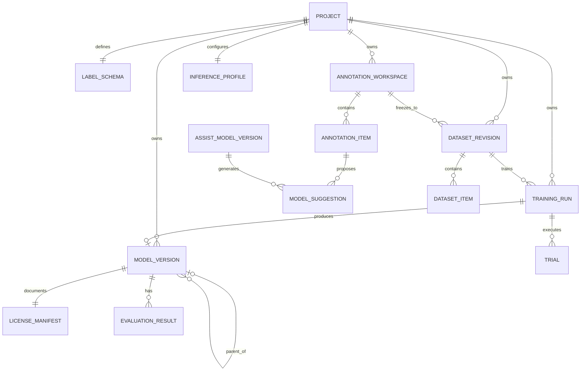
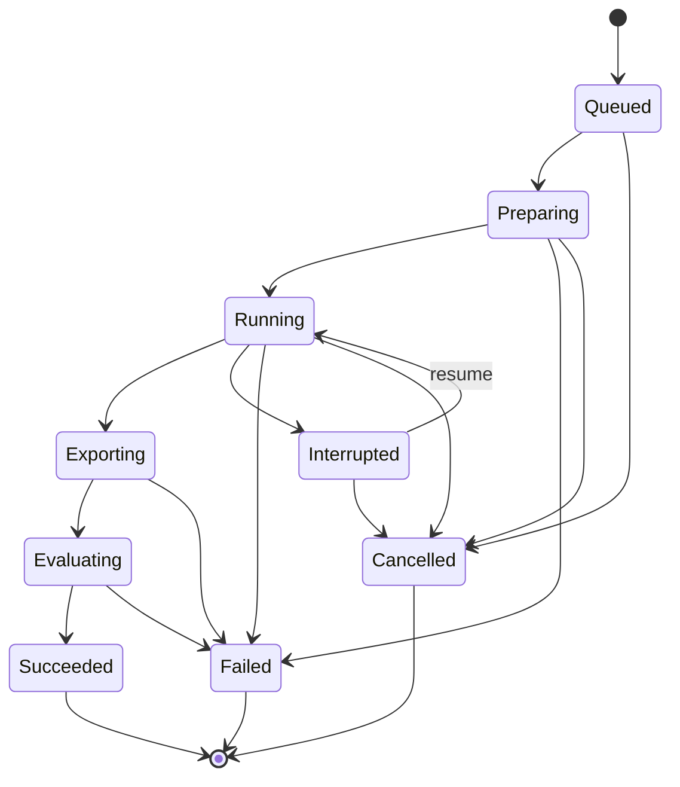
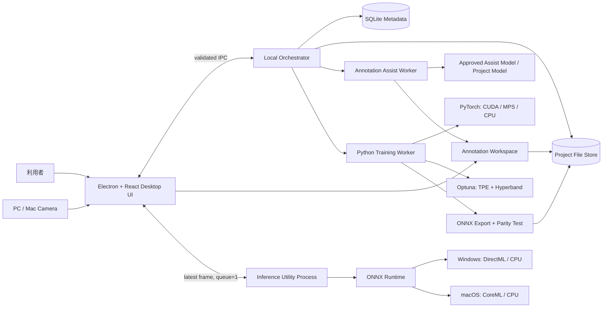

# AutoVision Studio 要求定義書

| 項目 | 内容 |
|---|---|
| 文書名 | AutoVision Studio 要求定義書 |
| 文書バージョン | 0.3 Draft |
| 作成日 | 2026-09-02 |
| 対象リリース | Version 1（MVP） |
| 対象リポジトリ | `dahatake/AutoVision-Studio` |
| ステータス | 実現性調査済み・実装前レビュー待ち |

## 1. 目的

AutoVision Studio は、画像分類（Image Classification）および物体検出（Object Detection）のデータ取り込み、ローカル学習、モデル版管理、評価、カメラ映像へのリアルタイム推論を、Windows および macOS 上で完結させるデスクトップアプリケーションである。

本製品は次を最優先の価値とする。

1. ユーザーがモデル構造やハイパーパラメーターを指定せずに学習できること。
2. 画像、モデル、評価結果を外部サービスへ送信しないこと。
3. Project 単位でデータ、学習履歴、モデル、推論設定を一貫して管理できること。
4. 商用製品へ組み込めるライセンス条件を満たすソフトウェアおよびモデルだけを使用すること。
5. OS 別のインストーラー 1 つだけで導入でき、完了後に追加セットアップなしですぐ利用できること。

本書で「必須」と記載した要求は MVP の受入条件である。「推奨」は、原則として実装するが、MVP から除外する場合に理由と代替策の記録を必要とする。

## 2. 実現性調査の結論

### 2.1 総合判定

**条件付きで実現可能（Conditional Go）** と判定する。

| 領域 | 判定 | 根拠・条件 |
|---|---|---|
| 画像分類のローカル学習・推論 | 実現可能 | PyTorch 系で学習し、ONNX Runtime で Windows/macOS 推論を共通化できる [S1][S3]。 |
| 物体検出のローカル学習・推論 | 実現可能 | 軽量な MobileNet/SSDLite 系などが存在する [S12][S13]。ただし、画像ごとの矩形アノテーションが必須である。 |
| 自動 Fine-Tuning / Hyperparameter Tuning | 実現可能 | Optuna の探索・枝刈り、および Hyperband による計算予算の早期配分が利用できる [S9][S10][S11]。 |
| Windows のローカル実行 | 実現可能 | CPU は常時フォールバックにでき、DirectX 12 GPU では DirectML、対応環境では Windows ML を使用できる [S1][S4]。 |
| macOS のローカル実行 | 実現可能 | Apple Silicon の MPS で学習、CoreML Execution Provider で推論を高速化できる [S3][S5]。 |
| 100 ms 間隔のカメラ推論 | 条件付きで実現可能 | 軽量モデル、固定入力形状、アクセラレーター、最新フレーム優先制御が必要。すべての PC で 10 FPS を保証することはできない。 |
| 商用利用可能性 | 条件付きで実現可能 | OSS 本体が permissive license でも、学習済み重みと学習元データには別条件があり得る [S14]。出荷前の重み単位の監査が必須である。 |
| Cloud を使用しない動作 | 実現可能 | モデル、ランタイム、依存物を同梱し、外向き通信を禁止する。Windows ML の実行プロバイダー自動取得等には依存しない。 |
| Windows/macOS 自己完結インストーラー | 実現可能 | Windows は署名済み EXE/MSI 系、macOS は署名済み flat PKG が適する [S33][S35]。アプリ、runtime、基盤重みを同梱するため配布物は大きくなる。 |
| 画面上での教師データ作成 | 実現可能 | 画像分類のタグ選択と物体検出の矩形作成・移動・サイズ変更・削除は、Microsoft および既存アノテーション製品で実装例がある [S37][S40][S41]。 |
| 既存モデルによる初期ラベル・矩形補助 | 条件付きで実現可能 | 分類タグや検出矩形の prelabeling は確立したパターンである [S37][S38][S39][S42]。ただし誤提案を前提に人間の確認・修正を必須とし、同梱 checkpoint の商用利用と再配布を別途承認する。 |

### 2.2 成立に必須の条件

1. 物体検出データには、少なくとも画像、クラス名、矩形座標を含む正しいアノテーションが存在すること。
2. macOS の MVP 対象を Apple Silicon 搭載 Mac とすること。
3. 10 FPS は「推奨ハードウェア＋出荷時承認済み軽量モデル」で実機検証し、性能ゲートを通過すること。
4. 学習済み基盤重みごとに、重みのライセンス、学習元データの条件、再配布条件を法務またはリリース責任者が承認すること。
5. 学習時間と精度はデータ件数、画像解像度、クラス数、ハードウェアに依存するため、固定時間または固定精度を製品全体では保証しないこと。
6. 各 OS のクリーン環境で、ネットワークおよび開発用 runtime なしのインストール・初回起動試験に合格すること。
7. 分類補助モデルおよび物体検出補助モデルについて、checkpoint 単位の商用利用・再配布・学習データ由来の監査とローカル実機 PoC を完了すること。
8. モデルの補助出力を自動的に正解へ昇格させず、人が確認したアノテーションだけを学習に使用すること [S37][S38]。

### 2.3 教師データ作成・モデル支援の調査結果

| 対象 | 公開事例から確認できたこと | 本製品の判定 |
|---|---|---|
| Image Classification | Microsoft Learn は multi-class で画像全体へ 1 タグを割り当て、誤りを置換・削除する UI を説明している [S37]。Label Studio も画像と選択肢を組み合わせる分類 UI を公開している [S40]。 | **実現可能。MVP に追加する。** |
| Object Detection | Microsoft Learn は 1 画像に複数の矩形と各 1 タグを付け、矩形の作成、移動、サイズ変更、削除を行う UI を説明している [S37]。Label Studio も `RectangleLabels` による矩形とラベルの同時作成を公開している [S41]。 | **実現可能。MVP に追加する。** |
| 分類の事前候補 | Microsoft Learn は、手動ラベルから学習した分類モデルが unlabeled 画像へ推奨タグを表示し、人が誤りを修正する方式を説明している [S37][S38]。CVAT の auto-annotation API にも分類モデルから tag annotation を生成する定義がある [S39]。 | **実現可能。初期汎用モデルと Project モデルの二段構成にする。** |
| 検出の事前候補 | Microsoft Learn は、モデルが予測した bounding box と label を表示し、人が確認・修正する方式を説明している [S37][S38]。CVAT は detection function から rectangle annotation を生成でき [S39]、Label Studio は bbox/choice prediction の表示と annotation へのコピーを説明している [S42]。 | **実現可能。候補レイヤーと確定レイヤーを分離する。** |
| ラベル名候補の生成 | CLIP 論文は自然言語ラベルを使う zero-shot classification を示す [S45]。Florence-2 は captioning と object detection を同じ prompt-based model で扱い、`<OD>` の結果として label と bbox を返す [S50][S51]。 | **技術的には可能。ただし業務固有クラスは汎用モデルが知らない場合があるため、候補名を人が作成・編集・統合する。** |
| 人による最終確認 | Microsoft Learn は、機械学習モデルは 100% 正確ではなく、分類 prelabel と検出 box の誤りを送信前に修正するよう明記する [S37]。Microsoft Research は AI の能力・誤りやすさを明示し、dismiss/correct/undo しやすくする指針を示す [S52]。 | **必須。未確認候補を教師データにしない。** |

Azure Machine Learning の資料 [S37][S38] は UI と human-in-the-loop の設計根拠としてのみ参照する。本製品は Azure Machine Learning、Azure Storage、その他の Cloud resource を呼び出さず、同等の処理を端末内で実装する。

## 3. 対象範囲

### 3.1 MVP に含むもの

- 複数 Project の作成、一覧、更新、削除
- single-label multi-class の画像分類 Project と、multi-class bounding box の物体検出 Project
- ローカルファイルまたはフォルダーからの学習データ取り込み
- 元ファイルの Project 作業領域へのコピー、または元パスの参照
- データ検証と学習用・検証用・テスト用分割
- バックグラウンド学習
- 自動 Fine-Tuning と自動 Hyperparameter Tuning
- 学習 Run、モデル版、データセット版の履歴管理
- 既存モデル版を起点とした追加学習
- 取り込んだ画像に対する、画面上での分類ラベルおよび物体検出矩形の作成・編集・確認
- 監査済み既存モデルと Project の既存モデル版による、ラベル名、分類ラベル、矩形の補助候補生成
- 学習結果、ハイパーパラメーター、元画像、予測結果の表示
- PC/Mac カメラを用いた 100 ms 間隔のフレーム取得と推論
- ローカル保存、ローカルログ、障害復旧
- 完全オフライン動作
- Windows x64 用および macOS arm64 用の自己完結型インストーラー
- インストール直後の追加ダウンロード、runtime 導入、コマンド操作を不要にする同梱配布
- ソフトウェア部品表（SBOM）と第三者ライセンス表示

### 3.2 MVP に含まないもの

- Cloud の学習、推論、ストレージ、認証、監視、テレメトリ
- ユーザーアカウント、組織、共同編集、Project 共有
- 手動のハイパーパラメーター入力
- 動画ファイル、ネットワークカメラ、RTSP ストリームへの推論
- アプリ終了後も動作する OS サービス型の学習
- 分散学習、複数 PC をまたぐ学習
- セグメンテーション、姿勢推定、OCR、生成 AI
- 未監査の外部モデルやプラグインの読み込み

> 未アノテーション画像だけでは教師あり学習を開始できない。MVP では、既存ラベル/COCO JSON の import、または本製品の教師データ作成画面で人が確認した annotation のいずれかを学習入力とする。

### 3.3 Cloud 不使用の境界

- Project の作成、データ取り込み、学習、HPO、モデル変換、評価、保存、カメラ推論、ログ、診断には Cloud resource、外部 API、外向き通信を一切使用しない。
- モデル、Execution Provider、依存ライブラリは、監査済みインストーラーへ事前同梱する。実行時 download を行わない。
- 開発・リリース工程における公開ソフトウェアの取得、コード署名、Apple notarization、配布物の公開はアプリの実行機能には含めない。ただし、これらへ画像、ラベル、Project、モデル、学習結果を送信してはならない。
- Apple notarization も含めて開発・配布工程の外部サービス利用を禁止する場合、署名済み macOS アプリの標準的な配布要件と両立しないため、TBD-04 で配布方法を再決定する。

## 4. 対応プラットフォーム

| プラットフォーム | MVP 対応 | 学習デバイス | 推論デバイス |
|---|---|---|---|
| Windows 11 24H2 以降、x64 | 必須 | NVIDIA CUDA 対応 GPUを優先、CPU フォールバック | DirectML または利用可能な Windows ML EP、CPU フォールバック |
| macOS 13 以降、Apple Silicon arm64 | 必須 | PyTorch MPS、CPU フォールバック | ONNX Runtime CoreML EP、CPU フォールバック |
| Windows on ARM | 対象外 | 将来検討 | 将来検討 |
| Intel Mac | 対象外 | 現行 MPS の対象および実用性能を満たさないため | 将来の CPU 推論のみを検討 |
| Windows 10 | 対象外 | OS サポート終了後の新規製品対象にしない | 対象外 |

macOS の下限を満たしていても、出荷時点で Apple のセキュリティ更新対象外となった OS 版はサポート対象外とする。

## 5. 用語と管理単位

| 用語 | 定義 |
|---|---|
| Project | 1 種類の CV タスク、データセット履歴、学習 Run、モデル版、推論設定をまとめる最上位単位。 |
| タスク種別 | `Image Classification` または `Object Detection`。初回学習後は変更不可。 |
| Dataset Revision | 取り込んだ画像、ラベル、分割、ファイルハッシュを固定した不変のデータセット版。 |
| Training Run | 1 回の AutoML 実行。複数 Trial、ログ、評価、状態を持つ。 |
| Trial | 1 組のモデル候補・ハイパーパラメーターによる学習試行。 |
| Model Version | 成功した Training Run から生成される不変の学習済みモデル一式。Project 内で `v1`, `v2`, ... と採番する。 |
| Base Model Version | 追加学習の開始点としてユーザーが選ぶ既存 Model Version。 |
| Curated Base Weight | 初回学習に用いる、製品側でライセンスと由来を承認した基盤重み。 |
| Inference Profile | 使用モデル版、カメラ、信頼度しきい値、表示設定、実行プロバイダーをまとめた Project 単位の推論設定。 |
| Copy モード | 元画像とアノテーションを Project 作業領域へ複製して使用する方式。 |
| Reference モード | 元ファイルを複製せず、絶対パスと内容ハッシュを保持して参照する方式。 |
| AutoML | 候補モデル選択、Fine-Tuning、ハイパーパラメーター探索、枝刈り、最良モデル決定を自動実行するローカル処理。枝刈りは、有望でないハイパーパラメーター Trial を途中終了することを指す。Cloud 製品名を意味しない。 |
| Self-contained Installer | 対象 OS/architecture 用のアプリ本体、runtime、依存ライブラリ、Curated Base Weight、Annotation Assist Model、UI asset、ライセンス通知を 1 ファイルへ含み、外部 download や別インストーラーを必要としない配布物。 |
| Label Schema | Project で使用する安定した class ID、表示名、任意の model alias、色、説明、正常例・境界例・反例をまとめた分類体系。 |
| Annotation Workspace | 取り込んだ画像、編集中 annotation、補助候補を保持する可変の作業領域。確定時に不変の Dataset Revision を生成する。 |
| Model Suggestion | 既存モデルが生成したラベル名、分類ラベル、矩形、model score 等の候補。人が承認するまでは Ground Truth ではない。 |
| Ground Truth | ユーザーが画面で作成または確認し、教師データとして確定した分類ラベルまたは矩形 annotation。 |
| Annotation Assist Model | 初回の補助候補を生成するため、製品側で checkpoint、由来、ライセンス、性能を承認してインストーラーへ同梱する既存モデル。 |

## 6. 利用者と前提

### 6.1 主利用者

- ローカル画像を所有し、CV モデルを作成・評価・カメラ推論したい利用者
- モデル構造やハイパーパラメーターの専門操作を必要としない利用者

### 6.2 利用前提

- ユーザーは入力画像、ラベル、アノテーションを利用・学習する権利を有する。
- 画像分類ではクラスラベル、物体検出ではクラスラベルと矩形アノテーションが必要である。
- 入力時点でラベルや矩形がない場合、ユーザーは教師データ作成画面で作成・確認してから学習を開始する。
- 学習中はアプリケーションが起動している。別画面への移動や最小化は可能である。
- ノート PC で長時間学習する場合、電源接続と十分な冷却を推奨する。
- 精度目標はデータおよび業務ごとに異なるため、Project ごとの利用者判断とする。

## 7. 画面構成

### 7.1 共通ナビゲーション

- Project 一覧
- 選択中 Project 名とタスク種別
- 教師データ
- 学習
- Training Run
- 結果・レポート
- 推論
- Project 設定
- ローカルジョブ状態、使用デバイス、空き容量、警告

### 7.2 画面一覧

| 画面 ID | 画面 | 主な内容 |
|---|---|---|
| UI-01 | 初回診断 | OS、CPU、メモリ、GPU、推論 EP、ディスク、カメラの検出結果と対応レベル |
| UI-02 | Project 一覧 | 複数 Project の一覧、検索、作成、削除、最終更新、学習状態、選択モデル版 |
| UI-03 | Project 作成・設定 | 名前、説明、タスク種別、作業フォルダー、Project 情報の更新 |
| UI-04 | データ取り込み | ファイル/フォルダー選択、Copy/Reference 選択、既存 annotation import、データ検証 |
| UI-05 | Training Run | Queue/実行状態、進捗、現在の Trial、暫定指標、経過時間、推定残時間、キャンセル |
| UI-06 | 結果・レポート | モデル版比較、指標、曲線、混同行列または PR、全 Trial のハイパーパラメーター、画像ギャラリー |
| UI-07 | 推論 | モデル版・カメラ選択、権限説明、開始/停止、ライブ映像、推論オーバーレイ、FPS・レイテンシ |
| UI-08 | ストレージ・ライセンス | Project 使用量、キャッシュ削除、第三者通知、SBOM、基盤重みの由来 |
| UI-09 | Label Schema | class の作成、名前変更、統合、削除、model alias、色、説明、正常例・境界例・反例 |
| UI-10 | 教師データ作成 | 分類の gallery/single view、検出の rectangle editor、補助候補、確認状態、filter、確定 |
| UI-11 | 補助ジョブ | 使用モデル版、進捗、候補件数、score/threshold、accept/edit/reject、再生成、キャンセル |

## 8. 機能要求

### 8.1 システム・ハードウェア診断

| ID | 要求 | 優先度 |
|---|---|---|
| FR-SYS-001 | 初回起動時およびユーザー要求時に、OS/CPU/論理コア数/物理メモリ/空きディスク/GPU または MPS/利用可能な ONNX Execution Provider/カメラ機能の有無をローカルで検出する。初回診断ではカメラストリームを開かず、OS が権限前の列挙を許さない場合は `推論開始時に確認` と表示する。 | 必須 |
| FR-SYS-002 | 診断結果を `非対応`、`CPU 動作可`、`推奨構成` のいずれかで表示し、不足理由を示す。 | 必須 |
| FR-SYS-003 | 実行デバイスは、利用可能性、メモリ、モデル互換性を基に自動選択する。ユーザーにハイパーパラメーターを入力させない。 | 必須 |
| FR-SYS-004 | アクセラレーターが利用不能またはモデル非互換の場合、処理を落とさず CPU へフォールバックし、その事実と性能低下見込みを表示する。 | 必須 |
| FR-SYS-005 | 診断および通常動作のために外部 API を呼び出さない。 | 必須 |

### 8.2 Project 管理

| ID | 要求 | 優先度 |
|---|---|---|
| FR-PRJ-001 | ユーザーは複数の Project を作成できる。 | 必須 |
| FR-PRJ-002 | Project 作成時に、名前、任意の説明、タスク種別、作業フォルダーを指定できる。 | 必須 |
| FR-PRJ-003 | Project 名は空白不可とし、同名を許可する場合でも内部では UUID により一意に識別する。 | 必須 |
| FR-PRJ-004 | Project 一覧には、タスク種別、最終更新日時、最新 Training Run 状態、推論対象モデル版、使用容量を表示する。 | 必須 |
| FR-PRJ-005 | ユーザーは Project 名、説明、作業フォルダー、既定の推論設定を更新できる。 | 必須 |
| FR-PRJ-006 | 初回 Training Run 作成後はタスク種別を変更できない。異なるタスク種別には別 Project を作成する。 | 必須 |
| FR-PRJ-007 | Project 削除前に、削除対象の Annotation Workspace、Model Suggestion、Dataset Revision、Training Run、Model Version、レポート、キャッシュの件数と容量を表示し、明示確認を求める。 | 必須 |
| FR-PRJ-008 | Project 削除時、Annotation Workspace、Model Suggestion、Copy モードの複製物と生成物は削除するが、Reference モードの参照元ファイルは一切削除しない。 | 必須 |
| FR-PRJ-009 | Project 切り替え後も、実行中のバックグラウンド学習を継続し、共通ジョブ表示から状態を確認できる。 | 必須 |
| FR-PRJ-010 | Project に関連する情報の追加・更新・削除操作を、依存関係と不変性ルールの範囲で提供する。モデル版と Dataset Revision は上書き更新せず、新版を作成する。 | 必須 |

### 8.3 データ取り込みと検証

| ID | 要求 | 優先度 |
|---|---|---|
| FR-DAT-001 | OS 標準のファイル/フォルダー選択 UI を使用し、ローカルの単一/複数画像またはフォルダーを選択できる。 | 必須 |
| FR-DAT-002 | データ確定前に `Project へコピー` または `元の場所を参照` をユーザーが必ず選択できる。 | 必須 |
| FR-DAT-003 | 対応画像形式を JPEG、PNG、WebP、BMP、TIFF とし、拡張子だけでなく実体を検証する。アニメーション画像は先頭フレームだけを暗黙利用せず、非対応として通知する。 | 必須 |
| FR-DAT-004 | EXIF Orientation を反映した正しい向きで学習・表示する。元ファイルは変更しない。 | 必須 |
| FR-DAT-005 | 画像分類では、未ラベル画像、`ルート/クラス名/画像` のフォルダー構造、または `path,label` を持つ UTF-8 CSV manifest を受け付ける。画像ファイルを直接選択した場合は、教師データ作成画面でラベルを割り当てられる。 | 必須 |
| FR-DAT-006 | 物体検出では、未 annotation 画像、または COCO JSON（画像、カテゴリ、bounding box）と対応する画像ルートを受け付ける。import 済み box も教師データ作成画面で編集できる。 | 必須 |
| FR-DAT-007 | 取り込み時は壊れた画像、読めないパス、重複画像、annotation 形式、矩形範囲、クラス ID を検証する。未ラベル/未 annotation は Annotation Workspace へ入れる対象とし、確定時に未確認項目、ゼロ件クラス等を Error/Warning に分けて再検証する。 | 必須 |
| FR-DAT-008 | 学習不能な Error が 1 件でもある場合は自動学習を開始せず、対象ファイルと修正方法を表示する。 | 必須 |
| FR-DAT-009 | 教師データ確定時に既定 split がない場合、確認済み Ground Truth だけを固定 seed により train/validation/test へ原則 70/15/15 で自動分割する。分類はクラス比を可能な限り維持し、同一内容ハッシュを複数 split に配置しない。 | 必須 |
| FR-DAT-010 | データが少なく全 split に必要なラベルを配置できない場合、比率を自動調整する。評価不能になる場合は Error とし、理由を示す。 | 必須 |
| FR-DAT-011 | Copy モードでは Project 内へコピー後に SHA-256 source manifest を Annotation Workspace に保存する。教師データ確定時、その source manifest と確認済み Ground Truth から不変の Dataset Revision manifest を生成する。 | 必須 |
| FR-DAT-012 | Reference モードでは絶対パス、OS の永続アクセス情報、サイズ、更新時刻、SHA-256 を保持する。継続アクセスできない場合は再リンクを求める。 | 必須 |
| FR-DAT-013 | Training Run 開始直前と学習中に Reference モードの全ファイルを hash 検証する。変更・消失が 1 件でもあれば Run を開始しないか安全に停止し、再リンクまたは Copy モードでの再取り込みを案内する。再現性が失われた状態で継続しない。 | 必須 |
| FR-DAT-014 | 表示用サムネイルや前処理キャッシュを生成する場合、参照元とは別の派生データであることを表示し、Project 削除またはキャッシュ削除で消去する。 | 必須 |
| FR-DAT-015 | 取り込み完了時に Annotation Workspace を作成または更新する。ユーザーが教師データを確定した時点で新しい Dataset Revision を作成し、過去 Revision を上書きしない。 | 必須 |
| FR-DAT-016 | 追加学習では、選択した Base Model Version が使用した Dataset Revision と新規取り込みデータを Annotation Workspace で結合し、内容 hash で重複排除する。新規データの Ground Truth を確認後に新しい Dataset Revision を作成し、結合元、追加件数、除外件数、split の再作成結果を学習開始前に表示する。 | 必須 |

#### 8.3.1 教師データ作成・共通

| ID | 要求 | 優先度 |
|---|---|---|
| FR-ANN-001 | ユーザーは取り込んだ未ラベル、部分ラベル済み、既存ラベル済み画像を Annotation Workspace で一覧表示し、教師データを新規作成・編集・確認できる。 | 必須 |
| FR-ANN-002 | Annotation Workspace は Dataset Revision 確定前の可変領域とし、編集によって参照元画像および過去 Dataset Revision を変更しない。 | 必須 |
| FR-ANN-003 | Label Schema 画面で class の作成、表示名変更、色変更、説明・例の編集、重複 class の統合、未使用 class の削除ができる。class ID は UUID とし、表示名と分離する。 | 必須 |
| FR-ANN-004 | class 表示名は Unicode を許可し、空白だけの名前、同一 Project 内で正規化後に重複する名前を拒否する。補助モデル用に任意の model alias を別途保持できる。 | 必須 |
| FR-ANN-005 | 各画像の状態を `未着手`、`補助候補あり`、`編集中`、`確認済み`、`除外` で管理し、状態、class、補助元、更新日時で filter/sort できる。`確認済み` は、ユーザーが画像全体と全候補を確認した上で明示的に確定操作を行った状態だけを指す。 | 必須 |
| FR-ANN-006 | 編集操作を自動保存し、画像単位の undo/redo を提供する。アプリ異常終了後も最後に成功した自動保存まで復元する。 | 必須 |
| FR-ANN-007 | annotation provenance を `manual`、`import-unmodified`、`import-edited`、`model-accepted`、`model-edited` として区別して保存する。元 suggestion/import ID とユーザーの変更差分を追跡できる。 | 必須 |
| FR-ANN-008 | 画像の zoom、pan、fit-to-window、actual-size、前後移動、サムネイル移動、キーボード操作を提供する。 | 必須 |
| FR-ANN-009 | ユーザーは画像を `除外` にできる。除外理由を任意で記録し、除外画像を学習・評価 split に含めない。 | 必須 |
| FR-ANN-010 | Dataset Revision 確定時、対象画像の Ground Truth、Label Schema、画像 hash、annotation hash、除外一覧、作成者、確定日時を immutable manifest に保存する。 | 必須 |
| FR-ANN-011 | 確定前に未確認画像、無効 annotation、class 件数、除外件数、未処理 Model Suggestion 件数を表示する。無効 annotation には、Schema 外 class、分類の 0/複数 class、非有限座標、画像外のみまたは幅/高さ 0 の rectangle を含む。Error があれば確定できず、教師データ作成画面で修正後に再検証できる。 | 必須 |
| FR-ANN-012 | 初回 Model Version の学習開始後は Label Schema を lock する。class の追加、削除、統合、意味変更が必要な場合、FR-TRN-021 に従い新しい Project を案内する。 | 必須 |
| FR-ANN-013 | 確定済み Dataset Revision を修正する場合は、内容を新しい Annotation Workspace へ複製し、修正後に新しい Revision として確定する。 | 必須 |
| FR-ANN-014 | 有効な Dataset Revision の確定直後、追加の HPO 入力を求めず FR-TRN-001 の Training Run を自動登録する。確定前の編集中データでは学習を開始しない。 | 必須 |

#### 8.3.2 Image Classification 教師データ作成

| ID | 要求 | 優先度 |
|---|---|---|
| FR-ANN-101 | MVP の single-label multi-class 分類では、学習対象の各画像に Label Schema 内の class を正確に 1 つ割り当てる。0 件または複数 class の画像は確定できない。 | 必須 |
| FR-ANN-102 | gallery view で複数画像を選択して同じ class を一括適用でき、single view で 1 画像を拡大確認して class を適用できる。Microsoft Learn にも複数画像への一括タグ適用例がある [S37]。 | 必須 |
| FR-ANN-103 | class の割り当て、置換、解除、除外を行える。置換前の値は undo できる。 | 必須 |
| FR-ANN-104 | class ごとに件数と比率を表示し、0 件 class、極端な偏り、train/validation/test に配置できない少数 class を警告する。 | 必須 |
| FR-ANN-105 | label 検索、最近使った label、数字キー等の shortcut を提供し、同じ操作を mouse と keyboard の双方で行える。 | 必須 |
| FR-ANN-106 | Label Schema が未定義の場合、ユーザーは手動で class 名を作成するか、FR-AST-006 の候補名を編集・統合して class として採用できる。 | 必須 |
| FR-ANN-107 | Model Suggestion を承認した場合も、確定画面では手動 annotation と同じ validation を行う。 | 必須 |

#### 8.3.3 Object Detection 教師データ作成

| ID | 要求 | 優先度 |
|---|---|---|
| FR-ANN-201 | 1 画像に 0 個以上の axis-aligned rectangle を作成でき、各 rectangle に Label Schema 内の class を正確に 1 つ割り当てる。Microsoft Learn と Label Studio に同等の矩形 UI 例がある [S37][S41]。 | 必須 |
| FR-ANN-202 | drag による矩形作成、選択、移動、辺/角によるサイズ変更、class 変更、複製、削除、全選択を提供する。 | 必須 |
| FR-ANN-203 | 画像上の矩形と region list を相互選択でき、各項目に class、座標、幅、高さ、作成元、確認状態を表示する。 | 必須 |
| FR-ANN-204 | zoom/pan 中も矩形座標を元画像 pixel 座標で保持し、表示座標の丸めや EXIF Orientation によって Ground Truth が変化しない。 | 必須 |
| FR-ANN-205 | 矩形は画像内に clamp し、幅/高さ 0、NaN、負値、画像外のみの矩形を拒否する。重複度の高い同一 class 矩形を warning とする。 | 必須 |
| FR-ANN-206 | 対象物がない画像は `対象物なし` と明示確認できる。未着手画像と区別し、negative sample として Dataset Revision に含める。 | 必須 |
| FR-ANN-207 | occlusion、画像端での切れ、極小物体、曖昧な境界について Project 固有の annotation instruction を Label Schema 画面に記録・常時表示できる。Microsoft Learn もこれらを事前に定義すべき論点として挙げる [S38]。 | 必須 |
| FR-ANN-208 | rectangle 作成、選択、削除、class 選択、前後画像移動に keyboard shortcut を提供し、誤操作時に undo できる。 | 必須 |
| FR-ANN-209 | import した COCO bounding box と category を同じ editor で修正し、確定 manifest では COCO の `[x, y, width, height]` 意味論へ lossless に変換できる。未変更は `import-unmodified`、ユーザーが修正した annotation は `import-edited` として provenance を記録する。 | 必須 |

#### 8.3.4 既存モデルによる補助候補

| ID | 要求 | 優先度 |
|---|---|---|
| FR-AST-001 | ユーザーが教師データ作成を選択した場合、取り込み後に補助候補生成をローカル background job として自動登録する。ユーザーは開始前に無効化でき、実行中にキャンセルできる。手動 annotation は完了を待たず開始できる。 | 必須 |
| FR-AST-002 | 同一 Project に成功済み Model Version がある場合は最新成功版を既定選択し、ユーザーが別の成功版へ変更できる。成功版がない場合だけ Annotation Assist Model を選ぶ。job 登録前と実行中に model ID/version/checkpoint hash と threshold policy を常時表示する。 | 必須 |
| FR-AST-003 | Project Model Version は、その版と Annotation Workspace の task type と Label Schema が一致する場合だけ補助に使用する。一致しない class 出力を暗黙変換しない。 | 必須 |
| FR-AST-004 | 成功済み Model Version をまだ持たない Project 用の Annotation Assist Model はインストーラーへ同梱し、実行時 download を行わない。分類用と検出用の少なくとも 1 checkpoint ずつが FR-LIC-004 と FR-LIC-014 を通過しない限り本機能を出荷しない。 | 必須 |
| FR-AST-005 | 分類で Label Schema が定義済みの場合、各画像について既存 class だけを対象に上位 3 件までの候補を順位付きで表示し、1 class を初期選択候補にできる。zero-shot image-text model による既存 text label の順位付けは CLIP で実証されている [S45][S46]。 | 必須 |
| FR-AST-006 | 分類で Label Schema が未定義の場合、caption または object label を `新しい class 名の候補` として別 panel に表示できる。候補を Ground Truth へ直接適用せず、ユーザーが作成、名前変更、統合、却下して Label Schema に採用する。Florence-2 は caption と object detection label を生成できる [S50][S51]。 | 必須 |
| FR-AST-007 | Object Detection では、既存モデルの出力から rectangle、class 候補、model score が提供される場合は score を初期候補として表示する。Grounding DINO は category name/referring expression に対応する open-set box を出力し [S48][S49]、Florence-2 の `<OD>` は label と bbox を返す [S51]。 | 必須 |
| FR-AST-008 | Label Schema が定義済みの検出では、Project model の class または open-vocabulary model への model alias を使用し、Schema 外の label は `新しい class 候補` として分離する。自動的に class を増やさない。 | 必須 |
| FR-AST-009 | Model Suggestion を Ground Truth と異なる色、線種、badge で表示し、候補レイヤーを非表示にできる。suggestion と確定 annotation をデータ上も分離する。 | 必須 |
| FR-AST-010 | ユーザーは候補を個別に `承認`、`編集して承認`、`却下` できる。承認操作は候補を draft annotation へコピーするだけとし、画像全体の `確認済み` とはしない。ユーザーは見逃された class/物体の有無も確認し、全候補を処理してから画像単位で確定する。Microsoft の human-AI guidelines に従い invocation、dismissal、correction、undo を効率的に行えるようにする [S52]。 | 必須 |
| FR-AST-011 | `確認済み` でない画像および未処理 Model Suggestion を Ground Truth、Dataset Revision、train/validation/test のいずれにも含めない。score にかかわらず自動承認、`すべて承認`、高 score 候補の一括承認を提供しない。Microsoft Learn も prelabel の誤りを人が修正することを求める [S37][S38]。 | 必須 |
| FR-AST-012 | model が score を返さない場合、confidence を捏造・推定表示しない。score がある場合も `正解確率` ではなく `モデルスコア` と表示し、意味、範囲、threshold をモデル manifest から参照可能にする。 | 必須 |
| FR-AST-013 | Project model による prelabel threshold は、人が確定した validation sample 上の評価から version ごとに決める。汎用 Annotation Assist Model は採用 PoC で固定した threshold policy を使用する。高 score でも人の確認を省略しない [S38]。 | 必須 |
| FR-AST-014 | suggestion ごとに assist model ID/version/checkpoint SHA-256、Project Model Version、task、input image hash、prompt/model alias、preprocess、threshold、raw score、生成日時、承認/編集/却下結果を保存する。 | 必須 |
| FR-AST-015 | 補助候補を再生成しても確認済み Ground Truth を上書きしない。新旧 suggestion set を version 管理し、ユーザーが比較・破棄できる。 | 必須 |
| FR-AST-016 | 1 つ以上の Project Model Version がある場合、新規画像への補助は同じ業務 class を学習した Project model を既定とする。確認済み訂正を含む次版の学習後、未確認画像だけを対象に再生成できる。これは手動ラベルから model を更新して prelabel する human-in-the-loop pattern に対応する [S38]。 | 必須 |
| FR-AST-017 | 分類では、確認済みデータから得た embedding を使って類似画像を同じ gallery にまとめる補助を提供できる。並び替えは Ground Truth を変更せず、偏りを隠さないよう元の順序へ戻せる。Microsoft Learn にも分類画像の clustering 例がある [S37][S38]。 | 推奨 |
| FR-AST-018 | 補助ジョブは UI と分離した worker で実行し、使用デバイス、進捗、処理件数、失敗件数、推定残時間を表示する。OOM 時は batch 縮小または CPU fallback を行い、結果へ記録する。 | 必須 |
| FR-AST-019 | 人物の人種、民族、性別、年齢、健康、犯罪性等の高リスク属性を汎用モデルから新規 class 名として提案しない。Project で明示定義された場合も警告と domain-specific validation を要求する。CLIP model card は class 設計による bias と demographic disparity を報告している [S47]。 | 必須 |
| FR-AST-020 | annotation assist へ任意 URL、未監査 checkpoint、remote code、Cloud API を追加する plugin 機能を MVP では提供しない。 | 必須 |

### 8.4 自動学習

| ID | 要求 | 優先度 |
|---|---|---|
| FR-TRN-001 | データ検証が成功し、Dataset Revision が確定した後、追加のハイパーパラメーター入力画面を挟まず、5 秒以内に Training Run を `Queued` または `Running` にする。 | 必須 |
| FR-TRN-002 | 学習は UI とは別のワーカー/プロセスで実行し、学習中も Project 閲覧、結果閲覧、画面遷移を可能にする。 | 必須 |
| FR-TRN-003 | 初回学習は、タスク種別とハードウェアに対応した Curated Base Weight を自動選択して Fine-Tuning する。転移学習の効果はデータ特性に依存するため [S17]、scratch 学習の短い baseline Trial と比較して採否を記録する。 | 必須 |
| FR-TRN-004 | 追加学習開始時、ユーザーは同一 Project の成功済み Model Version から Base Model Version を選択できる。 | 必須 |
| FR-TRN-005 | 追加学習は選択したモデルを上書きせず、親モデル ID を持つ新しい Training Run と Model Version を生成する。 | 必須 |
| FR-TRN-006 | AutoML は候補アーキテクチャ、学習率、optimizer、weight decay、batch size、入力解像度、augmentation、層の freeze/unfreeze、early stopping 条件等を内部探索する。 | 必須 |
| FR-TRN-007 | ユーザーは探索値を指定しない。内部探索空間、選択理由、各 Trial の実値はレポートで参照できる。 | 必須 |
| FR-TRN-008 | 探索には TPE 等の逐次探索と Hyperband/Successive Halving 等の枝刈りを用い、有望でない Trial を早期終了する [S9][S11]。 | 必須 |
| FR-TRN-009 | CPU/CUDA/MPS ごとの最大 Trial 数と最大 wall-clock 時間をリリースごとの versioned policy に有限値として固定する。その上限内で、初期 mini-run、データ量、メモリ、アクセラレーター、タスク種別から端末ごとの実行 Trial 数と時間予算を自動決定し、予測完了時刻を開始前後に更新表示する。ユーザーには入力させず、Run レポートに上限と適用値を残す。 | 必須 |
| FR-TRN-010 | 1 台の端末で同時に実行する Training Run は原則 1 件とし、他は FIFO Queue に置く。Out of Memory を避けるため Trial の並列数も自動制御する。 | 必須 |
| FR-TRN-011 | Training Run の状態を `Queued`, `Preparing`, `Running`, `Exporting`, `Evaluating`, `Succeeded`, `Failed`, `Cancelled`, `Interrupted` で管理する。 | 必須 |
| FR-TRN-012 | 進捗、Trial 番号、epoch、主要な validation 指標、経過時間、推定残時間、使用デバイスを更新表示する。 | 必須 |
| FR-TRN-013 | ユーザーは Queued Run の削除、実行中 Run のキャンセルを行える。Cancelled は再開不可の終端状態とする。キャンセル時は完了済み Trial とログを保持するが、推論可能モデル版は作成しない。 | 必須 |
| FR-TRN-014 | epoch または Trial 境界で復旧用 checkpoint を保存する。アプリまたは OS の異常終了後、互換性確認の上で中断 Run を再開できる。 | 必須 |
| FR-TRN-015 | seed、データ manifest、split、前処理、ソフトウェア版、デバイス、探索空間、全 Trial パラメーターを記録する。 | 必須 |
| FR-TRN-016 | 最良モデルは validation 指標で選択し、同等時は推論レイテンシ、モデルサイズ、安定性の順で決定する。test split は最終選択後の評価だけに使用する。 | 必須 |
| FR-TRN-017 | 分類の既定最適化指標を macro F1、物体検出の既定最適化指標を mAP@[0.50:0.95] とする。データ不均衡も併記する。 | 必須 |
| FR-TRN-018 | 成功モデルを固定入力形状の FP32 ONNX へ出力し、元フレームワークと ONNX Runtime CPU の parity を自動検証する。対応する生 tensor は `rtol <= 1e-3` かつ `atol <= 1e-4`、分類は test split の top-1 一致率 99.5% 以上、最適化指標の絶対低下は 0.005 以下、検出は mAP@[0.50:0.95] の絶対低下 0.005 以下を既定許容差とする。超過時は Run を `Evaluating` から `Failed` へ遷移する。例外は開発・リリース責任者が根拠、影響、モデル別承認値を model adoption record に残し、出荷前 review を通過した場合だけ versioned policy として適用できる。 | 必須 |
| FR-TRN-019 | 学習・変換・評価の全処理をローカルで行い、モデルや画像を外部送信しない。 | 必須 |
| FR-TRN-020 | CUDA/MPS の未対応演算、メモリ不足、ディスク不足、画像読込失敗を分類し、再試行可否と対処を表示する。 | 必須 |
| FR-TRN-021 | 追加学習で使用する Dataset Revision のクラス集合は、Base Model Version と一致しなければならない。クラスの追加、削除、名前変更がある場合、MVP では新しい Project として初回学習するよう案内する。 | 必須 |

### 8.5 モデル版管理

| ID | 要求 | 優先度 |
|---|---|---|
| FR-MOD-001 | 成功した各 Training Run に対して、不変の Model Version を 1 つ作成する。 | 必須 |
| FR-MOD-002 | Model Version は版番号、作成日時、親版、Dataset Revision、最良 Trial、指標、モデルファイル hash、前処理、ラベル集合、ライセンス manifest を保持する。 | 必須 |
| FR-MOD-003 | ユーザーは成功済み Model Version を Project の推論対象として選択できる。 | 必須 |
| FR-MOD-004 | 使用中または子版の親となる Model Version を削除する場合、依存関係を表示して明示確認する。子版の成果物と lineage 情報を破損させない。 | 必須 |
| FR-MOD-005 | 版間で主要指標、サイズ、推論レイテンシ、Dataset Revision、親版を比較できる。 | 必須 |

### 8.6 学習結果・レポート

| ID | 要求 | 優先度 |
|---|---|---|
| FR-REP-001 | Training Run および Model Version ごとに、概要、データ、評価、Trial、画像、環境、ライセンスのタブを表示する。 | 必須 |
| FR-REP-002 | 分類では accuracy、balanced accuracy、macro/micro precision・recall・F1、クラス別指標、loss 曲線、混同行列を表示する。 | 必須 |
| FR-REP-003 | 物体検出では mAP@[0.50:0.95]、AP50、AP75、クラス別 AP/precision/recall、PR 曲線、loss 曲線を表示する。 | 必須 |
| FR-REP-004 | 全 Trial の状態、開始/終了時刻、枝刈り理由、候補モデル、全ハイパーパラメーター、中間指標、最終指標を表示する。 | 必須 |
| FR-REP-005 | Dataset Revision の元画像をサムネイル一覧および詳細表示で参照できる。Copy モードでは複製画像、Reference モードでは参照元を表示する。 | 必須 |
| FR-REP-006 | 分類画像には正解ラベル、予測上位候補、信頼度を表示する。正解/不正解、クラス、信頼度で絞り込める。 | 必須 |
| FR-REP-007 | 物体検出画像には ground truth と予測 box を色分けし、クラス、信頼度、IoU、false positive/false negative を確認できる。 | 必須 |
| FR-REP-008 | Reference モードの元画像が見つからない場合、レポート自体は開き、画像を `参照切れ` と表示して再リンクを提供する。 | 必須 |
| FR-REP-009 | 実行環境として OS、CPU/GPU、メモリ、実行デバイス、主要ライブラリ版、seed、所要時間、最大メモリ、モデル hash を表示する。 | 必須 |
| FR-REP-010 | レポートデータをローカル JSON/CSV としてエクスポートできる。画像のエクスポートは明示選択された場合だけ行う。 | 推奨 |
| FR-REP-011 | Dataset Revision ごとに、manual/import/model-assisted の画像数と annotation 数、確認済み/除外件数、Label Schema、annotation provenance を表示する。 | 必須 |
| FR-REP-012 | Assist Model Version ごとに、suggestion coverage、未変更承認数、編集承認数、却下数、class 別内訳、生成時間、使用デバイス、threshold を表示する。accuracy として表示するのは、人が確定した評価用 Ground Truth と比較できる項目だけに限る。 | 必須 |

### 8.7 カメラ推論

| ID | 要求 | 優先度 |
|---|---|---|
| FR-INF-001 | 推論画面で、同一 Project の成功済み Model Version を選択できる。 | 必須 |
| FR-INF-002 | 利用可能なカメラを列挙し、複数ある場合はユーザーが選択できる。 | 必須 |
| FR-INF-003 | カメラ権限は、ユーザーが推論開始操作をした時だけ要求する。起動時や Project 閲覧時には要求しない [S2][S6]。 | 必須 |
| FR-INF-004 | OS 権限要求の前に、利用目的、保存有無、停止方法をアプリ内で説明し、ユーザーの明示同意を得る。 | 必須 |
| FR-INF-005 | Windows ではアクセス可否を確認し、拒否時は `Privacy & security > Camera` を開く導線と再試行を提供する [S2]。 | 必須 |
| FR-INF-006 | macOS では `NSCameraUsageDescription` を設定し、`notDetermined/granted/denied/restricted` を処理する。説明キー欠落による終了を出荷試験で防ぐ [S6][S7]。 | 必須 |
| FR-INF-007 | 音声を利用せず、マイク権限を要求しない。 | 必須 |
| FR-INF-008 | 権限許可後、カメラ映像を表示し、単調増加時計に基づき 100 ms ごと（10 Hz）に最新フレームを推論対象として取得する。 | 必須 |
| FR-INF-009 | 実行中フレームとは別に保持する未処理フレーム Queue の深さを 1 とする。前回推論が完了していない状態で次のフレームが到着した場合、Queue 内の古い未処理フレームを最新フレームで置換し、遅延を蓄積させない。 | 必須 |
| FR-INF-010 | 推奨ハードウェアでは、出荷時承認済み軽量モデルについて、30 分の連続試験中に各推論 service time を 100 ms 未満、warm-up 後の capture-to-display latency p95 を 100 ms 以下、drop 数を 0 とし、取得した 10 Hz フレームをすべて処理する。 | 必須 |
| FR-INF-011 | 100 ms を超える端末では最新フレーム優先で継続し、実 FPS、capture-to-display latency、drop 数、使用 EP、性能警告を表示する。10 FPS を偽って表示しない。 | 必須 |
| FR-INF-012 | 分類では上位 3 クラスと信頼度を表示し、最上位結果を映像上に表示する。 | 必須 |
| FR-INF-013 | 物体検出では box、クラス、信頼度を映像上に描画し、信頼度しきい値未満を表示しない。 | 必須 |
| FR-INF-014 | 信頼度しきい値、カメラ ID、選択モデル版、表示設定を Inference Profile として Project に保存する。 | 必須 |
| FR-INF-015 | 入力はモデルごとの固定サイズへ resize/letterbox し、box を元映像座標へ正しく逆変換する。 | 必須 |
| FR-INF-016 | 開始時にモデルを warm-up し、停止時、画面終了時、カメラ切断時、Project 削除時にカメラストリームを確実に解放する。 | 必須 |
| FR-INF-017 | カメラフレームおよび推論結果は既定でディスクへ保存しない。ログにも画像内容を保存しない。 | 必須 |
| FR-INF-018 | カメラ切断、権限変更、モデル読込失敗、EP 初期化失敗からクラッシュせず停止し、再選択または CPU 再試行を案内する。 | 必須 |
| FR-INF-019 | 学習と推論が同じアクセラレーターを競合する場合、推論開始前に警告し、学習の中断または CPU 推論を選べる。 | 必須 |

### 8.8 ライセンス・商用利用管理

| ID | 要求 | 優先度 |
|---|---|---|
| FR-LIC-001 | アプリに同梱するコード、バイナリ、モデル構造、学習済み重み、データ、フォント、アイコンごとにライセンスと再配布条件を記録する。 | 必須 |
| FR-LIC-002 | MIT、BSD-2/3-Clause、Apache-2.0、PSF-2.0、Public Domain、または明示的に商用利用と再配布を許す契約を原則許可する。 | 必須 |
| FR-LIC-003 | GPL/AGPL 等の copyleft、研究限定、非商用限定、用途制限付き部品は、製品全体の配布条件との適合を法務が個別承認しない限り同梱しない。 | 必須 |
| FR-LIC-004 | Curated Base Weight ごとに、名称、版、取得 URL、SHA-256、重みライセンス、学習データ由来、データ条件、NOTICE、承認者、承認日を manifest に持つ。model card、repository README、training recipe/script、dataset card/terms 等、各判断を裏付ける取得日付き一次資料 URL と保存 copy/hash を添付する。 | 必須 |
| FR-LIC-005 | ライブラリのコードライセンスだけを根拠に学習済み重みを承認しない。TorchVision も重みにはデータ由来の別条件があり得ると明記している [S14]。 | 必須 |
| FR-LIC-006 | ImageNet の配布データは非商用研究・教育目的に限定されるため [S19]、ImageNet 由来重みを自動的に商用利用可能と判定しない。法務承認なしに既定重みとして同梱しない。 | 必須 |
| FR-LIC-007 | COCO annotations は CC BY 4.0 だが画像著作権は COCO Consortium が保有せず、画像ごとの条件に従うため [S18]、COCO 学習済み重みも由来確認なしに承認しない。 | 必須 |
| FR-LIC-008 | Open Images を基盤重み作成に使う場合、annotations の CC BY 4.0、画像の表示上 CC BY 2.0、個別画像の再確認義務、帰属表示を満たす [S20]。 | 必須 |
| FR-LIC-009 | ユーザー入力データについて、権利を有することの確認を初回取り込み時に表示し、確認日時を Project に記録する。アプリは法的権利を自動保証しない。 | 必須 |
| FR-LIC-010 | ビルドごとに固定 dependency lock、SBOM、license report、`THIRD_PARTY_NOTICES` を生成し、禁止ライセンスまたは unknown があれば出荷を失敗させる。 | 必須 |
| FR-LIC-011 | 実行時にインターネットからモデル、コード、Execution Provider を自動ダウンロードしない。追加物は署名済みオフライン配布物として監査する。 | 必須 |
| FR-LIC-012 | アプリ内から第三者ライセンス、基盤重みの由来、必要な attribution を閲覧できる。 | 必須 |
| FR-LIC-013 | CUDA/cuDNN を同梱する場合、採用版の NVIDIA SDK Agreement と supplement を承認し、CUDA は Attachment A に列挙された redistributable、cuDNN は許可された runtime `.dll` だけをアプリの一部として配布する [S30][S31]。開発ツール、未列挙部品、pre-release SDK は同梱しない。 | 必須 |
| FR-LIC-014 | Annotation Assist Model ごとに、code と checkpoint を分けて名称、版、取得 URL、SHA-256、各ライセンス、model card の intended/out-of-scope use、全公開学習 dataset と各 terms、再配布条件、NOTICE、承認者、承認日を manifest に持つ。判断根拠となる取得日付き一次資料 URL と保存 copy/hash を添付する。いずれかが unknown、研究限定、非商用、製品用途対象外の場合は同梱しない。 | 必須 |
| FR-LIC-015 | repository code が permissive license であることだけを根拠に checkpoint を承認しない。OpenAI CLIP は code が MIT でも model card が deployed use を out-of-scope とするため [S46][S47]、本製品の既定 Annotation Assist Model から除外する。 | 必須 |

### 8.9 ローカルデータ・セキュリティ

| ID | 要求 | 優先度 |
|---|---|---|
| FR-SEC-001 | 画像、ラベル、モデル、メタデータ、ログ、レポートを端末内だけに保存する。 | 必須 |
| FR-SEC-002 | Cloud API、利用統計、クラッシュレポート、広告、CDN、外部フォント、更新確認を既定および MVP で使用しない。 | 必須 |
| FR-SEC-003 | アプリの通常動作中の外向きネットワーク通信を deny-by-default とし、オフライン試験および通信キャプチャで 0 件を確認する。 | 必須 |
| FR-SEC-004 | UI はフォント、アイコンを含む同梱済みローカルコンテンツだけを読み込む。Electron の `contextIsolation` と sandbox を有効化し、Node integration、任意 navigation、不要な window、remote code を無効化し、CSP を `default-src 'self'` を基準に制限する [S8]。 | 必須 |
| FR-SEC-005 | Electron の permission request/check handler は、アプリ自身の origin からの video media 要求だけを、ユーザー操作後に許可し、その他を拒否する [S7]。 | 必須 |
| FR-SEC-006 | IPC の sender、schema、Project ID、ファイルパスを検証し、renderer に任意ファイルアクセスまたは任意コマンド実行 API を公開しない [S8]。 | 必須 |
| FR-SEC-007 | 外部から読み込む重みは任意コード実行可能な pickle 全体モデルを許可せず、承認済み safetensors、ONNX、または安全な weights-only 形式に限定する。 | 必須 |
| FR-SEC-008 | 画像 decoder は不正画像、decompression bomb、巨大解像度、path traversal、symlink 越境を検査し、処理上限を設ける。 | 必須 |
| FR-SEC-009 | メタデータと manifest の更新を transaction/atomic rename で行い、成果物に checksum を持たせる。 | 必須 |
| FR-SEC-010 | ログには画像本体を含めず、ユーザー名を含む絶対パスは UI 用データと診断 export を除いて可能な限りマスクする。 | 必須 |
| FR-SEC-011 | Windows 配布物はコード署名し、macOS 配布物は Developer ID 署名、Hardened Runtime、Notarization を行う。 | 必須 |
| FR-SEC-012 | Project 削除後、参照元を除く Project 所有データと派生キャッシュを削除し、失敗した項目を報告する。 | 必須 |
| FR-SEC-013 | source/build artifact 内の `http://`、`https://`、WebSocket、外部 font/CDN 参照を CI で allowlist 検査する。Electron の spellchecker 等の暗黙 download 機能は無効化するか、必要 asset を監査済み配布物へ同梱する。 | 必須 |

### 8.10 インストール・配布

| ID | 要求 | 優先度 |
|---|---|---|
| FR-INS-001 | リリースごとに Windows 11 x64 用と macOS Apple Silicon arm64 用の 2 種類のインストーラーを作成する。 | 必須 |
| FR-INS-002 | Windows 配布物は `AutoVision-Studio-<version>-windows-x64.exe`、macOS 配布物は `AutoVision-Studio-<version>-macos-arm64.pkg` を基準とする。各 OS の利用者が起動するファイルは 1 つだけとする。 | 必須 |
| FR-INS-003 | インストーラーはネットワークに接続せず、オフラインで全 payload を検証・展開・登録できる。web installer、stub installer、実行時 dependency download を使用しない。 | 必須 |
| FR-INS-004 | payload には、アプリ本体、Electron/Node runtime、組み込み Python runtime、固定済み Python/NPM/native dependencies、ONNX Runtime と CPU EP、OS 別 accelerator integration、Curated Base Weight、承認済み Annotation Assist Model、フォント、アイコン、SBOM、`THIRD_PARTY_NOTICES` を含める。 | 必須 |
| FR-INS-005 | ユーザーに Python、Node.js、Visual C++ runtime、CUDA Toolkit、package manager、開発者ツール、環境変数の手動導入またはコマンド実行を要求しない。必要な再配布可能 runtime は同梱して自動導入する。 | 必須 |
| FR-INS-006 | GPU/NPU driver はインストーラーから導入・更新しない。対応 driver がない場合も CPU fallback によりインストール直後から全機能を利用可能とし、アクセラレーション不可の理由だけを初回診断に表示する。 | 必須 |
| FR-INS-007 | 開始前に OS、architecture、空き容量、書込権限、同一/旧/新バージョンの有無を検査する。非対応環境ではシステムを変更する前に停止し、理由を日本語で表示する。 | 必須 |
| FR-INS-008 | Windows インストーラーと同梱する全 PE 実行ファイル/DLL は、信頼された CA へ連鎖する証明書と secure timestamp で Authenticode 署名し、インストール前に署名と payload hash を検証する [S33][S34]。 | 必須 |
| FR-INS-009 | Windows は既定で per-user install とし、標準ユーザーが管理者権限なしで導入できる構成を優先する。管理者または組織が per-machine install を選ぶ場合だけ、標準 UAC prompt を許可する。 | 必須 |
| FR-INS-010 | macOS の app 本体と全 nested executable/framework/helper は Developer ID Application、flat PKG は Developer ID Installer で署名する。Hardened Runtime、secure timestamp、最小限の entitlement を使用し、PKG を notarize して ticket を staple する [S35][S36]。 | 必須 |
| FR-INS-011 | macOS インストーラーは標準 Installer.app で `/Applications/AutoVision Studio.app` へ導入する。OS 標準の認証 prompt は許可するが、Terminal 操作、Rosetta、Homebrew、Xcode、別 package の導入を要求しない。 | 必須 |
| FR-INS-012 | インストール完了時、Windows は Start menu、macOS は Applications/Launchpad からアプリを直ちに起動可能にする。完了画面には起動場所を表示し、Windows では任意の `AutoVision Studio を起動` 選択肢を提供する。 | 必須 |
| FR-INS-013 | 初回起動ではサインイン、製品 activation、利用規約への再同意、dependency 構築、モデル download を要求せず、Project 一覧と初回診断を表示する。ユーザーは直ちに Project を作成できる。 | 必須 |
| FR-INS-014 | インストール中および初回起動時にはカメラ権限を要求しない。カメラ権限は FR-INF-003 の推論開始操作時だけ要求する。 | 必須 |
| FR-INS-015 | 新版の同形式インストーラーを起動すると in-place upgrade でき、Project、Dataset Revision、Training Run、Model Version、Inference Profile、設定を保持する。migration 前にバックアップし、失敗時は旧版を起動可能な状態へ rollback する。 | 必須 |
| FR-INS-016 | 同一版の再実行では repair または再インストールを案内し、新版導入済み端末への旧版上書きはデータ互換性を検査して既定で拒否する。 | 必須 |
| FR-INS-017 | clean install、upgrade、repair、uninstall の結果を個人情報と Project 内容を含まないローカルログへ記録し、失敗画面から保存場所を開ける。 | 必須 |
| FR-INS-018 | 失敗またはキャンセル時は、作成途中の app file、service、shortcut、registry/package receipt を rollback し、動作不能な部分インストールを残さない。 | 必須 |
| FR-INS-019 | clean install では OS 再起動を要求しない。使用中ファイルにより upgrade 後の再起動が不可避な場合だけ理由を表示し、ユーザーに選択させる。 | 必須 |
| FR-INS-020 | Windows の Apps、macOS のアプリ内ヘルプからアンインストール手順へ到達できる。アプリ本体と同梱 runtime は削除し、ユーザー Project は既定で保持する。Project も削除する場合は対象と容量を明示して別途確認する。 | 必須 |

## 9. データモデル

### 9.1 主要エンティティ

| エンティティ | 主キー | 主な属性 | 更新方針 |
|---|---|---|---|
| Project | UUID | name, description, taskType, workspacePath, timestamps | 設定のみ更新可 |
| LabelSchema | UUID | classes, modelAliases, colors, instructions, lockedAt | 初回学習までは更新可、以後 lock |
| AnnotationWorkspace | UUID | projectId, sourceRevisionIds, state, timestamps | 確定まで更新可 |
| AnnotationItem | UUID | imageHash, annotation, state, provenance, updatedAt | Workspace 内で更新可 |
| ModelSuggestion | UUID | assistModelVersionId, imageHash, output, rawScore, decision | 候補自体は不変、decision のみ更新 |
| AssistModelVersion | UUID | task, name, version, checkpointHash, licenseManifest, policy | リリースごとに不変 |
| DatasetRevision | UUID | revisionNo, mode, manifestHash, splitSeed, status, lastVerifiedAt | 作成後不変。`lastVerifiedAt` のみ検証時に更新 |
| DatasetItem | UUID | relative/referencePath, sha256, label/boxes, split, dimensions | Revision 内で不変 |
| TrainingRun | UUID | status, baseModelVersionId, datasetRevisionId, budget, device, timestamps | 状態遷移とログ追記のみ |
| Trial | UUID | modelFamily, parameters, metrics, status, pruneReason | 完了後不変 |
| ModelVersion | UUID | versionNo, parentId, onnxPath, hash, preprocess, labels, metrics | 作成後不変 |
| InferenceProfile | Project UUID | modelVersionId, cameraId, threshold, displayOptions | 更新可 |
| LicenseManifest | ModelVersion UUID | weight/code/data licenses, sources, hashes, approvals | モデル版と共に不変 |

### 9.2 保存領域

- メタデータ: ローカル SQLite
- 大容量データ: Project 作業フォルダー配下のファイル
- 教師データ作業領域: `annotations/<workspace-id>/`
- 補助候補: `suggestions/<suggestion-set-id>/`
- Copy データ: `datasets/<revision-id>/source/`
- manifest: `datasets/<revision-id>/manifest.json`
- Training 成果物: `runs/<run-id>/`
- モデル版: `models/<version-id>/`
- レポート: `reports/<run-id>/`
- 再生成可能キャッシュ: `cache/`

パスは例示であり、OS ごとのユーザーデータ領域を使用する。DB には大容量画像やモデル blob を格納しない。

## 10. 状態遷移

- `Succeeded` のときだけ推論可能な Model Version を作成する。
- `Failed` と `Cancelled` のログ、Trial、診断情報はユーザーが削除するまで保持する。
- 再開時にコード版、checkpoint 形式、Dataset Revision hash が一致しない場合は resume せず、新規 Run を案内する。

## 11. 非機能要求

### 11.1 性能

| ID | 要求 |
|---|---|
| NFR-PERF-001 | 通常の画面遷移と Project メタデータ操作は、ローカル基準環境で p95 500 ms 以内に反応する。画像一覧の遅延ロードを許可する。 |
| NFR-PERF-002 | Dataset Revision 確定後、Training Run を 5 秒以内に Queue 登録する。データ検証・コピー時間はこの 5 秒に含めない。 |
| NFR-PERF-003 | カメラ取得周期は 100 ms を目標とし、推奨環境における周期ジッターの p95 を ±20 ms 以内とする。 |
| NFR-PERF-004 | 推奨環境と承認済み軽量モデルで、30 分の連続試験における各推論 service time を 100 ms 未満、warm-up 後の capture-to-display latency p95 を 100 ms 以下、drop 数を 0 とする。 |
| NFR-PERF-005 | DirectML/CoreML では可能な限り batch=1 の固定入力形状を使用する。DirectML セッションは単一推論ワーカーから逐次呼び出す [S3][S4]。 |
| NFR-PERF-006 | CoreML のコンパイルキャッシュはモデル hash ごとに分離し、モデル変更時に古いキャッシュを再利用しない [S3]。 |
| NFR-PERF-007 | 学習時間に固定 SLA は設けず、実測 mini-run から概算を更新する。 |

### 11.2 信頼性・復旧

| ID | 要求 |
|---|---|
| NFR-REL-001 | UI クラッシュまたは OS 再起動後も、完了済み Project、Dataset Revision、Model Version を破損させない。 |
| NFR-REL-002 | DB migration 前に自動バックアップし、失敗時に旧版へ戻せる。 |
| NFR-REL-003 | 生成物は一時パスに書き、checksum 検証後に atomic commit する。 |
| NFR-REL-004 | 同一 Project の二重書き込みをロックし、単一インスタンスまたは安全な排他制御を行う。 |
| NFR-REL-005 | カメラ停止後 2 秒以内にデバイスを解放し、他アプリが利用できる状態にする。 |

### 11.3 セキュリティ・プライバシー

| ID | 要求 |
|---|---|
| NFR-SEC-001 | ネットワーク切断状態で、Project 作成から学習、レポート、カメラ推論まで完了できる。 |
| NFR-SEC-002 | 最小権限とし、カメラ、選択済みパス以外の OS 権限を要求しない。 |
| NFR-SEC-003 | 依存ライブラリの既知脆弱性をリリースごとに検査し、Critical/High の未承認脆弱性を残さない。 |
| NFR-SEC-004 | ローカル診断 export はユーザー操作時だけ生成し、含有項目を事前表示する。 |

### 11.4 ユーザビリティ・アクセシビリティ

| ID | 要求 |
|---|---|
| NFR-UX-001 | MVP の UI、エラー、権限説明、レポート項目を日本語で提供する。内部用語には必要に応じて英語を併記する。 |
| NFR-UX-002 | 色だけに依存せず、文字・アイコンでも成功、警告、失敗、ground truth、prediction を区別する。 |
| NFR-UX-003 | キーボード操作、フォーカス表示、スクリーンリーダー用ラベル、200% 拡大を主要フローで確認する。 |
| NFR-UX-004 | 長時間処理では進捗、現在処理、キャンセル可否を常時示す。 |

### 11.5 保守性・再現性

| ID | 要求 |
|---|---|
| NFR-MNT-001 | 依存バージョンを OS/architecture ごとに lock し、再現可能なビルドを行う。 |
| NFR-MNT-002 | 各 Model Version からデータ manifest、コード版、環境、パラメーター、親版を追跡できる。 |
| NFR-MNT-003 | 学習、ONNX export、各 EP の互換性を Windows/macOS の実機 CI またはリリース試験機で確認する。 |
| NFR-MNT-004 | 精度差、ONNX 出力差、推論速度をモデル候補ごとの回帰試験にする。 |

### 11.6 ストレージ

| ID | 要求 |
|---|---|
| NFR-STO-001 | Copy 前に、元データ総量、予測生成物、作業一時領域、20% の安全余裕を含めて必要容量を計算する。不足時は開始しない。 |
| NFR-STO-002 | Project、Dataset Revision、Training Run、Model Version、cache ごとの使用容量を表示する。 |
| NFR-STO-003 | cache と失敗 Run の一時 checkpoint を、依存関係を壊さず個別削除できる。 |

### 11.7 インストール容易性・配布品質

| ID | 要求 |
|---|---|
| NFR-INS-001 | インストーラーは、対象 OS のクリーン環境でネットワークを無効にし、Python、Node.js、CUDA Toolkit、開発者ツールが未導入でも成功しなければならない。 |
| NFR-INS-002 | インストール完了から追加設定なしでアプリを起動でき、最小対応環境におけるアプリアイコン操作から Project 一覧表示までを 15 秒以内とする。OS の初回セキュリティ確認時間は除外する。 |
| NFR-INS-003 | インストールに必要な空き容量は、圧縮 payload、展開後サイズ、一時領域、10% の安全余裕から build 時に算出して manifest に記録し、開始前に検査する。 |
| NFR-INS-004 | インストーラー UI、エラー、進捗、完了、アンインストール案内を日本語で表示し、キーボード操作とスクリーンリーダー用ラベルを提供する。 |
| NFR-INS-005 | clean install、同一版 repair、直前版からの upgrade、失敗 rollback、uninstall を OS ごとのクリーン試験機で毎リリース検証する [S34][S35]。 |
| NFR-INS-006 | Windows は signature verification、macOS は `codesign`、package signature、notarization、stapled ticket、Gatekeeper assessment を build gate で検証する。 |
| NFR-INS-007 | インストーラー内の全 payload を SBOM と照合し、欠落、余剰、hash 不一致、unknown license があればリリースを失敗させる。 |
| NFR-INS-008 | Windows と macOS の同一製品版は、同じ schema version、Curated Base Weight version、Annotation Assist Model version、機能 flag、ライセンス通知を含む。 |

### 11.8 教師データ品質・モデル支援

| ID | 要求 |
|---|---|
| NFR-ANN-001 | annotation 編集は操作後 1 秒以内にローカル永続化を開始し、保存中/保存済み/失敗を表示する。 |
| NFR-ANN-002 | 4K 画像かつ 100 rectangles の基準データで、zoom、pan、select、move、resize の UI 応答を p95 100 ms 以内とする。 |
| NFR-ANN-003 | 補助候補生成中も annotation UI の入力、保存、画面遷移を妨げない。worker 異常終了時も手動 annotation を継続できる。 |
| NFR-ANN-004 | 同じ image hash、checkpoint hash、prompt、preprocess、threshold、seed の組み合わせでは deterministic inference を使用し、同一候補を再現できる。非決定的演算が残る場合は manifest とレポートに明記する。 |
| NFR-ANN-005 | 確定 Dataset Revision が `確認済み` 画像の Ground Truth だけを含み、未確認画像および未処理 Model Suggestion が 1 件も含まれないことを、自動 test と manifest 検査で保証する。 |
| NFR-ANN-006 | 採用候補モデルは、代表的な分類/検出データで manual-only と assisted の比較試験を行い、最終 Ground Truth の品質を悪化させず、annotation 所要時間を短縮することを出荷条件とする。測定条件と結果を model adoption record に保存する。 |
| NFR-ANN-007 | 補助候補の score 分布、承認率、編集率、却下率を class 別に監視できるが、画像や telemetry を端末外へ送信しない。 |
| NFR-ANN-008 | Label Schema と annotation instruction は日本語を含む Unicode を保存・表示でき、keyboard、screen reader、200% 拡大で主要 annotation 操作を完了できる。 |

## 12. ハードウェア要件と実用性

### 12.1 最小・推奨構成

| 項目 | Windows 最小（機能動作） | Windows 推奨（実用学習） | macOS 最小 | macOS 推奨 |
|---|---|---|---|---|
| OS/CPU | Windows 11 24H2+ x64、64-bit 4 core | 8 core 以上 | macOS 13+、Apple M1 | Apple M2 Pro 相当以上 |
| メモリ | 16 GB RAM | 32 GB RAM 以上 | 16 GB unified memory | 24–32 GB 以上 |
| 学習アクセラレーター | 不要、CPU 動作 | CUDA 対応 NVIDIA GPU、VRAM 8 GB 以上。検出の広い探索には 12 GB 以上を推奨 | Apple Silicon MPS | GPU core と unified memory に余裕のある Apple Silicon |
| 推論アクセラレーター | 不要、CPU fallback | DirectX 12 GPU または対応 EP | CoreML/Apple Silicon、CPU fallback | Apple Neural Engine/GPU 利用可能構成 |
| ストレージ | アプリ領域 20 GB 以上＋データ/成果物計算値 | NVMe SSD、50 GB 以上の余裕＋データ | 20 GB 以上＋データ/成果物計算値 | SSD 50 GB 以上の余裕＋データ |
| カメラ | UVC 互換、720p、10 FPS 以上 | 720p/30 FPS 以上 | 内蔵または UVC 互換 | 720p/30 FPS 以上 |

### 12.2 特別なハードウェアの要否

- **Windows:** 専用 GPU は機能上必須ではない。CPU だけで学習・推論できるが、物体検出と複数 Trial の学習は数時間から数日になり得るため、NVIDIA GPU を強く推奨する。
- **macOS:** MVP は Apple Silicon を必須とする。PyTorch MPS は MPS 対応デバイスを必要とし、現行実装は unified memory を前提とする [S5]。Intel Mac の学習は MVP で保証しない。
- **NPU:** 必須ではない。NPU は主に推論向けであり、AutoML 学習デバイスとしては扱わない。
- **10 FPS:** 専用アクセラレーターなしでも軽量モデルで達成できる場合はあるが、全 CPU への保証はしない。推奨構成での実測を出荷条件とする。

### 12.3 自動リソース制御

- 初回診断と mini-run から安全な batch size を探索する。
- GPU/MPS memory pressure または OOM 時は batch size を下げて 1 回だけ自動再試行する。
- 再試行後も失敗する場合は CPU またはより軽量な候補へ切り替え、レポートへ記録する。
- 物理メモリとディスクの安全余裕を侵食する Trial は開始しない。
- バッテリー駆動または thermal pressure 上昇時は警告し、性能より安定性を優先する。

## 13. 参考アーキテクチャ

要求は実装技術に依存しないが、実現性確認用の参考構成を次とする。

### 13.1 技術候補とライセンス一次評価

| 区分 | 候補 | 一次評価 | 注意事項 |
|---|---|---|---|
| Desktop shell | Electron | MIT、商用利用可 [S24] | Chromium 等の third-party notices を同梱し、最新版追随と security checklist が必要 [S8]。 |
| UI | React | MIT、商用利用可 [S25] | remote CDN を使わず同梱する。 |
| 学習 runtime | Python | PSF-2.0、商用配布可 [S26] | 同梱モジュールの notices も保持する。 |
| 学習 framework | PyTorch / TorchVision | BSD 系、商用利用可 [S21][S22] | 学習済み重みは別監査 [S14]。 |
| Windows 学習アクセラレーター | NVIDIA CUDA / cuDNN | Proprietary SDK terms。条件付きで商用アプリへ組み込み可 [S30][S31] | 再配布可能ファイルが限定される。採用版ごとの EULA、export control、third-party notices を法務確認する。 |
| HPO | Optuna | MIT、商用利用可 [S10][S23] | 単一端末向けに Trial 並列数を制限する。 |
| 推論 | ONNX Runtime | MIT、商用利用可 [S1][S21] | OS ごとの EP と演算対応を実機試験する。 |
| Windows GPU 推論 | DirectML | repository code は MIT [S32] | DirectML は sustained engineering のため [S4]、Windows ML への将来移行性を保つ。実行時 EP download には依存しない。 |
| Annotation UI 参考 | CVAT Community / Label Studio Community | CVAT code は MIT [S43]、Label Studio code は Apache-2.0 [S44] | 分類 tag、rectangle、pre-annotation の実装参考 [S39]–[S42]。実際に再利用する code と transitive dependency は別途 SBOM 監査する。 |
| 画像処理 | OpenCV | Apache-2.0、商用利用可 [S27] | optional codec の個別ライセンスを監査する。 |
| メタデータ | SQLite | Public Domain [S28] | 法域/組織要件により Warranty of Title を任意検討する。 |
| 安全な重み | safetensors | Apache-2.0、商用利用可 [S29] | 重みそのもののライセンスは別。 |
| 分類基盤候補 | DINOv2-small | 未承認候補。モデルカードの license 表示は Apache-2.0 [S15] | 表示だけで承認せず、重みと学習データ由来を FR-LIC-004 で監査する。22.1M parameters のため、10 FPS と Fine-Tuning 負荷も PoC で比較する。 |
| 軽量分類構造 | MobileNetV3 Small/Large | TorchVision 実装候補、論文上 mobile CPU を意識 [S13] | `DEFAULT` weight を無条件使用しない。承認済み重みを別途用意する。 |
| 軽量検出構造 | SSDLite320-MobileNetV3 / YOLOX-Nano | 軽量候補 [S12][S16] | YOLOX code は Apache-2.0 だが、公開 COCO weight は元画像条件を別監査する。 |

この表は最終承認ではない。lock file に含まれる全 transitive dependency、実際に同梱するバイナリ、モデル重みをリリースごとに再監査する。

### 13.2 モデル候補選定方針

1. 初回学習用の候補集合は製品内の許可リストに固定する。
2. 分類は軽量 CNN と商用条件が明示された self-supervised backbone を比較する。
3. 検出は 10 FPS を優先し、SSDLite/YOLOX-Nano 相当の小型構造を優先する。
4. 基盤重みは次のいずれかだけを許可する。
   - 重み自体に商用利用・再配布可能な明示ライセンスがある。
   - 製品チームが権利確認済みデータからローカルで作成し、配布権を保有する。
5. ImageNet/COCO の名称だけを根拠に重みを許可しない。
6. 精度だけでなく、ONNX 変換成功率、Windows/macOS 演算対応、p95 latency、サイズ、メモリを選定指標にする。

### 13.3 Annotation Assist Model 候補評価

現時点では、**商用製品への同梱を最終承認した Annotation Assist Model はない**。次表は技術調査結果であり、`候補` は採用決定を意味しない。

| 候補 | 検証できた能力 | ライセンス・利用条件の調査結果 | 判定 |
|---|---|---|---|
| Project の既存 Model Version | Microsoft の human-in-the-loop 事例と同様に、手動確定データから学習した分類 model は tag、検出 model は box を未確認画像へ prelabel できる [S38]。 | 本製品で生成するが、親 Curated Base Weight とユーザーデータの権利条件を継承する。 | **既存版がある場合の第一候補。** |
| Google SigLIP base patch16-224 | model card は candidate text label による zero-shot image classification、0.2B parameters、224 x 224 入力を記載する [S53]。論文は language-image pre-training と zero-shot 評価を説明する [S54]。 | model card metadata は Apache-2.0 で、Big Vision は明示例外がない限り models を含め Apache-2.0 と記載する [S53][S55]。一方、学習データは English image-text pairs の WebLI とされ、model card は Hugging Face 作成と明記される [S53]。採用時は Hugging Face checkpoint と公式 Big Vision model resource の同一性、WebLI 由来、再配布条件を hash と一次資料で確認する。 | **既存 class 順位付けの技術候補、未承認。** |
| Microsoft Florence-2-base-ft | model card は 0.23B parameters、captioning、`<OD>` が `labels` と `bboxes` を返すことを記載する [S51]。論文も captioning、detection、grounding を統一 prompt で扱う [S50]。 | model repository metadata と LICENSE text は MIT [S51]。ただし LICENSE の `Software` が配布 checkpoint を含むこと、および FLD-5B の 126 million images/5.4 billion annotations の全由来と条件は、本調査だけでは最終確定していない [S50][S51]。 | **初期ラベル名・矩形の技術候補、未承認。** |
| Grounding DINO | paper は category name/referring expression から arbitrary object を検出する open-set detector と説明する [S48]。公式 repository は image/text 入力、box/phrase 出力、CPU-only mode を説明する [S49]。 | repository code は Apache-2.0 [S49]。公式 checkpoint 表は O365、GoldG、Cap4M、COCO、OpenImage、ODinW-35、RefCOCO 等を学習元として挙げるが、review 済み資料では release checkpoint の独立した再配布条件を確認できていない [S49]。 | **Schema 名から矩形を出す技術候補、未承認。** |
| OpenAI CLIP | paper と repository は、画像と text label の類似度による zero-shot classification を示す [S45][S46]。 | repository code は MIT だが [S46]、model card は commercial/non-commercial を問わず deployed use を out-of-scope とし、固定 taxonomy での thorough in-domain testing、英語限定、bias への注意を記載する [S47]。 | **本製品の同梱候補から除外。能力比較の参考のみ。** |

SigLIP、Florence-2、Grounding DINO を採用できない場合は、同じ要件を満たす別 checkpoint を再調査する。分類用・検出用の各 1 checkpoint が FR-LIC-014、NFR-ANN-006、POC-16 を通過するまで、モデル支援を含む MVP のリリース判定を `Go` にしない。

## 14. リスクと対策

| ID | リスク | 影響 | 対策・出荷条件 |
|---|---|---|---|
| R-01 | 学習済み重みのライセンスがコードライセンスと異なる | 商用出荷不可 | 重み単位 manifest、法務承認、hash 固定。unknown は build failure。 |
| R-02 | ImageNet/COCO 由来の権利が曖昧 | 商用利用上の紛争 | 無承認で同梱しない。権利確認済み重みまたは監査済み Open Images 等から自社作成。 |
| R-03 | 未確認 annotation のまま学習が開始される | 教師データ不足または品質低下 | Annotation Workspace で未確認状態を表示し、FR-ANN-011 の確定 gate により学習開始を拒否する。 |
| R-04 | CPU-only で AutoML が長時間化 | UX 悪化、完了不能 | mini-run 見積り、軽量候補、Hyperband、早期停止、GPU 推奨表示。 |
| R-05 | MPS/CUDA の未対応演算または OOM | Run 失敗 | 候補別互換試験、batch 自動縮小、CPU fallback、checkpoint。 |
| R-06 | PyTorch と ONNX の出力差 | 誤推論 | export 後の数値 parity と Dataset 指標回帰を成功条件にする。 |
| R-07 | CoreML/DirectML がモデルの一部しか実行しない | 10 FPS 未達 | 固定 shape、演算 allowlist、EP profile、軽量候補への切替。 |
| R-08 | 100 ms より推論が遅い | 遅延蓄積 | Queue=1、古いフレーム drop、実 FPS 表示。推奨構成では性能ゲート必須。 |
| R-09 | macOS/Windows のカメラ拒否・署名不備 | 推論不能または app 終了 | packaged app で権限状態ごとの E2E 試験、説明キー、設定導線、署名/notarization。 |
| R-10 | Reference 元が移動・変更される | 再現不能、画像表示切れ | hash 検証、再リンク、学習中変更時の停止、Copy 推奨表示。 |
| R-11 | AutoML が validation に過適合する | 実運用品質低下 | test split の最終一回評価、全 Trial 開示、データ漏洩検査。 |
| R-12 | Electron/decoder の脆弱性 | ローカルコード実行 | sandbox、IPC allowlist、remote content 禁止、依存更新、悪性画像試験。 |
| R-13 | runtime、基盤重み、Annotation Assist Model の同梱でインストーラーが大容量化する | 配布・展開時間とディスク消費の増大 | OS/architecture 別 package、圧縮、重複排除、事前サイズ表示を行う。ただし自己完結性のため payload を実行時 download へ分離しない。 |
| R-14 | 署名、notarization、stapling、証明書期限の不備 | SmartScreen/Gatekeeper による警告または起動拒否 | 全 nested binary と最終 installer の署名検証、timestamp、notary log、stapled ticket をリリースゲート化する。 |
| R-15 | upgrade 中断で既存アプリまたは Project migration が破損する | アプリ起動不能、データ損失 | 事前バックアップ、transactional install、rollback、旧版起動確認を必須試験とする。 |
| R-16 | 誤った Model Suggestion にユーザーが引きずられる | 誤ラベルの体系的混入 | 候補/確定レイヤー分離、能力限界表示、accept/edit/reject、undo、blind audit を行う [S37][S52]。 |
| R-17 | 汎用モデルが業務固有 class を知らない | 候補なし、誤った class 名や box | 手動 Label Schema、model alias、Project model への段階移行、低 score の非表示、`不明` 扱いを行う [S38][S47]。 |
| R-18 | 補助 checkpoint の code license だけを見て商用利用可と誤認する | 配布停止、法的リスク | code/checkpoint/model card/training data を分離した FR-LIC-014 と release gate を適用する。 |
| R-19 | 自動生成 label 名の同義語・表記揺れ | class 分裂と不整合 | 新規 class 候補を自動作成せず、正規化後の重複検査、名前変更、統合、固定 class ID を使用する。 |
| R-20 | 補助モデルがメモリと installer 容量を増大させる | OOM、導入時間増加 | base-size 候補、background worker、batch 自動縮小、CPU fallback、OS 別圧縮を評価し、実機 PoC を通す。 |

## 15. PoC とリリースゲート

| Gate | 合格条件 |
|---|---|
| POC-01 分類 E2E | Windows 推奨機と Mac 推奨機で、取り込み→AutoML→モデル版→レポート→カメラ推論を完了する。 |
| POC-02 検出 E2E | 同一 2 環境で COCO JSON を取り込み、box 表示まで完了する。 |
| POC-03 推論性能 | 各 OS の推奨構成で、承認済み軽量モデルを 30 分連続実行し、全推論 service time 100 ms 未満、capture-to-display p95 100 ms 以下、10 Hz の全フレーム処理、drop=0 を満たす。 |
| POC-04 CPU fallback | Windows CPU-only と Apple Silicon Mac の CPU fallback で全機能が完了し、性能警告と実測値を表示する。10 FPS は合格条件外。Intel Mac は試験対象に含めない。 |
| POC-05 復旧 | 学習中にアプリを強制終了し、再起動後に checkpoint から再開して整合したモデルを得る。 |
| POC-06 オフライン | ネットワーク無効状態で初回起動後の全主要フローを完了し、通信キャプチャの外向き通信が 0 件である。 |
| POC-07 権限 | Windows/macOS で未決定、許可、拒否、制限、途中切断を試験し、クラッシュしない。 |
| POC-08 ONNX parity | 候補ごとに元モデルと ONNX の出力・評価差が定義した許容範囲内である。許容範囲はモデル採用記録に固定する。 |
| POC-09 ライセンス | SBOM、third-party notices、全 weight manifest に unknown、非商用、未承認 copyleft がない。 |
| POC-10 削除 | Project 削除で Project 所有データが消え、Reference 元が変更・削除されない。 |
| POC-11 Windows installer | クリーンな Windows 11 x64 標準ユーザー環境で、ネットワーク無効・開発 runtime なしの状態から EXE 1 ファイルだけで導入し、再起動なしで Project 作成まで完了する。署名検証にも合格する。 |
| POC-12 macOS installer | クリーンな Apple Silicon Mac で、ネットワーク無効・Rosetta/Homebrew/Xcode なしの状態から stapled PKG 1 ファイルだけで導入し、Applications から Project 作成まで完了する。Gatekeeper assessment に合格する。 |
| POC-13 servicing | 両 OS で直前版からの upgrade、同一版 repair、意図的な中断からの rollback、uninstall を行い、Project 保持とアプリ整合性を確認する。 |
| POC-14 分類 annotation | 未ラベル画像を import し、Label Schema 作成、gallery 一括 tag、single view 修正、undo、自動保存、確定、新 Dataset Revision、学習自動開始までを Windows/macOS で完了する。 |
| POC-15 検出 annotation | 未 annotation 画像を import し、複数 rectangle の作成・移動・resize・class 変更・削除、対象物なし、COCO import 修正、確定、学習自動開始までを Windows/macOS で完了する。 |
| POC-16 初期モデル支援 | 分類と検出の採用候補ごとに、完全オフライン、CPU/CUDA/MPS、installer 同梱、license manifest、候補表示、accept/edit/reject、未確認候補の学習除外を確認する。representative gold set で manual-only より最終品質を悪化させず annotation 中央所要時間を短縮する。 |
| POC-17 Project model 支援 | 成功済み Model Version を明示選択し、新規画像へ分類 tag または検出 rectangle を生成する。version/hash/provenance を記録し、確認済み Ground Truth を再生成で上書きしない。 |

## 16. 受入条件

1. **Project CRUD:** 3 件以上の異なる Project を作成し、再起動後も保持され、1 件の削除が他 Project と参照元へ影響しない。
2. **Copy/Reference:** 同じデータを両モードで取り込み、Copy は元削除後も表示でき、Reference は参照切れと再リンクを正しく処理する。
3. **自動開始:** 有効なデータ確定後に追加設定なしで Training Run が Queue 登録され、UI が応答し続ける。
4. **AutoML 可視性:** ユーザーが指定していない全 Trial のモデル候補、ハイパーパラメーター、枝刈り理由をレポートで確認できる。
5. **版管理:** `v1` から追加学習した `v2` が親子関係を持ち、`v1` を上書きせず、どちらも比較・推論選択できる。
6. **画像付き結果:** 分類の正解/予測、検出の ground truth/prediction box を元画像上で確認できる。
7. **カメラ同意:** 明示操作前にカメラへアクセスせず、拒否時もアプリが継続し、許可時だけ映像を開始する。
8. **10 Hz:** 推奨構成で 30 分間、100 ms 周期、全推論 service time 100 ms 未満、capture-to-display p95 100 ms 以下、未処理 Queue 蓄積なし、drop 0 を満たす。
9. **低速端末:** 性能未達時に古いフレームを drop し、実 FPS/latency/drop を正しく表示する。
10. **オフライン:** 画像・モデル・テレメトリを外部送信せず、ネットワークなしで主要フローが完了する。
11. **クロスプラットフォーム:** Windows x64 と macOS arm64 の署名済み配布物で同じ Project 機能とモデル意味論を提供する。
12. **商用利用:** 実際の配布物に含まれる全ソフトウェア、重み、データ、asset がライセンスゲートを通過する。
13. **Windows 導入:** クリーンな Windows 11 x64 で、署名済み EXE 1 ファイルを起動するだけでオフライン導入でき、別 runtime、コマンド、再起動なしで Project を作成できる。
14. **macOS 導入:** クリーンな Apple Silicon Mac で、署名・notarize・staple 済み PKG 1 ファイルを起動するだけでオフライン導入でき、別 runtime、コマンドなしで Project を作成できる。
15. **更新・復旧:** 直前版からの upgrade で全 Project データを保持し、意図的に失敗させた場合は旧版を起動可能な状態へ rollback する。
16. **分類教師データ作成:** 未ラベル画像に画面上で Label Schema 内の 1 class を設定・修正・一括適用し、確認済み項目だけから Dataset Revision を確定できる。
17. **検出教師データ作成:** 未 annotation 画像に画面上で複数 rectangle と class を作成・編集し、`対象物なし` を区別して Dataset Revision を確定できる。
18. **初期補助候補:** 初回 Project でも承認済み同梱モデルから label 名候補、分類候補、または rectangle 候補を表示し、ユーザーが accept/edit/reject できる。候補処理と画像単位の人手確認を省略する自動承認経路は存在しない。
19. **既存モデル選択:** Project に複数 Model Version がある場合、補助に使う版を選択でき、候補に model version/hash が表示・保存される。
20. **モデル支援の安全性:** 未確認候補が学習データに 0 件であること、外向き通信 0 件であること、全同梱 checkpoint がライセンス承認済みであることを検査で証明する。

## 17. 元要求とのトレーサビリティ

| 元要求 | 対応箇所 |
|---|---|
| Image Classification と Object Detection | 1, 3, 8.3–8.7 |
| Windows/macOS のローカルで学習・推論 | 2, 4, 8.1, 12, 15 |
| 複数 Project と全情報 CRUD | 7, 8.2, 9, 16.1 |
| フォルダー/ファイル選択 | FR-DAT-001, FR-DAT-005, FR-DAT-006 |
| コピー/参照をユーザー選択 | FR-DAT-002, FR-DAT-011–014 |
| 指定直後にバックグラウンド学習 | FR-TRN-001, FR-TRN-002 |
| AutoML による Fine-Tuning/HPO | FR-TRN-003, FR-TRN-006–009 |
| HPO 値をレポートで参照 | FR-TRN-007, FR-REP-004 |
| 追加学習とモデル版管理 | FR-TRN-004–005, 8.5 |
| 学習対象の版を選択 | FR-TRN-004 |
| 学習結果を元画像と確認 | 8.6 |
| 取り込んだ分類教師データを画面で作成 | UI-09–10, FR-ANN-001–014, FR-ANN-101–107, POC-14, 16.16 |
| 取り込んだ検出教師データを画面で作成 | UI-09–10, FR-ANN-001–014, FR-ANN-201–209, POC-15, 16.17 |
| 既存モデルによるラベル名・分類候補 | FR-AST-002–006, 13.3, POC-16–17, 16.18–19 |
| 既存モデルによる矩形・class 候補 | FR-AST-002–004, FR-AST-007–016, 13.3, POC-16–17, 16.18–19 |
| 補助候補を人が確認・修正 | FR-AST-009–015, NFR-ANN-005–007, 16.20 |
| カメラ許可 | FR-INF-003–007 |
| 1/10 秒ごとの取得・推論・表示 | FR-INF-008–015, NFR-PERF-003–005 |
| 特別ハードウェア調査 | 12 |
| 論文・Microsoft 等のベストプラクティス | 2, 13, 18 |
| Cloud を一切使用しない | 3.2–3.3, FR-TRN-019, FR-SEC-001–003, POC-06 |
| 商用利用可能なモデル/ソフトウェアのみ | 8.8, 13.1–13.3, POC-09, POC-16 |
| Windows/macOS ごとのインストーラー | 3.1, 8.10, 11.7, POC-11–13, 16.13–15 |
| インストーラー完了後すぐ利用可能 | FR-INS-003–006, FR-INS-012–014, NFR-INS-001–002 |

## 18. 未決事項

| ID | 未決事項 | 本書での暫定方針 | 決定期限 |
|---|---|---|---|
| TBD-01 | rotated bounding box、polygon、mask を将来追加するか | MVP は axis-aligned rectangle のみ | Version 2 計画時 |
| TBD-02 | Curated Base Weight の最終セット | MobileNetV3/SSDLite 等の軽量構造を優先し、重み監査と PoC 後に固定 | 実装開始前 |
| TBD-03 | CPU/CUDA/MPS ごとの AutoML 最大 Trial 数と最大時間 | mini-run から予算を下げることは許可するが、有限の製品上限値を versioned policy として固定し、ユーザーには編集させない | POC-01/02 後、実装着手前 |
| TBD-04 | macOS の配布経路と notarization の許容 | Developer ID 署名済み direct distribution と Apple notarization を基準とし、Project/モデルを送らない。開発・配布工程にも外部サービスを禁止する場合は代替配布を再評価 | リリース設計時 |
| TBD-05 | 業務ごとの合格精度 | 製品共通値を置かず、レポートで判断可能にする | 利用 Project ごと |
| TBD-06 | 分類・検出の Annotation Assist Model | SigLIP / Florence-2 / Grounding DINO 等は技術候補に留め、checkpoint、学習データ由来、再配布、実機性能、最終 annotation 品質を監査して各 1 つを承認する | 実装着手前、POC-16 完了時 |
| TBD-07 | annotation editor の実装方式 | CVAT/Label Studio は機能・license の参考とし、全体を同梱するか task-focused editor を実装するかを installer 容量、依存、UX、SBOM で比較する | アーキテクチャ設計時 |
| TBD-08 | モデル支援の有用性 threshold | representative gold set と manual-only baseline を定義し、coverage、最終品質、所要時間の採用基準を class/task ごとに固定する | POC-16 計画時 |

## 19. 参考資料

すべて 2026-09-02 に参照した。URL 先のライセンス表記は将来変更され得るため、実装時とリリース時に再確認する。

### 19.1 Microsoft・OS・ランタイム

- **[S1]** Microsoft Learn, [What is Windows ML?](https://learn.microsoft.com/windows/ai/new-windows-ml/overview) — ONNX Runtime、ローカル実行、NPU/GPU/CPU、CPU fallback、Windows 11 24H2。
- **[S2]** Microsoft Learn, [Handle the Windows camera privacy setting](https://learn.microsoft.com/windows/apps/develop/camera/camera-privacy-setting) — 事前確認、`E_ACCESSDENIED`、設定画面への誘導、fallback。
- **[S3]** ONNX Runtime, [CoreML Execution Provider](https://onnxruntime.ai/docs/execution-providers/CoreML-ExecutionProvider.html) — macOS 要件、固定 shape、compute unit、model cache。
- **[S4]** ONNX Runtime, [DirectML Execution Provider](https://onnxruntime.ai/docs/execution-providers/DirectML-ExecutionProvider.html) — DirectX 12、逐次実行、固定 shape、DirectML の sustained engineering 状態。
- **[S5]** PyTorch, [MPS backend notes](https://github.com/pytorch/pytorch/blob/v2.11.0/docs/source/notes/mps.rst) および現行 MPS 実装 — MPS availability、macOS/MPS 対応デバイス、unified memory。
- **[S6]** Apple Developer, [Requesting Authorization for Media Capture on macOS](https://developer.apple.com/documentation/bundleresources/requesting-authorization-for-media-capture-on-macos) — 利用時要求、権限状態、`NSCameraUsageDescription`。
- **[S7]** Electron, [systemPreferences](https://www.electronjs.org/docs/latest/api/system-preferences) / [session permission handlers](https://www.electronjs.org/docs/latest/api/session#sessetpermissionrequesthandlerhandler) — camera status/request と media permission filtering。
- **[S8]** Electron, [Security](https://www.electronjs.org/docs/latest/tutorial/security) — sandbox、context isolation、CSP、IPC sender 検証、remote content 禁止。

### 19.2 AutoML・Computer Vision 論文

- **[S9]** Li et al., [Hyperband: A Novel Bandit-Based Approach to Hyperparameter Optimization](https://jmlr.org/papers/v18/16-558.html), JMLR 18(185), 2018 — adaptive resource allocation と early stopping。
- **[S10]** Akiba et al., [Optuna: A Next-generation Hyperparameter Optimization Framework](https://arxiv.org/abs/1907.10902), KDD 2019 — define-by-run、探索、pruning、MIT license。
- **[S11]** Optuna, [Efficient Optimization Algorithms](https://optuna.readthedocs.io/en/stable/tutorial/10_key_features/003_efficient_optimization_algorithms.html) — TPE、Successive Halving、Hyperband Pruner。
- **[S12]** Sandler et al., [MobileNetV2: Inverted Residuals and Linear Bottlenecks](https://openaccess.thecvf.com/content_cvpr_2018/html/Sandler_MobileNetV2_Inverted_Residuals_CVPR_2018_paper.html), CVPR 2018 — lightweight architecture と SSDLite。
- **[S13]** Howard et al., [Searching for MobileNetV3](https://openaccess.thecvf.com/content_ICCV_2019/html/Howard_Searching_for_MobileNetV3_ICCV_2019_paper.html), ICCV 2019 — hardware-aware mobile classification/detection architecture。
- **[S14]** TorchVision, [Models and pre-trained weights](https://docs.pytorch.org/vision/stable/models.html) — pretrained weight は学習データ由来の独自条件を持ち得るという公式注意書き。
- **[S15]** Hugging Face, [facebook/dinov2-small model card](https://huggingface.co/facebook/dinov2-small) — Apache-2.0 表記、feature extraction/fine-tuning 用途、model size。
- **[S16]** Megvii, [YOLOX](https://github.com/Megvii-BaseDetection/YOLOX) — Apache-2.0 code、Nano/Tiny、ONNX Runtime deployment。
- **[S17]** Kornblith et al., [Do Better ImageNet Models Transfer Better?](https://openaccess.thecvf.com/content_CVPR_2019/html/Kornblith_Do_Better_ImageNet_Models_Transfer_Better_CVPR_2019_paper.html), CVPR 2019 — Fine-Tuning の有効性と小規模・細粒度データでの限界。

### 19.3 データ・ライセンス

- **[S18]** COCO Consortium, [Terms of Use](https://cocodataset.org/#termsofuse) — annotations は CC BY 4.0、画像著作権は個別条件。
- **[S19]** ImageNet, [Download / Terms of access](https://www.image-net.org/download.php) — Database は non-commercial research and educational purposes 限定。
- **[S20]** Open Images V7, [Description and licenses](https://storage.googleapis.com/openimages/web/factsfigures_v7.html#licenses) — annotations CC BY 4.0、画像 CC BY 2.0 表示、個別確認の免責。
- **[S21]** PyTorch, [LICENSE](https://github.com/pytorch/pytorch/blob/main/LICENSE) / ONNX Runtime, [LICENSE](https://github.com/microsoft/onnxruntime/blob/main/LICENSE) — BSD 系 / MIT。
- **[S22]** TorchVision, [LICENSE](https://github.com/pytorch/vision/blob/main/LICENSE) — BSD-3-Clause。
- **[S23]** Optuna, [LICENSE](https://github.com/optuna/optuna/blob/master/LICENSE) — MIT。
- **[S24]** Electron, [LICENSE](https://github.com/electron/electron/blob/main/LICENSE) — MIT。
- **[S25]** React, [LICENSE](https://github.com/facebook/react/blob/main/LICENSE) — MIT。
- **[S26]** Python, [History and License](https://docs.python.org/3/license.html) — PSF License Version 2 と同梱部品の通知。
- **[S27]** OpenCV, [LICENSE](https://github.com/opencv/opencv/blob/4.x/LICENSE) — Apache-2.0。
- **[S28]** SQLite, [SQLite Is Public Domain](https://www.sqlite.org/copyright.html) — commercial/non-commercial を問わず利用可能。
- **[S29]** safetensors, [LICENSE](https://github.com/huggingface/safetensors/blob/main/LICENSE) — Apache-2.0。
- **[S30]** NVIDIA, [CUDA Toolkit End User License Agreement](https://docs.nvidia.com/cuda/eula/index.html) — SDK 使用条件、配布要件、Attachment A の redistributable files。
- **[S31]** NVIDIA, [cuDNN Software License Agreement](https://docs.nvidia.com/deeplearning/cudnn/backend/latest/reference/eula.html) — runtime `.so`/`.dll` の条件付き配布。
- **[S32]** Microsoft, [DirectML LICENSE](https://github.com/microsoft/DirectML/blob/master/LICENSE) — MIT。

### 19.4 インストール・配布

- **[S33]** Microsoft Learn, [Choose a distribution path for your Windows app](https://learn.microsoft.com/windows/apps/package-and-deploy/choose-distribution-path) — MSI/EXE、self-contained deployment、code signing、servicing の選択肢。
- **[S34]** Microsoft Learn, [Windows Installer Best Practices](https://learn.microsoft.com/windows/win32/msi/windows-installer-best-practices) — clean install、署名、rollback、repair、upgrade、uninstall、package validation。
- **[S35]** Apple Developer, [Packaging Mac software for distribution](https://developer.apple.com/documentation/xcode/packaging-mac-software-for-distribution) — flat PKG、Developer ID Installer、notarization、stapling、clean/upgrade test。
- **[S36]** Apple Developer, [Notarizing macOS software before distribution](https://developer.apple.com/documentation/security/notarizing-macos-software-before-distribution) — Developer ID、Hardened Runtime、secure timestamp、notary ticket。

### 19.5 教師データ作成・モデル支援

- **[S37]** Microsoft Learn, [Labeling images and text documents](https://learn.microsoft.com/azure/machine-learning/how-to-label-data?view=azureml-api-2) — multi-class tag、複数画像への tag、bounding box の作成・編集、分類/検出 prelabel の人手修正。
- **[S38]** Microsoft Learn, [Set up an image labeling project](https://learn.microsoft.com/azure/machine-learning/how-to-create-image-labeling-projects?view=azureml-api-2) — human-in-the-loop、clustering、分類 tag/検出 box の prelabel、validation に基づく confidence threshold、annotation instruction。
- **[S39]** CVAT, [Auto-annotation API](https://docs.cvat.ai/docs/api_sdk/sdk/auto-annotation/) — machine-under-control の auto-annotation、classification tag、detection rectangle、model version/threshold に相当する入力。
- **[S40]** Label Studio, [Image Classification template](https://labelstud.io/templates/image_classification.html) — image と choices を使う分類 annotation UI。
- **[S41]** Label Studio, [Object Detection with Bounding Boxes](https://labelstud.io/templates/image_bbox.html) — `RectangleLabels` による rectangle と class label の作成・編集 UI。
- **[S42]** Label Studio, [Import pre-annotated data](https://labelstud.io/guide/predictions.html) — classification choice と bbox prediction の表示、model version、score、prediction から annotation へのコピー。
- **[S43]** CVAT, [LICENSE](https://github.com/cvat-ai/cvat/blob/develop/LICENSE) — Community repository code の MIT License。
- **[S44]** Label Studio, [LICENSE](https://github.com/HumanSignal/label-studio/blob/develop/LICENSE) — Community repository code の Apache License 2.0。
- **[S45]** Radford et al., [Learning Transferable Visual Models From Natural Language Supervision](https://proceedings.mlr.press/v139/radford21a.html), ICML 2021 — natural-language class を用いる zero-shot image classification。
- **[S46]** OpenAI, [CLIP repository](https://github.com/openai/CLIP) / [LICENSE](https://github.com/openai/CLIP/blob/main/LICENSE) — image/text similarity API と repository code の MIT License。
- **[S47]** OpenAI, [CLIP Model Card](https://github.com/openai/CLIP/blob/main/model-card.md) — deployed use の out-of-scope、固定 taxonomy での in-domain test、英語、fine-grained classification、bias/fairness の制約。
- **[S48]** Liu et al., [Grounding DINO: Marrying DINO with Grounded Pre-Training for Open-Set Object Detection](https://arxiv.org/abs/2303.05499), ECCV 2024 — category name/referring expression に基づく open-set object detection。
- **[S49]** IDEA Research, [Grounding DINO repository](https://github.com/IDEA-Research/GroundingDINO) / [LICENSE](https://github.com/IDEA-Research/GroundingDINO/blob/main/LICENSE) — image/text 入力、box/phrase 出力、CPU-only mode、checkpoint の学習 dataset 表示、repository code の Apache License 2.0。
- **[S50]** Xiao et al., [Florence-2: Advancing a Unified Representation for a Variety of Vision Tasks](https://arxiv.org/abs/2311.06242) — prompt-based captioning、object detection、grounding と FLD-5B の規模・作成法。
- **[S51]** Microsoft, [Florence-2-base-ft model card](https://huggingface.co/microsoft/Florence-2-base-ft) / [LICENSE](https://huggingface.co/microsoft/Florence-2-base-ft/resolve/main/LICENSE) — 0.23B model、caption prompt、`<OD>` の labels/bboxes、model repository の MIT License 表示。
- **[S52]** Amershi et al., [Guidelines for Human-AI Interaction](https://www.microsoft.com/en-us/research/publication/guidelines-for-human-ai-interaction/), CHI 2019 / [Microsoft Research summary](https://www.microsoft.com/en-us/research/blog/guidelines-for-human-ai-interaction-design/) — 能力・誤りやすさの明示、efficient invocation/dismissal/correction、uncertainty、feedback の UI 指針。
- **[S53]** Google / Hugging Face, [SigLIP base patch16-224 model card](https://huggingface.co/google/siglip-base-patch16-224) — zero-shot image classification、0.2B model、224 x 224、Apache-2.0 metadata、WebLI、model card 作成主体の disclaimer。
- **[S54]** Zhai et al., [Sigmoid Loss for Language Image Pre-Training](https://arxiv.org/abs/2303.15343), ICCV 2023 — SigLIP の pairwise sigmoid loss と zero-shot image classification 評価。
- **[S55]** Google Research, [Big Vision repository](https://github.com/google-research/big_vision) / [LICENSE](https://github.com/google-research/big_vision/blob/main/LICENSE) — SigLIP の公式 model resource と、明示例外がない限り models を含む Apache License 2.0 の適用表記。

## 20. 注意事項

- 本書のライセンス調査は技術選定の一次評価であり、法的助言ではない。
- 「商用利用可能」は、単なる使用許可だけでなく、アプリへの同梱、再配布、改変、NOTICE、attribution、特許条項、学習データ由来の権利を満たすことを意味する。
- 実際に採用するバージョンとバイナリが確定した時点で、法務レビューと自動 license/SBOM 検査の両方を実施する。
